# frida学习

* [frida学习](#frida学习)
  * [环境配置](#环境配置)
  * [基本能力Ⅰ：hook参数、修改结果](#基本能力ⅰhook参数修改结果)
  * [基本能力Ⅱ：参数构造、方法重载、隐藏函数的处理](#基本能力ⅱ参数构造方法重载隐藏函数的处理)
  * [hook类中某个函数的所有重载](#hook类中某个函数的所有重载)
  * [中级能力：远程调用](#中级能力远程调用)
  * [高级能力：互联互通、动态修改](#高级能力互联互通动态修改)
  * [简单脚本](#简单脚本)
    * [枚举所有的类](#枚举所有的类)
    * [定位目标类并打印类的实例](#定位目标类并打印类的实例)
    * [枚举所有方法并定位方法](#枚举所有方法并定位方法)
    * [综合案例：在安卓10上dump蓝牙接口和实例](#综合案例在安卓10上dump蓝牙接口和实例)
  * [Hook Native层](#hook-native层)

[主要参考链接](https://github.com/r0ysue/AndroidSecurityStudy)，本文是r0ysue系列文章的复现

frida是面向开发人员、逆向工程师和安全研究人员的动态工具集

可以用它将JavaScript的片段或自己的库注入Windows，MacOS，GNU/Linux，iOS，Android和QNX上的本机应用程序。Frida还提供了一些在Frida API之上构建的简单工具。

## 环境配置

Windows平台：pip install frida

root过的pixel 2 android 10：[下载](https://github.com/frida/frida/releases)amd64位的frida-server并使用adb安装

Windows平台通过`frida-ps -U`测试是否能够呈现app进程

frida-server版本和pip安装的frida版本要一致

关闭selinux：

```
adb shell getenforce
adb shell setenforce 0 
```

frida直接运行js脚本：

-U usb，-f target，-l script，--no-pause 在启动后自动开始主线程

```
frida -U -f com.example.testfrida2 -l 1.js --no-pause
```

## 基本能力Ⅰ：hook参数、修改结果

附件：1.apk 1.js

app中onCreate函数中调用fun(50,30)，fun函数实现：

```java
public void fun(int x , int y ){
    Log.d("Sum" , String.valueOf(x+y));
}
```

frida js：

- Dalvik层的代码必须定义为一个函数并使用**Java.perform(...)**注册
- **Java.use**选取要HOOK的类
- 将目标方法的**implementation**属性修改为一个新的函数，其**参数的数量必须与原函数相同**
  - 运行原方法只需在函数内部调用**this.方法名**
- setImmediate()用于异步执行一段代码，越快越好

```javascript
function main() {
    Java.perform(() => {
        var my_class = Java.use("com.example.testfrida2.MainActivity");
        my_class.fun.implementation = function(x,y){
                this.fun(2,5);
                console.log("x => " + x + "   y => " + y);
            };
    });
}

setImmediate(main)
```

运行效果：

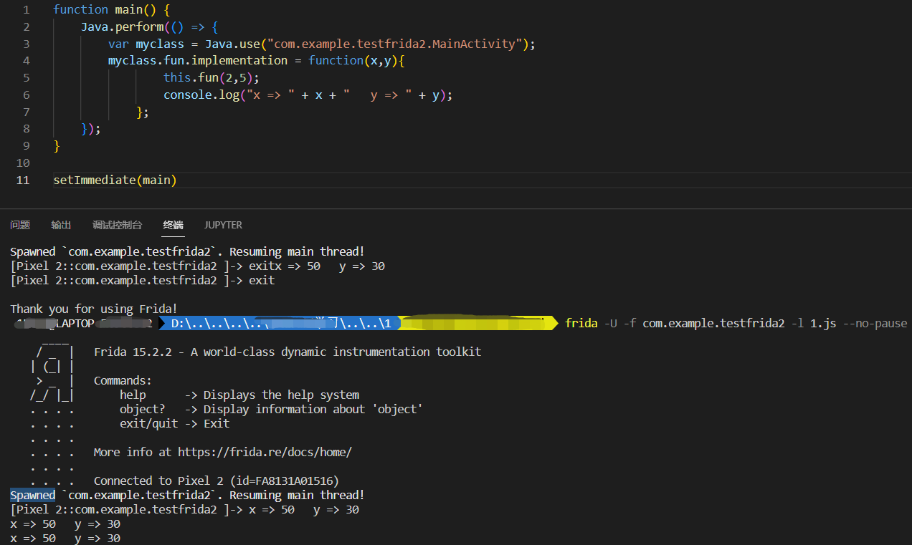

logcat | grep Sum，看到log改变：

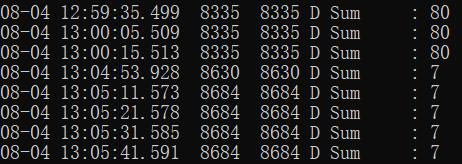

## 基本能力Ⅱ：参数构造、方法重载、隐藏函数的处理

附件：2.apk、2.js

app中定义一个成员、两个fun及其调用：

```java
private String total = "@@@###@@@";
```

onCreate函数中：

```java
fun(50,30);
Log.d("ROYSUE.string" , fun("LoWeRcAsE Me!!!!!!!!!"));
```

```java
void fun(int x , int y ){
    Log.d("ROYSUE.Sum" , String.valueOf(x+y));
}

String fun(String x){
    total +=x;
    return x.toLowerCase();
}

String secret(){
    return total;
}
```

frida js：

- **overload**实现函数重载
- java string类型数据需获取**java.lang.String**类，通过**类.new()**方法构造函数
- **Java.choose**方法可以用来调用**隐藏函数**
  - **onMatch**查找类的实例，调用每个类实例的方法，有多少类实例就会调用多少次
- Java.choose**选择内存中已有的实例**，Java.use会**新建实例**

```javascript
function main() {
    Java.perform(() => {
        var string_class = Java.use("java.lang.String");
        var my_class = Java.use("com.example.testfrida2.MainActivity");
        my_class.fun.overload("java.lang.String").implementation = function(x){
            console.log("Original arg: " + x );
            var my_string = string_class.$new("My Test String#####");
            var ret =  this.fun(my_string);
            console.log("Return value: " + ret);
            return ret;
            };
        my_class.fun.overload("int" , "int").implementation = function(x,y){
            console.log("x => " + x + "   y => " + y);
            this.fun(x, y);
            console.log("*************************************");
            };
        Java.choose("com.example.testfrida2.MainActivity" , {
            onMatch : function(instance){
                console.log("Found instance: "+instance);
                console.log("Result of secret func: " + instance.secret());
            },
            onComplete:function(){}
            });
    });
}

setImmediate(main)
```

运行效果：


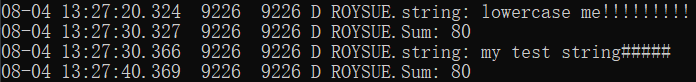

## hook类中某个函数的所有重载

附件：2.apk hook.js

- 目标类[目标方法].overloads.length获取**重载函数的个数**
- 目标类[目标方法].overloads[i]**索引重载函数**
- arguments.length获取**参数的个数**，arguments[j]**索引参数值**
- this[方法].apply(this, arguments)**获取返回值**

```javascript
setTimeout(function (){
    Java.perform(function (){
        // 目标类
        var hook = Java.use("com.example.testfrida2.MainActivity");
        // 目标方法
        var targetMethod = 'fun';
        // 重载次数
        var overloadCount = hook[targetMethod].overloads.length;
        console.log("Tracing " + targetMethod + " [" + overloadCount + " overload(s)]");
        // 进入每个目标方法
        for (var i = 0; i < overloadCount; i++) {
            hook[targetMethod].overloads[i].implementation = function() {
                console.warn("\n*** entered " + targetMethod);
                //可以打印每个重载的调用栈，对调试有巨大的帮助，当然，信息也很多，尽量不要打印，除非分析陷入僵局
                // var bt = Java.use("android.util.Log").getStackTraceString(Java.use("java.lang.Exception").$new());
                // console.log("\nBacktrace:\n" + bt); 
        
                // 打印参数
                if (arguments.length) console.log();
                for (var j = 0; j < arguments.length; j++) {
                    console.log("arg[" + j + "]: " + arguments[j]);
                }

                //打印返回值
                var retval = this[targetMethod].apply(this, arguments); // rare crash (Frida bug?)
                console.log("\nretval: " + retval);
                console.warn("\n*** exiting " + targetMethod);
                return retval;
            }
        }
    });
});
```

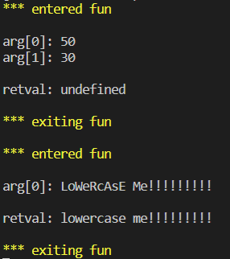

## 中级能力：远程调用

附件：2.apk、2-1.py、2-1.js

使用`frida`提供的`RPC`功能

python脚本：

- **script.exports.函数名()**直接调用frida脚本

```python
import time
import frida

def my_message_handler(message, payload):
    print(message)
    print(payload)

device = frida.get_usb_device()
pid = device.spawn(["com.example.testfrida2"])
device.resume(pid)
time.sleep(1)
session = device.attach(pid)
with open("2-1.js") as f:
    script = session.create_script(f.read())
script.on("message", my_message_handler)
script.load()

command = ""
while 1 == 1:
    command = input("Enter command:\n1: Exit\n2: Call secret function\nchoice:")
    if command == "1":
        break
    elif command == "2": #在这里调用
        script.exports.callsecretfunction()
```

js脚本：

- **rpc.exports**定义导出符号映射关系，把callSecretFun函数导出为callsecretfunction符号，导出名**不可以有大写字母或者下划线**

```javascript
console.log("Script loaded successfully ");

function callSecretFun() { 
    Java.perform(function () {
        Java.choose("com.example.testfrida2.MainActivity", {
            onMatch: function (instance) {
                console.log("Found instance: " + instance);
                console.log("Result of secret func: " + instance.secret());
            },
            onComplete: function () { }
        });
    });
}
rpc.exports = {
    callsecretfunction: callSecretFun
};
```

vscode输出：

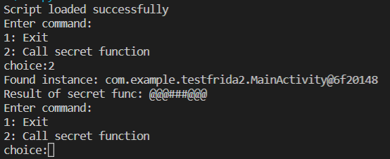

## 高级能力：互联互通、动态修改

附件：3.apk、3.js、3.py

app中onCreate函数中设计一个简单的登录数据传输逻辑：

- 如果输入admin，提示不能以admin身份登录
- 否则，输出name和password的base64编码

```java
password_et = (EditText) this.findViewById(R.id.editText2);
username_et = (EditText) this.findViewById(R.id.editText);
message_tv = ((TextView) findViewById(R.id.textView));

this.findViewById(R.id.button).setOnClickListener(new View.OnClickListener() {
    @Override
    public void onClick(View v) {

        if (username_et.getText().toString().compareTo("admin") == 0) {
            message_tv.setText("You cannot login as admin");
            return;
        }
        //hook target
        message_tv.setText("Sending to the server :" + Base64.encodeToString((username_et.getText().toString() + ":" + password_et.getText().toString()).getBytes(), Base64.DEFAULT));

    }
});
```

效果：


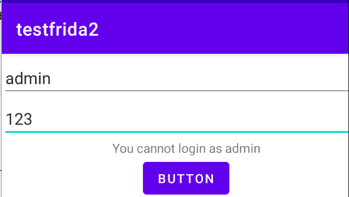


frida 涉及到python和js的交互

python代码：主要处理数据

- **my_message_handler**接收和发送给js代码消息

```python
import time
import frida
import base64

def my_message_handler(message, payload):
    if message["type"] == "send" and message["payload"]:
        data = message["payload"].split(":")[1].strip()
        print('message:', message)
        data = base64.decodebytes(data.encode('utf-8')) # 对data进行解码
        data = str(data)
        user, pw = data.split(":")
        data = base64.encodebytes(("admin" + ":" + pw).encode()) # 重新加密数据，尝试以admin登录
        data = str(data)
        print("encoded data:", data)
        script.post({"my_data": data})  # 将JSON对象发送回去
        print("Modified data sent")

device = frida.get_usb_device()
pid = device.spawn(["com.example.testfrida2"])
device.resume(pid)
time.sleep(1)
session = device.attach(pid)
try:
    with open("3.js") as f:
        script = session.create_script(f.read())
    script.on("message", my_message_handler)  # 注册消息处理函数
    script.load()
except Exception as e:
    print(e)
```

js代码：主要负责截获数据，将数据发给python处理，接收python传来的数据进行下一步操作

- 修改TextView类的setText实现
- **send**函数向python发送消息
- **recv**函数接收python端消息
- **wait**函数表明接收到数据后再进行下一步操作

```javascript
Java.perform(() => {
    var tv_class = Java.use("android.widget.TextView"); 
    tv_class.setText.overload("java.lang.CharSequence").implementation = function (x) {
        var string_to_send = x.toString();
        var string_to_recv;
        send(string_to_send); 
        recv(function (received_json_object) {
            string_to_recv = received_json_object.my_data
            console.log("string_to_recv: " + string_to_recv);
        }).wait(); 
        string_to_recv = Java.use("java.lang.String").$new(string_to_recv);
        return this.setText(string_to_recv);
    }
});
```

python输出为：

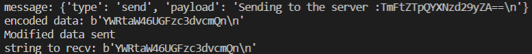

## 简单脚本

附件：test.js

### 枚举所有的类

- Java.enumerateLoadedClasses实现枚举类的功能

```javascript
setTimeout(function (){
    Java.perform(function (){
      console.log("\n[*] enumerating classes...");
      var sum = 0;
      Java.enumerateLoadedClasses({
        onMatch: function(_className){
          console.log("[*] found instance of '"+_className+"'");
          sum += 1;
        },
        onComplete: function(){
          console.log("[*] class enuemration complete");
          console.log("[*] the number of the classes:" + sum);
        }
      });
    });
  });
```

运行：

```
frida -U -l test.js com.android.bluetooth
```

结果：


### 定位目标类并打印类的实例

增加实例名中是否包含bluetooth的判断

```javascript
setTimeout(function (){
    Java.perform(function (){
        Java.enumerateLoadedClasses({
            onMatch: function(instance){
              if (instance.split(".")[1] == "bluetooth"){
                console.log("[->]\t"+instance);
              }
            },
            onComplete: function() {
              console.log("[*] class enuemration complete");
            }
          });
    });
});
```

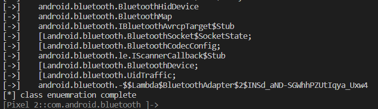

选择android.bluetooth.BluetoothDevice类，输出已连接设备的MAC地址和名称

```javascript
Java.choose("android.bluetooth.BluetoothDevice",{
    onMatch: function (instance){
        console.log("[*] "+" android.bluetooth.BluetoothDevice instance found"+" :=> '"+instance+"'");
        console.log(instance.getAddress())
        console.log(instance.getName())
    },
    onComplete: function() { console.log("[*] -----");}
});
```

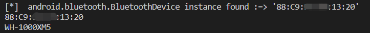

### 枚举所有方法并定位方法

- 类名.class.getDeclaredMethods()获取类中所有方法
- $dispose销毁对象

```javascript
function enumMethods(targetClass)
{
	var hook = Java.use(targetClass);
	var ownMethods = hook.class.getDeclaredMethods();
	hook.$dispose;
	return ownMethods;
}

setTimeout(function (){
    Java.perform(function (){
        var a = enumMethods("android.bluetooth.BluetoothDevice")
		a.forEach(function(s) {
			console.log(s);
		});
    });
});
```

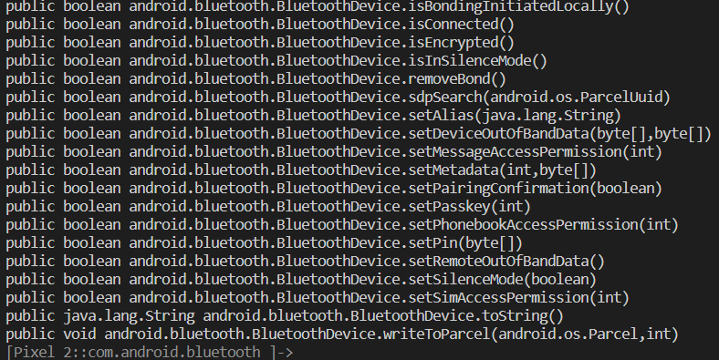

### 综合案例：在安卓10上dump蓝牙接口和实例

附件：bluecrawl-1.0.0-change.js

附件为[BlueCrawl](https://github.com/IOActive/BlueCrawl)的修改版，主要将`\033`修改为`\x1B`，给一些变量声明前加上`var`，解决报错

主要运行函数逻辑：

```javascript
// 枚举包含bluetooth名称的类
Java.enumerateLoadedClasses({
    onMatch: function(instance){
        if (instance.split(".")[1] == "bluetooth"){
            ...
        }
    },
    onComplete: function() {}
});
// 查找并打印各类信息
Java.choose("android.bluetooth.BluetoothGattServer",{
    onMatch: function (instance){
       	...
        // 调用Info函数打印实例属性
        bluetoothGattServerInfo(instance);		
    },
    onComplete: function() { console.log("[*] -----");}
});
Java.choose("android.bluetooth.BluetoothGattService",{...});
Java.choose("android.bluetooth.BluetoothSocket",{...});
Java.choose("android.bluetooth.BluetoothServerSocket",{...});
Java.choose("android.bluetooth.BluetoothDevice",{...});
```

输出结果：

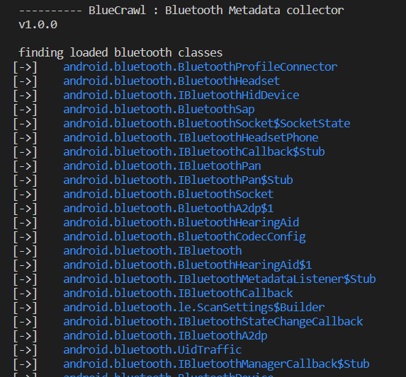

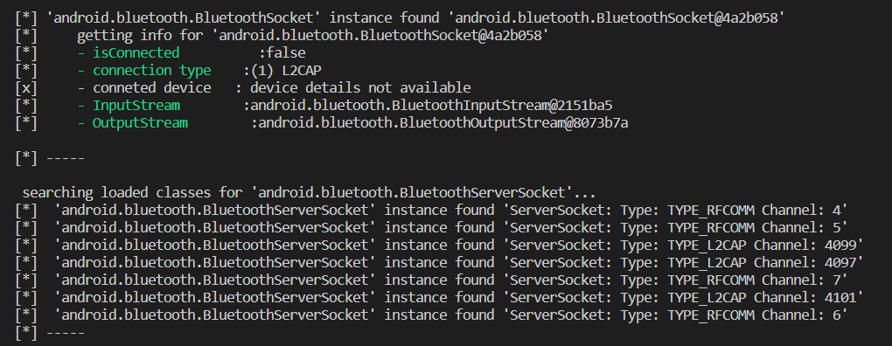

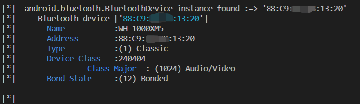

## Hook Native层

附件：4.apk 4.js

编写so库可以看本系列之前的文章

注意在android studio中，要用的libs库所在的文件夹必须命名为jniLibs，才能被识别：

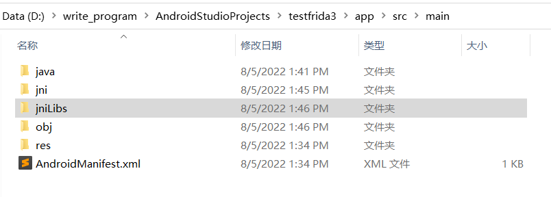

jniLibs文件夹中包含各版本的lib库：

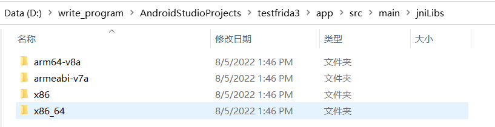

效果：

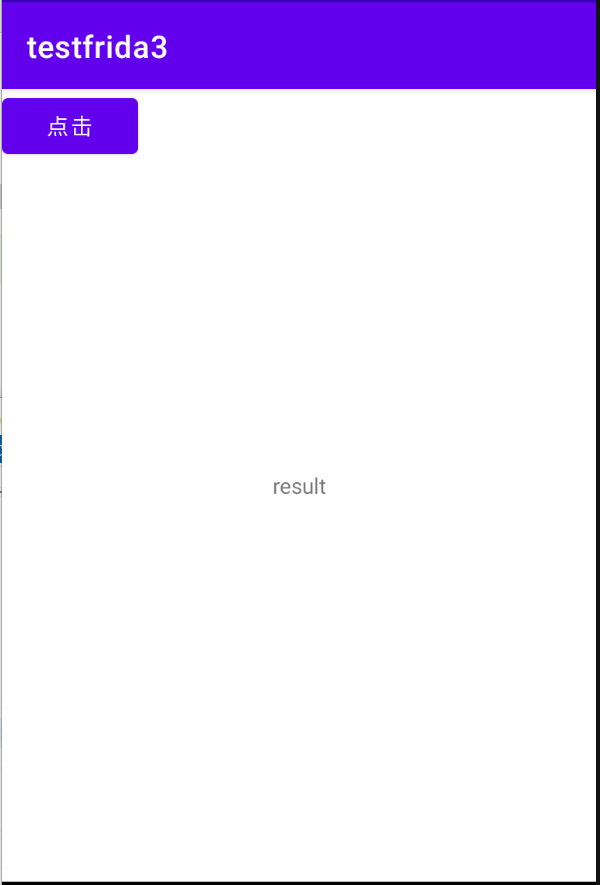

点击后：


frida脚本：

- **Module.findExportByName**指定要Hook的so文件名和要Hook的函数名（IDA中的导出函数名）
- **onEnter: function(args)**是进入该函数前要执行的代码，其中args是传入的参数，一般so层函数第一个参数都是JniEnv，第二个参数是jclass，从第三个参数开始才是java层传入的参数
- **onLeave: function(retval)**是该函数执行结束要执行的代码，其中retval参数即是返回值
- **retval.replace(0);**替换返回值

```javascript
setTimeout(()=>{
    Java.perform(()=>{
        var addr = Module.findExportByName("libMyJni.so", "Java_com_example_testfrida3_MyJni_add");
        Interceptor.attach(addr, {
            onEnter: function(args) {
                console.log("Hook Start");
                console.log("arg[2] = " + args[2]);
                console.log("arg[3] = " + args[3]);
            },
            onLeave: function(retval) {
                console.log("return = " + retval);
                retval.replace(0);
            }
        });
    });
});
```

`frida -U -f com.example.testfrida3 -l 4.js --no-pause`执行frida脚本

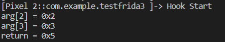

