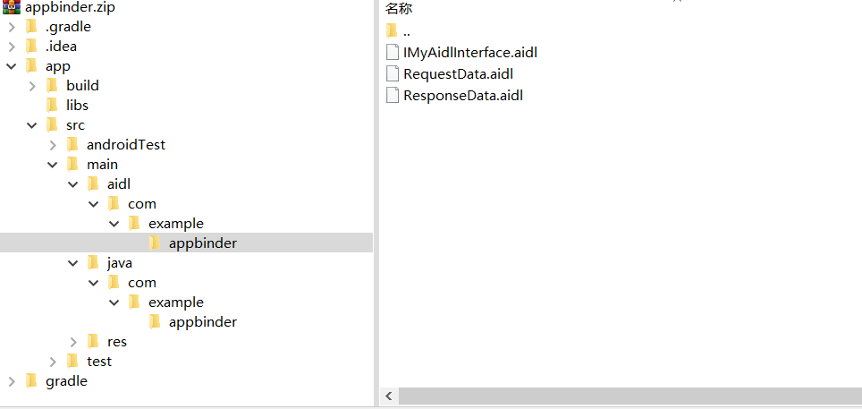
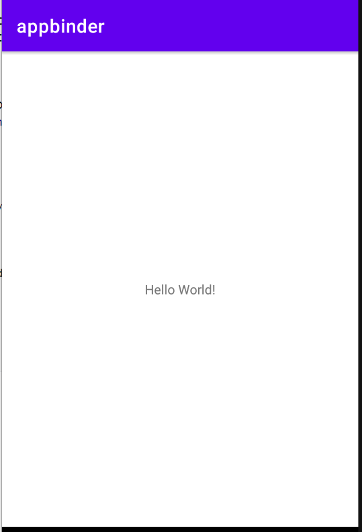

# Android Framework

* [Android Framework](#android-framework)
  * [Android 系统架构](#android-系统架构)
  * [Android Framework通信](#android-framework通信)
    * [APP启动流程](#app启动流程)
    * [init进程](#init进程)
    * [zygote进程](#zygote进程)
      * [fork函数](#fork函数)
    * [SystemServer进程](#systemserver进程)
    * [binder通信](#binder通信)
    * [handler通信](#handler通信)
  * [binder通信实现](#binder通信实现)
    * [service端](#service端)
      * [目录结构](#目录结构)
      * [aidl文件](#aidl文件)
      * [aidl文件编译](#aidl文件编译)
      * [java文件](#java文件)
      * [清单文件](#清单文件)
    * [client端](#client端)
      * [目录结构](#目录结构-1)
      * [aidl文件编译](#aidl文件编译-1)
      * [MainActivity中bindservice](#mainactivity中bindservice)
    * [实现效果](#实现效果)
    * [AIDL源码分析](#aidl源码分析)

## Android 系统架构


## Android Framework通信

应用进程之间通过**binder IPC**进行通信

用户态和内核态通过**system call**进行通信


### APP启动流程


### init进程

init进程是Android系统中及其重要的第一个进程，主要工作：

- 创建和挂载启动所需要的文件目录
- 初始化和启动属性服务
- 解析**init.rc**配置文件并启动**Zygote**进程，也会启动**ServiceManager**进程（binder服务管家，控制访问，管理通信）
  - init.rc是一个非常重要的配置文件

### zygote进程

- 一部分在native层，一部分在java层
- 通过**fork**孵化子进程
  - 每个子进程都有独立的JVM
- 启动**SystemServer**进程
- 是一个C/S模型，Zygote进程作为服务端，接收fork新进程的请求

zygote启动过程：


#### fork函数

使用fork()函数得到的子进程是父进程的一个**复制品**：

- 它从父进程处继承了整个进程的地址空间
  - 包括进程上下文（进程执行活动全过程的静态描述）、进程堆栈、打开的文件描述符、信号控制设定、进程优先级、进程组号等。
  - 除了文件锁以外，其他的锁都会被继承

- 子进程所独有的只有它的进程号，计时器等（只有小量信息）。

因此通知zygote复制的时候采用**socket**进行通信，而不是具有并发性的binder，来避免子进程复制了父进程的锁，但是没有线程为它解锁，从而导致死锁情况的出现。


### SystemServer进程

SystemServer是Zygote fork的第一个Java进程，提供所有的**系统核心服务**

- 包括ActivityManagerService和WindowManagerService, 他们是应用程序运行起来的前提
- SystemServiceManager管理SystemService抽象类以及下面的多种service，主要复制创建实例、启动实例、管理实例的生命周期


### binder通信

binder用于**进程通信**

客户端通过binder获取注册在ServiceManager中的服务


binder通信，数据只需要**复制1次**，从数据发送方复制到内核地址空间。内核地址空间和数据接收方中存储的虚拟地址会指向同一块物理内存，避免再次复制。

采取这样的方式可以在保证安全性的情况下，尽可能减少数据复制的次数。


### handler通信

handler用于实现**线程**之间的通信，主要是子线程通过handler给主线程发送数据。

子线程与主线程构成**生产-消费者**模型。

主线程looper保持循环，等到MessageQueue的数据，子线程将message放到主线程的MessageQueue中实现通信。


Binder、Socket和Handler：

- 进程间通信使用Binder
- 发起创建进程的请求、fork新进程使用Socket
- 线程间通信使用Handler


[参考](https://www.bilibili.com/video/av812017406/)

[android源码学习网站](http://androidxref.com/)

## binder通信实现

[kotlin实现参考链接](https://cloud.tencent.com/developer/article/1912170)

[原理说明参考链接](https://medium.com/swlh/binder-android-interface-definition-language-43b6f12f04f8)

本文为Java实现，基本流程与参考链接一致，代码和可运行的APK文件在github文件夹中

### service端

#### 目录结构

service端实际架构如下（与android studio中的目录显示不太一样）

aidl是Android 接口定义语言，定义数据接口



通过android studio的build功能，可以自动生成IMyAidlInterface.aidl的java接口实现，位置在：


service端需要实现aidl中定义的RequestData类和ResponseData类，以及MyService类调用IMyAidlInterface.Stub对象的asBinder方法


#### aidl文件

RequestData.aidl

parcelable定义了binder在用户空间使用的数据模型

```java
package com.example.appbinder;

parcelable RequestData;
```

ResponseData.aidl

```java
package com.example.appbinder;

parcelable ResponseData;
```

IMyAidlInterface.aidl

interface定义了一个binder service，在编译中aidl会自动生成两类binder对象：

- Stub类继承了Binder，应该在服务端实现
- Proxy类应该在客户端实现

interface中函数的参数

- 可以是原始类型、parcelable、Binder对象
- 可以通过in、out、inout来修饰
  - in表示参数中的数据只从客户端移动到服务端，服务端只接收其中的数据不做更改
  - out则是相反的情况，在客户端给服务端发消息时，该参数只是一个占位符，不会被序列化；在服务端返回消息时，该占位符才会被初始化
  - inout是两者的结合

```java
package com.example.appbinder;
import com.example.appbinder.RequestData;
import com.example.appbinder.ResponseData;

interface IMyAidlInterface {
    ResponseData send(in RequestData  request);
}
```

#### aidl文件编译

配置app的build.gradle


直接编译，在刚才的位置可以找到生成的IMyAidlInterface.java文件

#### java文件

RequestData.java

实现Parcelable接口，有一个字符串作为私有变量，一个toString函数来打印RequestData类数据

```java
package com.example.appbinder;

import android.os.Parcel;
import android.os.Parcelable;

import static android.os.UserHandle.readFromParcel;

public class RequestData implements Parcelable {

    private String s;

    protected RequestData(Parcel in) {
        readFromParcel(in);
    }

    public RequestData(String s) {
        this.s = s;
    }

    /** 将数据写入到Parcel **/
    @Override
    public void writeToParcel(Parcel dest, int flags) {
        dest.writeString(s);
    }

    /** 从Parcel中读取数据 **/
    public void readFromParcel(Parcel in){
        s = in.readString();
    }

    @Override
    public int describeContents() {
        return 0;
    }

    public static final Creator<RequestData> CREATOR = new Creator<RequestData>() {
        @Override
        public RequestData createFromParcel(Parcel in) {
            return new RequestData(in);
        }

        @Override
        public RequestData[] newArray(int size) {
            return new RequestData[size];
        }
    };

    @Override
    public String toString() {
        return s;
    }
}
```

ResponseData.java

```java
package com.example.appbinder;

import android.os.Parcel;
import android.os.Parcelable;

public class ResponseData implements Parcelable {

    private String s;

    protected ResponseData(Parcel in) {
        readFromParcel(in);
    }

    public ResponseData(String s) {
       this.s = s;
    }

    /** 将数据写入到Parcel **/
    @Override
    public void writeToParcel(Parcel dest, int flags) {
        dest.writeString(s);
    }

    /** 从Parcel中读取数据 **/
    public void readFromParcel(Parcel in){
        s = in.readString();
    }

    @Override
    public int describeContents() {
        return 0;
    }

    public static final Parcelable.Creator<ResponseData> CREATOR = new Parcelable.Creator<ResponseData>() {
        @Override
        public ResponseData createFromParcel(Parcel in) {
            return new ResponseData(in);
        }

        @Override
        public ResponseData[] newArray(int size) {
            return new ResponseData[size];
        }
    };

    @Override
    public String toString() {
        return s;
    }
}
```

MyService.java

Service在onBind方法返回Binder实体，最后会注册到ServiceManager的映射表，供客户端调用；binder实体在IMyAidlInterface中已经被定义，只需要实现自定义的send方法

```java
package com.example.appbinder;

import android.app.Service;
import android.content.Intent;
import android.os.IBinder;
import android.os.RemoteException;
import android.util.Log;

public class MyService extends Service {

    private final IMyAidlInterface.Stub mBinder = new IMyAidlInterface.Stub() {
        @Override
        public ResponseData send(RequestData data) throws RemoteException {
            Log.i("service","[RemoteService] receive  "+ data.toString());
            return new ResponseData("i'm service message");
        }
    };

    @Override
    public IBinder onBind(Intent intent) {
        return mBinder;
    }
}
```

MainActivity.java

启动service

```java
package com.example.appbinder;

import androidx.appcompat.app.AppCompatActivity;

import android.content.ComponentName;
import android.content.Intent;
import android.os.Bundle;

public class MainActivity extends AppCompatActivity {

    @Override
    protected void onCreate(Bundle savedInstanceState) {
        super.onCreate(savedInstanceState);
        setContentView(R.layout.activity_main);

        Intent in = new Intent();
        in.setComponent(new ComponentName("com.example.appbinder", "com.example.appbinder.MyService"));
        //启动service
        startService(in);
    }
}
```

#### 清单文件

注册service

```xml
<service
    android:name=".MyService"
    android:exported="true">
    <intent-filter>
        <action android:name="com.example.appbinder.service" />
        <category android:name="android.intent.category.DEFAULT" />
    </intent-filter>
</service>
```

### client端

#### 目录结构

aidl文件夹与server端一致，里面包含RequestData.aidl、ResponseData.aidl、IMyAidlInterface.aidl三个文件

java文件夹下com.example.appbinder文件夹中，包含RequestData.java、ResponseData.java两个文件

注意上面的文件与server端的完全相同，且包名也一致


#### aidl文件编译

同样需要配置app的build.gradle

同样对IMyAidlInterface.aidl进行编译得到IMyAidlInterface.java文件

#### MainActivity中bindservice

实现bindservice，同时定义一个按钮，实现send发送消息和回显消息

```java
package com.example.appbinderclient;

import androidx.appcompat.app.AppCompatActivity;

import android.content.ComponentName;
import android.content.Context;
import android.content.Intent;
import android.content.ServiceConnection;
import android.os.Bundle;
import android.os.IBinder;
import android.widget.TextView;

import com.example.appbinder.IMyAidlInterface;
import com.example.appbinder.RequestData;
import com.example.appbinder.ResponseData;

public class MainActivity extends AppCompatActivity {

    private IMyAidlInterface mAidlInterface;

    @Override
    protected void onCreate(Bundle savedInstanceState) {
        super.onCreate(savedInstanceState);
        setContentView(R.layout.activity_main);
		
        // bind上服务端的service
        Intent in = new Intent();
        in.setComponent(new ComponentName("com.example.appbinder", "com.example.appbinder.MyService"));
        bindService(in, connD, Context.BIND_AUTO_CREATE);
    }

    private ServiceConnection connD = new ServiceConnection() {
        @Override
        public void onServiceConnected(ComponentName name, IBinder service) {
            mAidlInterface = IMyAidlInterface.Stub.asInterface(service);
        }

        @Override
        public void onServiceDisconnected(ComponentName name) {
            mAidlInterface = null;
        }
    };

    // 发送消息和回显消息
    public void send(android.view.View v) {
        try {
            ResponseData data = mAidlInterface.send(new RequestData("hello i'm client"));
            TextView textView = findViewById(R.id.textview);
            textView.setText(data.toString());
        } catch (Exception e) {

        }
    }
}
```

### 实现效果

先打开server端：



然后打开客户端：


点击客户端的send按钮，客户端收到信息：


同时server端后台日志也说明收到了client端信息：


### AIDL源码分析

查看生成的IMyAidlInterface.java文件


IMyAidlInterface实现了android的IInterface接口：

- Stub类继承了Binder类，为服务端

  - 构造器Stub()，创建stub并附加到接口上

  - asInterface(Ibinder obj)，提供给客户端调用

    输入obj可以是Binder也可以是BinderProxy，客户端可以通过调用bindService bind to RemoteService，服务端自己也可以bind to RemoteService，两种情况下都会在onServiceConnected得到一个IBinder，但是如果是客户端IBinder类型为BinderProxy，如果是服务端类型为Binder。

    ```java
    public static com.example.appbinder.IMyAidlInterface asInterface(android.os.IBinder obj)
    {
      if ((obj==null)) {
        return null;
      }
      // DESCRIPTOR就是com.example.appbinder.IMyAidlInterface
      android.os.IInterface iin = obj.queryLocalInterface(DESCRIPTOR);
      if (((iin!=null)&&(iin instanceof com.example.appbinder.IMyAidlInterface))) {
        return ((com.example.appbinder.IMyAidlInterface)iin);
      }
      return new com.example.appbinder.IMyAidlInterface.Stub.Proxy(obj);
    }
    ```

  - onTransact是核心，Client调用aidl接口后，最终onTransact会接收到消息，并调用我们自己定义的方法

    ```java
    @Override public boolean onTransact(int code, android.os.Parcel data, android.os.Parcel reply, int flags) throws android.os.RemoteException
    {
      java.lang.String descriptor = DESCRIPTOR;
      switch (code)
      {
        case INTERFACE_TRANSACTION:
        {
          reply.writeString(descriptor);
          return true;
        }
        case TRANSACTION_send:
        {
          data.enforceInterface(descriptor);
          com.example.appbinder.RequestData _arg0;
          if ((0!=data.readInt())) {
            _arg0 = com.example.appbinder.RequestData.CREATOR.createFromParcel(data);
          }
          else {
            _arg0 = null;
          }
          // 调用我们定义的方法
          com.example.appbinder.ResponseData _result = this.send(_arg0);
          reply.writeNoException();
          if ((_result!=null)) {
            reply.writeInt(1);
            _result.writeToParcel(reply, android.os.Parcelable.PARCELABLE_WRITE_RETURN_VALUE);
          }
          else {
            reply.writeInt(0);
          }
          return true;
        }
        default:
        {
          return super.onTransact(code, data, reply, flags);
        }
      }
    }
    ```

  - Proxy类为客户端

    ```java
    private static class Proxy implements com.example.appbinder.IMyAidlInterface
    {
      private android.os.IBinder mRemote;
      Proxy(android.os.IBinder remote)
      {
        mRemote = remote;
      }
      @Override public android.os.IBinder asBinder()
      {
        return mRemote;
      }
      public java.lang.String getInterfaceDescriptor()
      {
        return DESCRIPTOR;
      }
      /**
           * Demonstrates some basic types that you can use as parameters
           * and return values in AIDL.
           */
      @Override public com.example.appbinder.ResponseData send(com.example.appbinder.RequestData request) throws android.os.RemoteException
      {
        // 序列化参数
        android.os.Parcel _data = android.os.Parcel.obtain();
        android.os.Parcel _reply = android.os.Parcel.obtain();
        com.example.appbinder.ResponseData _result;
        try {
          _data.writeInterfaceToken(DESCRIPTOR);
          if ((request!=null)) {
            _data.writeInt(1);
            request.writeToParcel(_data, 0);
          }
          else {
            _data.writeInt(0);
          }
          // 发送消息，调用Binder的onTransact方法
          boolean _status = mRemote.transact(Stub.TRANSACTION_send, _data, _reply, 0);
          if (!_status && getDefaultImpl() != null) {
            return getDefaultImpl().send(request);
          }
          _reply.readException();
          if ((0!=_reply.readInt())) {
            //读取返回结果
            _result = com.example.appbinder.ResponseData.CREATOR.createFromParcel(_reply);
          }
          else {
            _result = null;
          }
        }
        finally {
          _reply.recycle();
          _data.recycle();
        }
        return _result;
      }
      public static com.example.appbinder.IMyAidlInterface sDefaultImpl;
    }
    ```

- send方法是IMyAidlInterface中自己定义的函数

  ```java
  public com.example.appbinder.ResponseData send(com.example.appbinder.RequestData request) throws android.os.RemoteException;
  ```


关键文件：IMyService.java和MyService.java

- IMyService.java是IMyService.aidl编译后的结果，分析时主要关注`Stub.Proxy`类的实现，学习如何构造发送数据
- MyService.java是对IMyService.java中接口的实现，分析时主要关注`Stub`类中方法的实现，分析发送数据的含义和限制范围

对于Android Framework，Android源码中只能看到AIDL文件，服务接口和服务实现文件在framework.jar或XXX-service.jar中

获取binder

- 获取app service的binder
  - `bindservice`方法绑定服务，在`onServiceConnected`回调函数的参数中获取binder
- 获取系统服务的binder
  - 通过反射调用`android.os.ServiceManager`的`getService`方法，参数为系统服务的名字，方法返回值即为binder

获取binder后调用方法

- 可以直接用`binder.transact`方法，传入要调用的函数编号
- 也可以拷贝jar中反编译后的IMyService.java接口文件，先`IMyService.Stub.asInterface(binder)`强制类型转换为IMyService.Stub.Proxy类，再利用转换后的实例调用所需方法
  - 这些方法最终还是会调用transact函数将数据传输给服务端