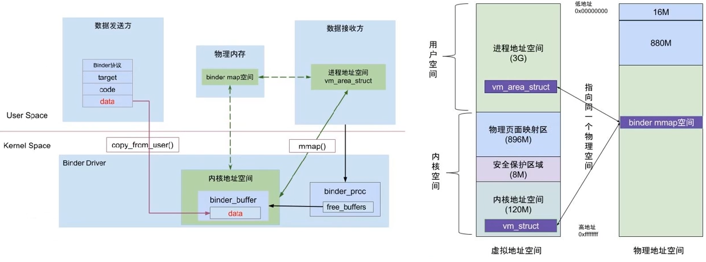

## Android 系统架构

## Android Framework通信

应用进程之间通过**binder IPC**进行通信

用户态和内核态通过**system call**进行通信

### APP启动流程

### init进程

init进程是Android系统中及其重要的第一个进程，主要工作：

- 创建和挂载启动所需要的文件目录
- 初始化和启动属性服务
- 解析**init.rc**配置文件并启动**Zygote**进程，也会启动**ServiceManager**进程（binder服务管家，控制访问，管理通信）
  - init.rc是一个非常重要的配置文件

### zygote进程

- 一部分在native层，一部分在java层
- 通过**fork**孵化子进程
  - 每个子进程都有独立的JVM
- 启动**SystemServer**进程
- 是一个C/S模型，Zygote进程作为服务端，接收fork新进程的请求

zygote启动过程：

#### fork函数

使用fork()函数得到的子进程是父进程的一个**复制品**：

- 它从父进程处继承了整个进程的地址空间
  - 包括进程上下文（进程执行活动全过程的静态描述）、进程堆栈、打开的文件描述符、信号控制设定、进程优先级、进程组号等。
  - 除了文件锁以外，其他的锁都会被继承

- 子进程所独有的只有它的进程号，计时器等（只有小量信息）。

因此通知zygote复制的时候采用**socket**进行通信，而不是具有并发性的binder，来避免子进程复制了父进程的锁，但是没有线程为它解锁，从而导致死锁情况的出现。

### SystemServer进程

SystemServer是Zygote fork的第一个Java进程，提供所有的**系统核心服务**

- 包括ActivityManagerService和WindowManagerService, 他们是应用程序运行起来的前提
- SystemServiceManager管理SystemService抽象类以及下面的多种service，主要复制创建实例、启动实例、管理实例的生命周期

### binder通信

binder用于**进程通信**

客户端通过binder获取注册在ServiceManager中的服务

binder通信，数据只需要**复制1次**，从数据发送方复制到内核地址空间。内核地址空间和数据接收方中存储的虚拟地址会指向同一块物理内存，避免再次复制。

采取这样的方式可以在保证安全性的情况下，尽可能减少数据复制的次数。

### handler通信

handler用于实现**线程**之间的通信，主要是子线程通过handler给主线程发送数据。

子线程与主线程构成**生产-消费者**模型。

主线程looper保持循环，等到MessageQueue的数据，子线程将message放到主线程的MessageQueue中实现通信。

Binder、Socket和Handler：

- 进程间通信使用Binder
- 发起创建进程的请求、fork新进程使用Socket
- 线程间通信使用Handler

[参考](https://www.bilibili.com/video/av812017406/)

[android源码学习网站](http://androidxref.com/)