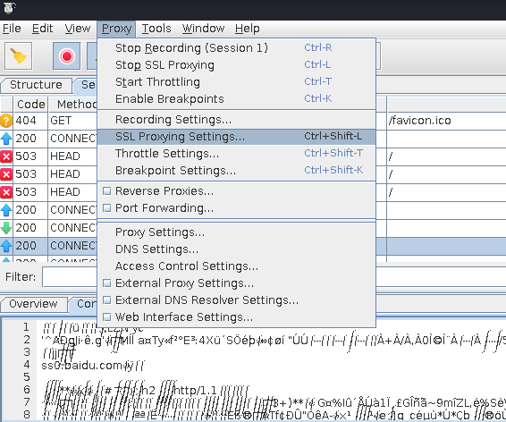
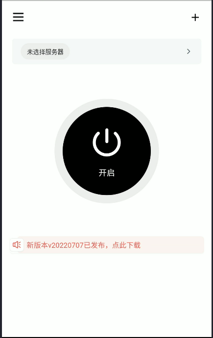

# HTTPS抓包

## HTTPS原理

[HTTP 与 HTTPS](https://xiaolincoding.com/network/2_http/http_interview.html#http-%E4%B8%8E-https)

HTTP**S** 在 HTTP 与 TCP 层之间加入了 TLS 协议，实现信息加密、校验机制、身份证书

HTTPS 采用的是**对称加密**和**非对称加密**结合的「混合加密」方式：

- 在通信建立前采用**非对称加密**的方式交换「会话秘钥」，后续就不再使用非对称加密。
- 在通信过程中全部使用**对称加密**的「会话秘钥」的方式加密明文数据。

采用「混合加密」的方式的原因：

- **对称加密**只使用一个密钥，运算速度快，密钥必须保密，无法做到安全的密钥交换。
- **非对称加密**使用两个密钥：公钥和私钥，公钥可以任意分发而私钥保密，解决了密钥交换问题但速度慢。


在非对称加密中，通过数字证书的方式保证服务器公钥的身份，解决冒充的风险


证书结构使用X.509标准，X509证书常用的文件扩展名

- PEM（Privacy Enhanced Mail）
  - Base64编码，文件扩展名.pem，证书信息在“ — — -BEGIN CERTIFICATE — — -”和 “ — — -END CERTIFICATE — — -”之间
- PKCS（Public-key cryptography standards）
  - 用于基于单个文件交换公钥和私钥，扩展为.p7b、.p7c、.p12
- DER（Distinguished Encoding Rules）
  - 二进制编码，文件扩展名为.cer、.der和.crt

TLS四次握手


wireshark抓包查看四次握手


wireshark查看服务端返回的证书


### 中间人攻击

在HTTPS中如果要实现抓包，中间人需要分别和客户端、服务端完成TLS握手，也就是客户端必须要信任中间人的证书


### 双向认证

一般的HTTPS是单向认证，客户端会验证服务端身份，但是服务端不会验证客户端身份

如果用了双向认证方式，不仅客户端会验证服务端的身份，而且服务端也会验证客户端的身份。服务端一旦验证到请求自己的客户端为不可信任的，服务端就拒绝继续通信，客户端如果发现服务端为不可信任的，那么也中止通信


### SSL Pinning

[证书锁定SSL Pinning简介及用途](https://www.infinisign.com/faq/what-is-ssl-pinning)

SSL Pinning中的证书锁定是指将服务器提供的SSL/TLS证书内置到移动端开发的APP客户端中，当客户端发起请求时，通过比对内置的证书和服务器端证书的内容，以确定这个连接的合法性

证书锁定的两种方式

- Certificate Pinning
  - 将APP代码内置仅接受指定域名的证书，而不接受操作系统或浏览器内置的CA根证书对应的任何证书，通过这种授权方式，保障了APP与服务端通信的唯一性和安全性
  - 但是CA签发证书都存在有效期问题，所以缺点是在证书续期后需要将证书重新内置到APP中
- Public Key Pinning
  - 提取证书中的公钥并内置到APP中，通过与服务器对比公钥值来验证连接的合法性
  - 公钥在证书的续期前后都可以保持不变（即密钥对不变），所以可以避免证书有效期问题

## 环境配置

### Kali配置

#### Kali桥接模式设置

第一步，Kali桥接模式选择自己的无线网卡，可以去设置里看下自己无线网卡的硬件名称


第二步，查看主机所在的网络IP、子网掩码、网关

最好不要用校园网，校园网的IP可能都被占用了，用自己主机的IP的话，主机就上不了网了

所以可以考虑手机热点，下面是主机IP


对于虚拟机修改接口文件，设置一个和主机IP不一样的address，然后设置和主机相同的netmask和gateway

```
vi /etc/network/interfaces 
```


修改虚拟机的域名解析文件，主要加上后面两行

```
vi /etc/resolv.conf
```


然后重启网络

```
/etc/init.d/networking restart
```

使用ifconfig可以看到已经有IP地址，然后访问baidu.com成功，说明设置成功


#### Kali的NAT模式设置

需要修改虚拟网络编辑器为NAT模式

同样需要修改网络接口

```
vim /etc/network/interfaces
```


然后重启网络服务

```
/etc/init.d/networking restart
```

### charles配置

[charles](https://www.charlesproxy.com/)是在 PC 端常用的网络抓包工具，能够截取 Http 和 Https 数据包。

[Charles 功能介绍和使用教程](https://juejin.cn/post/6844903665304600589)

抓包需要虚拟机和手机在同一个网络中，所以需要kali设置**桥接模式**

charles作为客户端和服务端之间的中间人，有两种代理模式

- HTTP代理
  - 是应用层面的，应用可以选择是否使用系统的HTTP代理
  - `System.getProperty("http:proxyHost")`查看系统是否开启http代理
- socks代理
  - 可以在手机端使用VPN来将流量导出到抓包软件上
    - 使用VPN可以同时抓到Http(s)和socket的包
    - VPN会在操作系统中虚拟出一块网卡，所有网络流量都会通过这块虚拟网卡进行接收和发送
    - VPN层面的抓包可以对所有流量进行捕获
    - VPN抓包检测可以通过判断网络接口名字是否包含ppp0或tun0，获取当前网络Transport字样`NetworkCapabilities.TRANSPORT_VPN`

[浅谈vpn、vps、Proxy以及shadowsocks之间的联系和区别](https://medium.com/@thomas_summon/%E6%B5%85%E8%B0%88vpn-vps-proxy%E4%BB%A5%E5%8F%8Ashadowsocks%E4%B9%8B%E9%97%B4%E7%9A%84%E8%81%94%E7%B3%BB%E5%92%8C%E5%8C%BA%E5%88%AB-b0198f92db1b)

#### HTTP代理抓包设置

配置手机的网络代理，在“高级”里面，代理服务器主机名就是kali的IP地址，端口是charles默认端口8888

[scrcpy](https://github.com/Genymobile/scrcpy)工具可以在电脑上显示手机）


点击保存后，charles会弹出窗口


然后就可以看到charles捕捉到手机访问的数据包


charles需要设置SSL proxy，才会使接收的HTTPS数据不是乱码



需要设置相应的Host和Port端口


#### 手机配置charles证书

此时如果手机访问www.baidu.com，会出现警告信息

因为charles作为中间人拦截了手机浏览器和百度的通信，所以charles会将自己的证书而不是百度的提供给手机浏览器，手机浏览器在发现证书校验失败后，就会阻止访问

所以需要在手机上下载并安装charles的证书，网址为http://chls.pro/ssl


证书安装完成后，可以在手机证书的用户一列看到，此时就可以正常捕捉到浏览器的HTTPS包


但是APP默认不信任用户自己安装的证书，所以需要把证书导入到系统证书中

##### 将证书导入系统方法一（android 10不适用）

android系统根证书存放目录：`/system/etc/security/cacerts`

用户自己添加的证书存放目录：`/data/misc/user/0/cacerts-added`

android系统根证书文件名是Hash值，后缀是数字，用于避免冲突


导出charles证书pem文件


通过下面的命令计算charles证书的Hash值

```
openssl x509 -subject_hash_old -in /root/Desktop/charles.pem
```

根据生成的hash值修改charles证书的名称，然后可以拷贝到系统证书路径下（需要挂载/system），再修改证书权限

##### 将证书导入系统方法二

anhdroid 10无法挂载系统目录进行读写操作

所以使用[MagiskTrustUserCerts](https://github.com/NVISOsecurity/MagiskTrustUserCerts/releases)模块（注意很多博客推荐MoveCertificates模块，但是我尝试了在[FoxMagiskModuleManager](https://github.com/Fox2Code/FoxMagiskModuleManager)中下载的版本，不管用）

下载安装MagiskTrustUserCerts模块，重启手机，可以看到系统列表中出现了charles证书


但是移动过后，可以捕获app的包，但是不能捕获浏览器的包（提示不安全的连接），目前我还没探究原因

#### SOCKS代理抓包设置

charles设置SOCKS代理监听


在手机上安装[brook](https://github.com/txthinking/brook)工具



添加socks5服务器，端口选择charles的socks监听端口8889


开启监听后，即可捕捉到不使用代理的包

在brook中bypass可以选择否，表示无论请求是否成功都要经过抓包软件


## r0capture使用与分析

[r0capture](https://github.com/r0ysue/r0capture)是安卓应用层抓包通杀脚本

项目主要涉及到的知识点如下，完整的思维导图可以去r0capture的github项目上看，下面转载和补充其中一些关键点


### HTTPS中间人抓包绕过双向认证

双向认证就是在客户端验证服务端身份的基础上，服务端也会验证客户端的身份

绕过双向认证的方法：

- dump客户端证书
- charles配置客户端证书

#### dump客户端证书

r0capture源码中关键代码如下

- hook`java.security.KeyStore$PrivateKeyEntry`类的`getPrivateKey`函数和`getCertificateChain`函数
- 通过`this.getPrivateKey()`和`this.getCertificate()`获取私钥和证书
- 将私钥和证书存为.p12文件格式

```javascript
function storeP12(pri, p7, p12Path, p12Password) {
    var X509Certificate = Java.use("java.security.cert.X509Certificate")
    var p7X509 = Java.cast(p7, X509Certificate);
    var chain = Java.array("java.security.cert.X509Certificate", [p7X509])
    var ks = Java.use("java.security.KeyStore").getInstance("PKCS12", "BC");
    ks.load(null, null);
    ks.setKeyEntry("client", pri, Java.use('java.lang.String').$new(p12Password).toCharArray(), chain);
    try {
        var out = Java.use("java.io.FileOutputStream").$new(p12Path);
        ks.store(out, Java.use('java.lang.String').$new(p12Password).toCharArray())
    } catch (exp) {
        console.log(exp)
    }
}
//在服务器校验客户端的情形下，帮助dump客户端证书，并保存为p12的格式，证书密码为r0ysue
Java.use("java.security.KeyStore$PrivateKeyEntry").getPrivateKey.implementation = function () {
       var result = this.getPrivateKey()
       var packageName = Java.use("android.app.ActivityThread").currentApplication().getApplicationContext().getPackageName();
       storeP12(this.getPrivateKey(), this.getCertificate(), '/sdcard/Download/' + packageName + uuid(10, 16) + '.p12', 'r0ysue');
       return result;
}
     Java.use("java.security.KeyStore$PrivateKeyEntry").getCertificateChain.implementation = function () {
       var result = this.getCertificateChain()
       var packageName = Java.use("android.app.ActivityThread").currentApplication().getApplicationContext().getPackageName();
       storeP12(this.getPrivateKey(), this.getCertificate(), '/sdcard/Download/' + packageName + uuid(10, 16) + '.p12', 'r0ysue');
       return result;
}
```

#### charles配置客户端证书


### HTTPS中间人抓包绕过ssl pinning

ssl pinning就是指客户端内置了服务端的证书或公钥，在建立HTTPS连接时会比较服务端传输和内置证书or公钥的一致性，进而识别出中间人攻击

绕过方法

- 熟悉各种常用框架的ssl pinning相关API，定位绑定的代码位置
  - [各种框架进行证书绑定操作的源代码示例](https://appmattus.medium.com/android-security-ssl-pinning-1db8acb6621e)
- hook修改执行逻辑
  - [DroidSSLUnpinning](https://github.com/WooyunDota/DroidSSLUnpinning)进行HOOK

下图来源：[Android APP漏洞之战（6）——HTTP/HTTPs通信漏洞详解](https://bbs.pediy.com/thread-270634.htm#msg_header_h2_3)

常见https类的各自证书校验方式


要进行 SSL 会话，必须先建立一个 SSLSocket 对象

- SSLSocket 对象是通过 SSLSocketFactory 来管理的
- SSLSocketFactory 对象则依赖于 SSLContext 
- SSLContext 对象的初始化需要 keyManager、TrustManager 和 SecureRandom
  - TrustManager 对象负责证书的校验，对网站进行认证，要想确保数据不被中间人抓包分析，就需要实现这个类进行验证，以保障数据的安全性，所以可以改写 TrustManager 类，实现对证书对校验或让它不要对证书做校验


绕过证书的实现原理


对于未知框架，因为客户端证书无论如何都要从磁盘读入内存，所以可以通过hook Java的file类构造函数，检测客户端证书读取，下面为r0capture的源码

```javascript
//SSLpinning helper 帮助定位证书绑定的关键代码
Java.use("java.io.File").$init.overload('java.io.File', 'java.lang.String').implementation = function (file, cert) {
	var result = this.$init(file, cert)
    // 查看调用栈的路径中是否包含了相关信息
	var stack = Java.use("android.util.Log").getStackTraceString(Java.use("java.lang.Throwable").$new());
	if (file.getPath().indexOf("cacert") >= 0 && stack.indexOf("X509TrustManagerExtensions.checkServerTrusted") >= 0) {
		var message = {};
        message["function"] = "SSLpinning position locator => " + file.getPath() + " " + cert;
        message["stack"] = stack;
        var data = Memory.alloc(1);
        send(message, Memory.readByteArray(data, 1))
	}
	return result;
}
```

以OkHttp为例子，展示证书绑定和绕过的方法

#### OkHttp3证书绑定

第一处`check`函数

```java
CertificatePinner.Builder cerBuilder = new CertificatePinner.Builder();
// pin方法绑定证书，建立连接时CertificatePinner的check方法会检查服务端发送来的证书与绑定的证书是否一致
cerBuilder.add("www.XXXXX.com", CertificatePinner.pin(certificate));
builder.certificatePinner(cerBuilder.build());
```

第二处`verify`函数

```java
builder.hostnameVerifier(new HostnameVerifier() {
    @Override
    public boolean verify(String hostname, SSLSession session) {
        if(hostname.equals("www.XXXXX.com")) {
            try {
                Certificate[] peerCertificates = session.getPeerCertificates();
                // 此处可以比较一次证书
                if(peerCertificates[0].getPublicKey().equals(finalCertificate.getPublicKey())) {
                    return true;
                } else {
                    return false;
                }
            } catch (Exception e) {
                e.printStackTrace();
                return false;
            }
        }
        return false;
    }
});
```

第三处`TrustManager`

```java
OkHttpClient.Builder builder = new OkHttpClient.Builder();
// 此处的trustManagers中包含了证书信息
builder.sslSocketFactory(sslSocketFactory, (X509TrustManager) trustManagers[0]);
```

#### OkHttp3证书绑定绕过

以下是DroidSSLUnpinning的部分源码

第一部分，实现不做任何校验的TrustManager，替换掉原先的

```javascript
var X509Certificate = Java.use("java.security.cert.X509Certificate");
var TrustManager;
try {
    TrustManager = Java.registerClass({
        name: 'org.wooyun.TrustManager',
        implements: [X509TrustManager],
        methods: {
            checkClientTrusted: function(chain, authType) {},
            checkServerTrusted: function(chain, authType) {},
            getAcceptedIssuers: function() {
                return [];
            }
        }
    });
} catch (e) {
    quiet_send("registerClass from X509TrustManager >>>>>>>> " + e.message);
}
```

```javascript
SSLContext_init.implementation = function(keyManager, trustManager, secureRandom) {
quiet_send('Overriding SSLContext.init() with the custom TrustManager');
SSLContext_init.call(this, null, TrustManagers, null);
};
```

第二处，hook check方法，让它什么也不做

```javascript
var CertificatePinner = Java.use('okhttp3.CertificatePinner');
quiet_send('OkHTTP 3.x Found');
CertificatePinner.check.overload('java.lang.String', 'java.util.List').implementation = function() {
    quiet_send('OkHTTP 3.x check() called. Not throwing an exception.');
}
```

第三处，hook verify函数，同样实现一个不进行校验的类，然后替换掉原先的类

DroidSSLUnpinning源码里实现了一个TrustHostnameVerifier类，但好像没有针对OkHttp3 verify函数的hook

```javascript
var TrustHostnameVerifier;
try {
    TrustHostnameVerifier = Java.registerClass({
        name: 'org.wooyun.TrustHostnameVerifier',
        implements: [HostnameVerifier],
        method: {
            verify: function(hostname, session) {
                return true;
            }
        }
    });

} catch (e) {
    //java.lang.ClassNotFoundException: Didn't find class "org.wooyun.TrustHostnameVerifier"
    quiet_send("registerClass from hostnameVerifier >>>>>>>> " + e.message);
}
```

### HOOK抓HTTP包

HTTP通过socket直接明文传输，直接将内容dump下即可

write和read方法调用的底层关键方法

- SocketOutputStream类中的native 方法socketWrite0
- SockeInputStream类中的native 方法socketRead0

重写这两个方法

- `bytearry`参数中包含了发送或接收的数据

- `this.socket.value`获取socket中的发送方接收方地址和端口信息

```javascript
Java.use("java.net.SocketOutputStream").socketWrite0.overload('java.io.FileDescriptor', '[B', 'int', 'int').implementation = function (fd, bytearry, offset, byteCount) {
    var result = this.socketWrite0(fd, bytearry, offset, byteCount);
    var message = {};
    message["function"] = "HTTP_send";
    message["ssl_session_id"] = "";
    message["src_addr"] = ntohl(ipToNumber((this.socket.value.getLocalAddress().toString().split(":")[0]).split("/").pop()));
    message["src_port"] = parseInt(this.socket.value.getLocalPort().toString());
    message["dst_addr"] = ntohl(ipToNumber((this.socket.value.getRemoteSocketAddress().toString().split(":")[0]).split("/").pop()));
    message["dst_port"] = parseInt(this.socket.value.getRemoteSocketAddress().toString().split(":").pop());
    message["stack"] = Java.use("android.util.Log").getStackTraceString(Java.use("java.lang.Throwable").$new()).toString();
    var ptr = Memory.alloc(byteCount);
    for (var i = 0; i < byteCount; ++i)
        Memory.writeS8(ptr.add(i), bytearry[offset + i]);
    send(message, Memory.readByteArray(ptr, byteCount))
    return result;
}
Java.use("java.net.SocketInputStream").socketRead0.overload('java.io.FileDescriptor', '[B', 'int', 'int', 'int').implementation = function (fd, bytearry, offset, byteCount, timeout) {
    var result = this.socketRead0(fd, bytearry, offset, byteCount, timeout);
    var message = {};
    message["function"] = "HTTP_recv";
    message["ssl_session_id"] = "";
    message["src_addr"] = ntohl(ipToNumber((this.socket.value.getRemoteSocketAddress().toString().split(":")[0]).split("/").pop()));
    message["src_port"] = parseInt(this.socket.value.getRemoteSocketAddress().toString().split(":").pop());
    message["dst_addr"] = ntohl(ipToNumber((this.socket.value.getLocalAddress().toString().split(":")[0]).split("/").pop()));
    message["dst_port"] = parseInt(this.socket.value.getLocalPort());
    message["stack"] = Java.use("android.util.Log").getStackTraceString(Java.use("java.lang.Throwable").$new()).toString();
    if (result > 0) {
        var ptr = Memory.alloc(result);
        for (var i = 0; i < result; ++i)
            Memory.writeS8(ptr.add(i), bytearry[offset + i]);
        send(message, Memory.readByteArray(ptr, result))
    }
    return result;
}
```

### HOOK抓HTTPS包

发送数据：[HTTP明文]--->[SSL库API]-->[HTTPS密文]，在[SSL库API]调用之前可以获取明文数据

接收数据：[HTTPS密文]--->[SSL库API]-->[HTTP明文]，在[SSL库API]调用之后可以获取明文数据

#### java层hook点

大于android8

```java
Java.use("com.android.org.conscrypt.ConscryptFileDescriptorSocket$SSLOutputStream").write.overload('[B', 'int', 'int')
Java.use("com.android.org.conscrypt.ConscryptFileDescriptorSocket$SSLInputStream").read.overload('[B', 'int', 'int')
```

小于等于android8

```java
Java.use("com.android.org.conscrypt.OpenSSLSocketImpl$SSLOutputStream").write.overload('[B', 'int', 'int')
Java.use("com.android.org.conscrypt.OpenSSLSocketImpl$SSLInputStream").read.overload('[B', 'int', 'int').implementation
```

#### native层hook点

/system/lib/libssl.so库中的SSL_read()和SSL_write()

```javascript
 Interceptor.attach(addresses["SSL_read"],
   {
     onEnter: function (args) {
       var message = getPortsAndAddresses(SSL_get_fd(args[0]), true);
       message["ssl_session_id"] = getSslSessionId(args[0]);
       message["function"] = "SSL_read";
       message["stack"] = SSLstackread;
       this.message = message;
       this.buf = args[1];
     },
     onLeave: function (retval) {
       retval |= 0; // Cast retval to 32-bit integer.
       if (retval <= 0) {
         return;
       }
       send(this.message, Memory.readByteArray(this.buf, retval));
     }
   });
 
 Interceptor.attach(addresses["SSL_write"],
   {
     onEnter: function (args) {
       var message = getPortsAndAddresses(SSL_get_fd(args[0]), false);
       message["ssl_session_id"] = getSslSessionId(args[0]);
       message["function"] = "SSL_write";
       message["stack"] = SSLstackwrite;
       send(message, Memory.readByteArray(args[1], parseInt(args[2])));
     },
     onLeave: function (retval) {
     }
   });
```

## 某app ssl pinning绕过实战

charles抓包失败，提示SSL证书拒绝


查看包安装路径，将apk pull到桌面上，用jadx打开分析，发现okhttp3框架

搜索CertificatePinner，找到CertificatePinner类


可以看到熟悉的check函数，直接hook这里就可以了


编写frida hook代码，参考DroidSSLUnpinning，关键点

- 针对okhttp3框架
  - 重写CertificatePinner.check方法，不做任何校验
- WebView组件加载网页发生证书认证错误时，会调用WebViewClient类的onReceivedSslError方法
  - 调用handler.proceed()可以忽略该证书错误

```javascript
function main() {
    Java.perform(function() {
        var CertificatePinner = Java.use('okhttp3.CertificatePinner');
        CertificatePinner.check.overload('java.lang.String', 'java.util.List').implementation = function() {
            console.log('OkHTTP 3.x check() called.');
        };
        
        var WebViewClient = Java.use("android.webkit.WebViewClient");
        WebViewClient.onReceivedSslError.implementation = function(webView, sslErrorHandler, sslError) {
            console.log("WebViewClient onReceivedSslError invoke");
            //执行proceed方法
            sslErrorHandler.proceed();
            return;
        };
    });
}

setImmediate(main);
```

frida运行代码

```
frida -U -f app包名 -l hook.js --no-pause
```

输出HOOK日志


charles抓包成功

