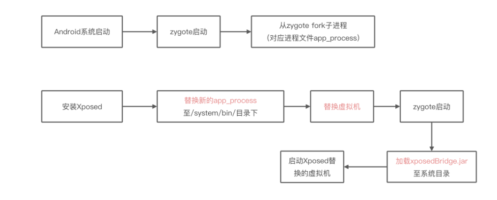
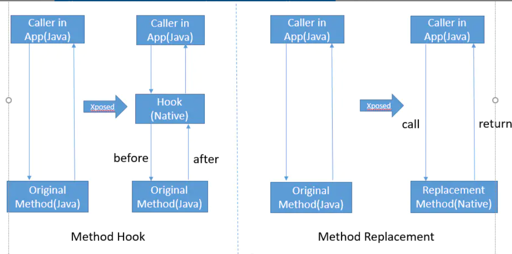
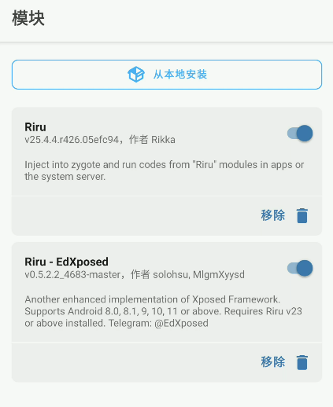
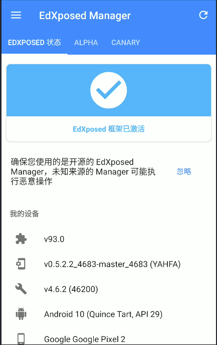
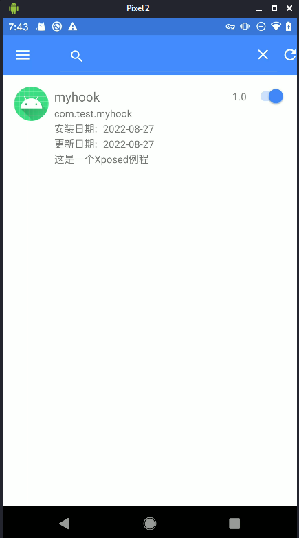
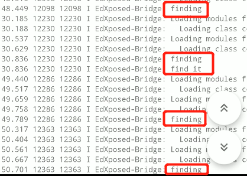

# EdXposed学习

本文参考：

[Xposed ART原理分析笔记](https://bbs.pediy.com/thread-267048.htm)

[Android Hook技术学习——常见的hook技术方案](https://bbs.pediy.com/thread-272870.htm)

[源码编译（3）——Xposed源码定制](https://bbs.pediy.com/thread-269627.htm)

## Xposed原理

Xposed可以在不修改apk的情况下改变Android系统和应用程序的行为

主要原理：

- 替换/system/bin/app_process控制zygote进程
- 让zygote进程在fork得到app过程中加载XposedBridge.jar
- 完成对zygote进程和它创建的dalvik虚拟机的劫持，允许开发者独立替代任何一个class



[Xposed](https://github.com/rovo89)相关源码

- XposedBridge： Xposed提供的jar文件，app_process启动过程中会加载该jar包，其他的Modules 的开发都是基于该jar包
- Xposed： Xposed的C++部分，主要是用来替换/system/bin/app_process，并为XposedBridge提供 JNI方法
- XposedInstaller： Xposed的安装包，提供对基于Xposed框架的Modules的管理
- android_art：Xposed修改的art部分源码

Xposed通过修改Art虚拟机，将需要hook的函数注册为Native函数，当执行这一函数时，虚拟机会优先执行Native函数，然后执行java函数，这样就成功完成了函数的hook



## EdXposed安装

Xposed官方版本中最新版本停留在Android8.0/8.1版本

[EdXposed](https://github.com/ElderDrivers/EdXposed)与Xposed的功能基本相同，主要区别在于

- EdXposed完全支持Android Pie、Q和R
- EdXposed有App列表模式。只有想用Xposed模块的app才会被hook，其他app运行在完全干净的环境中
- EdXposed不需要重启系统就能够激活大多数模块
- EdXposed很难被检测到，使用Riru来检测，不修改libart和app_process

在安装EdXposed之前需要先安装[Magisk](https://github.com/topjohnwu/Magisk)，在Magisk中安装[Riru](https://github.com/RikkaApps/Riru)和[Riru-EdXposed](https://github.com/Magisk-Modules-Repo/riru_edxposed)模块，可以采取在github上下载zip包，然后点击从本地安装的模式来安装，注意两个版本号要匹配，可以参考下图中的版本号

- Magisk：用于定制化Android的开源软件集合
- Riru：注入zygote进程使其他模块能够在app或系统服务中运行代码
  - 注入zygote进程的方法
    - v22.0版本之前，使用替换zygote加载的系统库(libmemtrack)的方法，然而会导致一些奇怪的问题
    - 之后使用"native bridge"也就是`ro.dalvik.vm.native.bridge`，这个so文件将会被系统自动的dlopen-en和dlclose-ed



安装好该模块后，手机上会出现EdXposed的app，此时还需要再根据提示下载[EdXposedManager](https://github.com/ElderDrivers/EdXposedManager)应用，才能开始使用EdXposed。安装完成后的EdXposed图下图所示



如果EdXposed报错file does not exist，可以通过在EdXposed中关、开模块来解决

## EdXposed使用

### 编写简单的hook模块

下面编写第一个hook模块

新建一个项目，在清单文件中添加：

```xml
// 在application目录下
<meta-data
	android:name="xposedmodule"
	android:value="true" />    //xposed模块识别标识设置为true
<meta-data
	android:name="xposeddescription"
	android:value="这是一个Xposed例程" />//xposed模块名称
<meta-data
	android:name="xposedminversion"
	android:value="53" />//xposed最低版本号
```

在build.gradle(app)的dependencies中添加

```
compileOnly 'de.robv.android.xposed:api:82'
compileOnly 'de.robv.android.xposed:api:82:sources'
```

添加类Myhook：实现`IXposedHookLoadPackage`接口的`handleLoadPackage`方法

打印log的两种方式：

- Log.e
- XposedBridge.log

```java
package com.test.myhook;

import de.robv.android.xposed.IXposedHookLoadPackage;
import de.robv.android.xposed.XposedBridge;
import de.robv.android.xposed.callbacks.XC_LoadPackage;

public class Myhook implements IXposedHookLoadPackage {
    @Override
    public void handleLoadPackage(XC_LoadPackage.LoadPackageParam lpparam) throws Throwable {
        // 如果打开别的app就只显示finding
        XposedBridge.log("finding");
        if(lpparam.packageName.equals("包名")) {
            // 如果打开的是想要的app就会显示finding和find it
            XposedBridge.log("find it");
        }
    }
}
```

右键点击 “main ” 文件夹，选择new --> Folder -->Assets Folder，新建assets文件夹，然后右键点击assets文件夹， new--> file，文件名为`xposed_init`(文件类型选text)，在xposed_init文件中写入Myhook类的全名：

```
com.test.myhook.Myhook
```

然后编译运行程序，EdXposed中出现该模块



运行该模块，同时点击目标app和其他app，查看EdXposed的日志：



### HOOK构造函数

- `XposedHelpers.findAndHookConstructor`
- `XposedBridge.hookAllConstructors`

第一种方法是hook某一个函数

- `lpparam.classLoader.loadClass`加载类
- `XposedHelpers.findAndHookConstructor`输入类信息、参数类别、`XC_MethodHook`对象
  - 实现`beforeHookedMethod`方法
  - 实现`afterHookedMethod`方法

```java
public class Myhook implements IXposedHookLoadPackage {
    @Override
    public void handleLoadPackage(XC_LoadPackage.LoadPackageParam lpparam) throws Throwable {
		// 判断包名
        if(lpparam.packageName.equals("com.test.myapplication")) {
            // 加载类
            Class applicationclass = lpparam.classLoader.loadClass("com.test.myapplication.Myclass");
            // 传入加载后的类信息、参数类信息
            XposedHelpers.findAndHookConstructor(applicationclass, Context.class, List.class, new XC_MethodHook() {
                // 在被Hook的方法执行之前
                @Override
                protected void beforeHookedMethod(MethodHookParam param) throws Throwable {
                    super.beforeHookedMethod(param);
                    XposedBridge.log("hook success");
                }
				// 在被Hook的方法执行之后
                @Override
                protected void afterHookedMethod(MethodHookParam param) throws Throwable {
                    super.afterHookedMethod(param);
                    XposedBridge.log("hook over");
                }
            });
        }
    }
}
```

成功hook构造函数


第二种方法是hook所有的构造函数

- `XposedBridge.hookAllConstructors`中不用输入参数类型
- `param.thisObject`获取实例
- `XposedHelpers.callMethod(实例，方法名)`调用实例方法

```java
// 参数包含加载后的类
XposedBridge.hookAllConstructors(applicationclass, new XC_MethodHook() {
    @Override
    protected void beforeHookedMethod(MethodHookParam param) throws Throwable {
        super.beforeHookedMethod(param);
        XposedBridge.log("hook success2");
        // 修改函数参数
        param.args[1] = "new_param";
    }

    @Override
    protected void afterHookedMethod(MethodHookParam param) throws Throwable {
        super.afterHookedMethod(param);
        XposedBridge.log("hook over2");
        // 打印函数参数，可能需要强转参数的类型
        XposedBridge.log((String) param.args[0]);
        XposedBridge.log((String) param.args[1]);
        // param.thisObject获取实例，XposedHelpers.callMethod调用实例方法
        int count = (int) XposedHelpers.callMethod(param.thisObject, "getCount");
        XposedBridge.log(String.valueOf(count));
    }
});
```

### HOOK普通函数

- `XposedHelpers.findAndHookMethod`
- `XposedBridge.hookAllMethod`

第一种方法指定函数参数

- `XposedHelpers.findAndHookMethod`

```java
if(lpparam.packageName.equals("com.test.myapplication")) {
    XposedHelpers.findAndHookMethod("com.test.myapplication.MainActivity", lpparam.classLoader, "方法名", String.class, new XC_MethodHook() {
        @Override
        protected void beforeHookedMethod(MethodHookParam param) throws Throwable {
            super.beforeHookedMethod(param);
        }

        @Override
        protected void afterHookedMethod(MethodHookParam param) throws Throwable {
            super.afterHookedMethod(param);
            // 打印参数和返回值
            XposedBridge.log((String) param.args[0]);
            XposedBridge.log((String) param.getResult());
            // param.setResult(XXX)可以修改函数返回值
        }
    });
}
```

第二种方法打印同名函数的所有重载

- `XposedBridge.hookAllMethod`需要传函数名，但是不需要传函数的参数信息

```java
Class mainActivity = lpparam.classLoader.loadClass("com.test.myapplication.MainActivity");
XposedBridge.hookAllMethods(mainActivity, "方法名", new XC_MethodHook() {
	@Override
	protected void beforeHookedMethod(MethodHookParam param) throws Throwable {
        super.beforeHookedMethod(param);
    }

	@Override
    protected void afterHookedMethod(MethodHookParam param) throws Throwable {
        super.afterHookedMethod(param);
        XposedBridge.log((String) param.args[0]);
        XposedBridge.log((String) param.getResult());
    }
});
```

### 获取实例并修改对象属性

可以通过oncreate方法获取MainActivity实例间接修改所需类属性

首先通过MainActivity的onCreate方法获取MainActivity实例（需要慢一点，等它加载完）

- `param.thisObject`获取活动实例

然后在每次Message构造函数调用发送更新UI的消息之前，获取并修改MainActivity实例的属性值（需要耐心等待）

- `XposedHelpers.getObjectField`获取对象属性
- `XposedHelpers.setObjectField`设置对象属性

```java
public class Myhook implements IXposedHookLoadPackage {
    Activity activity;
    @Override
    public void handleLoadPackage(XC_LoadPackage.LoadPackageParam lpparam) throws Throwable {
        if(lpparam.packageName.equals("com.test.myapplication")) {
            Class mainActivity = lpparam.classLoader.loadClass("com.test.myapplication.MainActivity");
            XposedBridge.hookAllMethods(mainActivity, "onCreate", new XC_MethodHook() {
                @Override
                protected void beforeHookedMethod(MethodHookParam param) throws Throwable {
                    super.beforeHookedMethod(param);
                }

                @Override
                protected void afterHookedMethod(MethodHookParam param) throws Throwable {
                    super.afterHookedMethod(param);
                    // 获取Activity实例
                    activity = (Activity) param.thisObject;
                }
            });
            Class message = lpparam.classLoader.loadClass("android.os.Message");
            XposedBridge.hookAllConstructors(message, new XC_MethodHook() {
                @Override
                protected void beforeHookedMethod(MethodHookParam param) throws Throwable {
                    super.beforeHookedMethod(param);
                }

                @Override
                protected void afterHookedMethod(MethodHookParam param) throws Throwable {
                    super.afterHookedMethod(param);
                    // 获取实例属性
                    String name = (String) XposedHelpers.getObjectField(activity, "name");
                    // 设置实例属性
                    String replace = "XXXXX";
                    XposedHelpers.setObjectField(activity, "name", replace);
                }
            });
        }
    }
}
```

### 主动调用函数

- 先获取MainActivity实例（通过initViews也可以）
- 再通过`XposedHelpers.callMethod`调用其函数，`XposedHelpers.callStaticMethod`调用静态函数

```java
XposedBridge.hookAllMethods(lpparam.classLoader.loadClass("com.dta.dtawallpaper.MainActivity"), "initViews", new XC_MethodHook() {
    @Override
    protected void beforeHookedMethod(MethodHookParam param) throws Throwable {
        super.beforeHookedMethod(param);
        Activity activity = (Activity) param.thisObject;
        String result = (String) XposedHelpers.callMethod(activity, "方法名", "参数值");
        Log.e("test123", result);
    }

    @Override
    protected void afterHookedMethod(MethodHookParam param) throws Throwable {
        super.afterHookedMethod(param);
    }
});
```

