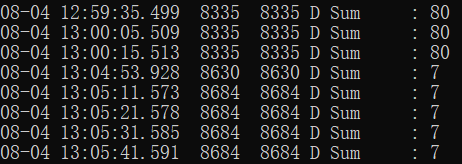
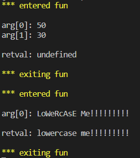
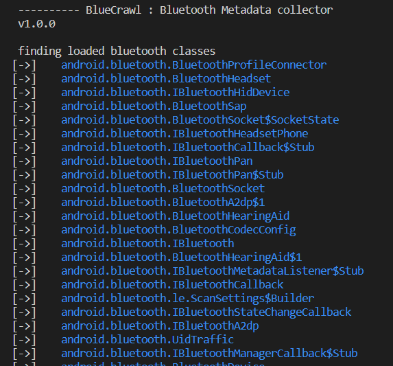
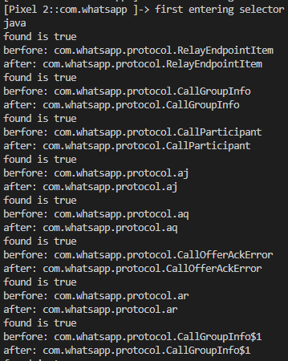

# frida学习

[主要参考链接](https://github.com/r0ysue/AndroidSecurityStudy)，本文是r0ysue系列文章的复现

frida是面向开发人员、逆向工程师和安全研究人员的动态工具集

可以用它将JavaScript的片段或自己的库注入Windows，MacOS，GNU/Linux，iOS，Android和QNX上的本机应用程序。Frida还提供了一些在Frida API之上构建的简单工具。

两种模式：

- attach模式
  - attach到已经存在的进程，核心原理是通过ptrace修改内存，如果内存处于调试状态（traceid不为0），则attach失败
- spawn模式
  - 启动一个新的进程并挂起，在启动进程的同时注入frida代码，适用于需要在进程启动前进行hook的部分，如hook RegisterNative，注入完成后输入`%resume`恢复进程

## frida原理

Frida原理和Xposed hook一样，也是把java method转为native method，并修改函数的入口，使得调用时能够执行自定义代码

但是ART模式下的实现与Dalvik模式下实现不同，参考文章[Frida源码分析](https://mabin004.github.io/2018/07/31/Mac%E4%B8%8A%E7%BC%96%E8%AF%91Frida/)，下面主要介绍ART模式下的实现

ART虚拟机执行Java方法主要有两种模式

- quick code模式：执行arm汇编指令
- Interpreter模式：解释器解释执行Dalvik字节码

在一种模式执行过程中，可能有类的方法需要用另一种模式执行

- Interpreter模式执行的类方法通过`artInterpreterToCompiledCodeBridge`函数的返回值调用quick code模式执行的类方法
- quick code模式执行的类方法通过`artQuickToInterpreterBridge`的返回值调用Interpreter模式执行的类方法

对于一个native方法，ART虚拟机会先尝试使用quick code模式执行，检查ARTMethod结构中的`entry_point_from_quick_compiledcode`成员：

- 如果函数已经存在quick code, 则指向这个函数对应的 quick code的起始地址
- 当一个 java 函数不存在 quick code时，它的值是函数`artQuickToInterpreterBridge`的地址，用以从 quick code模式切换到 Interpreter模式来解释执行 java 函数代码
- 当一个 java native（JNI）函数不存在 quick code时，它的值是函数`art_quick_generic_jni_trampoline`的地址，用以执行没有quick code的 jni 函数
  - frida将java方法改为jni方法是不存在quick code的，所以需要将该成员的值改为`art_quick_generic_jni_trampoline`的地址

总结，frida把java method改为jni method，需要修改ARTMethod结构体中的这几个值：

```
accessflags = native
entry_point_fromjni = 自定义代码的入口
entry_point_from_quick_compiledcode = art_quick_generic_jni_trampoline函数的地址
entry_point_frominterpreter = artInterpreterToCompiledCodeBridge函数地址
```

## 使用配置

frida-server版本和pip安装的frida版本要一致

关闭selinux：

```
adb shell getenforce
adb shell setenforce 0 
```

frida直接运行js脚本：

-U usb，-f target，-l script，--no-pause 在启动后自动开始主线程

```
frida -U -f com.example.testfrida2 -l 1.js --no-pause
```

## 基本使用

### hook参数、修改结果

附件：1.apk 1.js

app中onCreate函数中调用fun(50,30)，fun函数实现：

```java
public void fun(int x , int y ){
    Log.d("Sum" , String.valueOf(x+y));
}
```

frida js：

- Dalvik层的代码必须定义为一个函数并使用**Java.perform(...)**注册
- **Java.use**选取要HOOK的类
- fun是方法名，如果要hook构造函数，则使用`$init`
- 将目标方法的**implementation**属性修改为一个新的函数，其**参数的数量必须与原函数相同**
  - 运行原方法只需在函数内部调用**this.方法名**
  - 需要根据原函数的返回值类型，return相应类型的**返回值**
- setImmediate()用于异步执行一段代码，越快越好

```javascript
function main() {
    Java.perform(() => {
        var my_class = Java.use("com.example.testfrida2.MainActivity");
        my_class.fun.implementation = function(x,y){
                this.fun(2,5);
                console.log("x => " + x + "   y => " + y);
            };
    });
}

setImmediate(main)
```

运行效果：


logcat | grep Sum，看到log改变：



### 参数构造、方法重载、隐藏函数处理

附件：2.apk、2.js

app中定义一个成员、两个fun及其调用：

```java
private String total = "@@@###@@@";
```

onCreate函数中：

```java
fun(50,30);
Log.d("ROYSUE.string" , fun("LoWeRcAsE Me!!!!!!!!!"));
```

```java
void fun(int x , int y ){
    Log.d("ROYSUE.Sum" , String.valueOf(x+y));
}

String fun(String x){
    total +=x;
    return x.toLowerCase();
}

String secret(){
    return total;
}
```

frida js：

- **overload**实现函数重载
- **参数构造**
  - 构造java string类型参数需获取**java.lang.String**类，通过**类.new()**方法构造参数
  - 构造char类型的java array类型参数
    - `Java.array('char', ['a', 'b', 'c', 'd'])`
- Java.choose**选择内存中已有的实例**，Java.use会**新建实例**
- **Java.choose**
  - **onMatch**查找类的实例，调用每个类实例的方法，有多少类实例就会调用多少次
  - 找到实例instance后，通过instance.方法名就可以**主动调用方法**
- **主动调用静态方法**
  - 直接用类名.方法就可以`Java.use("com.test.demo").static_add("123", "456");`

```javascript
function main() {
    Java.perform(() => {
        var string_class = Java.use("java.lang.String");
        var my_class = Java.use("com.example.testfrida2.MainActivity");
        my_class.fun.overload("java.lang.String").implementation = function(x){
            console.log("Original arg: " + x );
            // 构造一个string类型的参数
            var my_string = string_class.$new("My Test String#####");
            var ret =  this.fun(my_string);
            console.log("Return value: " + ret);
            return ret;
            };
        my_class.fun.overload("int" , "int").implementation = function(x,y){
            console.log("x => " + x + "   y => " + y);
            this.fun(x, y);
            console.log("*************************************");
            };
        Java.choose("com.example.testfrida2.MainActivity" , {
            onMatch : function(instance){
                console.log("Found instance: "+instance);
                // 调用隐藏函数
                console.log("Result of secret func: " + instance.secret());
            },
            onComplete:function(){}
            });
    });
}

setImmediate(main)
```

运行效果：


#### hook某个函数的所有重载

附件：2.apk hook.js

- 目标类[目标方法].overloads.length获取**重载函数的个数**
- 目标类[目标方法].overloads[i]**索引重载函数**
- arguments.length获取**参数的个数**，arguments[j]**索引参数值**
- this[方法].apply(this, arguments)**获取返回值**

在实际中一般等到frida报错，提示函数所有可能的重载后，再选择自己想要参数类型的重载函数在overload中写明

```javascript
setTimeout(function (){
    Java.perform(function (){
        // 目标类
        var hook = Java.use("com.example.testfrida2.MainActivity");
        // 目标方法
        var targetMethod = 'fun';
        // 重载次数
        var overloadCount = hook[targetMethod].overloads.length;
        console.log("Tracing " + targetMethod + " [" + overloadCount + " overload(s)]");
        // 进入每个目标方法
        for (var i = 0; i < overloadCount; i++) {
            hook[targetMethod].overloads[i].implementation = function() {
                console.warn("\n*** entered " + targetMethod);
                //可以打印每个重载的调用栈，对调试有巨大的帮助，当然，信息也很多，尽量不要打印，除非分析陷入僵局
                // var bt = Java.use("android.util.Log").getStackTraceString(Java.use("java.lang.Exception").$new());
                // console.log("\nBacktrace:\n" + bt); 
        
                // 打印参数
                if (arguments.length) console.log();
                for (var j = 0; j < arguments.length; j++) {
                    console.log("arg[" + j + "]: " + arguments[j]);
                }

                //打印返回值
                var retval = this[targetMethod].apply(this, arguments); // rare crash (Frida bug?)
                console.log("\nretval: " + retval);
                console.warn("\n*** exiting " + targetMethod);
                return retval;
            }
        }
    });
});
```



## 其他技巧

### 打印Java常用数据结构

枚举类

```javascript
var color = Java.use("com.test.app.Color");
console.log(color.RED.value);
```

List

```javascript
for(var i = 0; i < list.size(); i++)
    console.log(list.get(i));
```

Map

```javascript
var keySet = map.keySet();
var iterator = keySet.iterator();
while(iterator.hasNext()) {
    var key = iterator.next();
    console.log(key);
    console.log(map.get(key));
}
```

### 使用Gson打印Java对象

直接打印Java对象，会显示[Object object]

使用Gson，可以将Java对象打印成Json格式

但是在使用gson.dex打印[object]的时候，有时候apk里内置了一个gson，再load就会有重名的问题，使用r0ysue编译的改了包名的gson，就不会再重名了

使用方法：将r0gson.dex文件adb push到fridaserver同目录下之后

```javascript
Java.openClassFile("/data/local/tmp/r0gson.dex").load(); 
const gson = Java.use('com.r0ysue.gson.Gson'); 
console.log(gson.$new().toJson(xxx));
```

### 注册Java类

`Java.registerClass`注册类

- name：类名
- superClass：基类
- implements：实现的接口
- fields：属性
- methods：方法
  - returnType
  - argumentTypes
  - implementation

```javascript
const SomeBaseClass = Java.use('com.example.SomeBaseClass');
const X509TrustManager = Java.use('javax.net.ssl.X509TrustManager');

const MyTrustManager = Java.registerClass({
  name: 'com.example.MyTrustManager',
  implements: [X509TrustManager],
  methods: {
    checkClientTrusted(chain, authType) {
    },
    checkServerTrusted(chain, authType) {
    },
    getAcceptedIssuers() {
      return [];
    },
  }
});
```

### 切换classloader

为使用后续被其他classloader加载进内存的类

- 通过`Java.enumerateClassLoaders`枚举所有的类加载器
- `loader.findClass(类名)`找到所需的类加载器
- 更改当前正在使用的类加载器`Java.classFactory.loader = loader`

```javascript
Java.enumerateClassLoaders({
	onMatch: function(loader){
        try{
            if(loader.findClass("com.test.app.MyClass")){
            console.log("find it");
            Java.classFactory.loader = loader;
            }
        }
        catch(E){

        }
	},
	onComplete: function(){
    	console.log("complete");
    }
})
```

## 远程调用

附件：2.apk、2-1.py、2-1.js

使用`frida`提供的`RPC`功能

python脚本：

- **script.exports.函数名()**直接调用frida脚本

```python
import time
import frida

def my_message_handler(message, payload):
    print(message)
    print(payload)

device = frida.get_usb_device()
pid = device.spawn(["com.example.testfrida2"])
device.resume(pid)
time.sleep(1)
session = device.attach(pid)
with open("2-1.js") as f:
    script = session.create_script(f.read())
script.on("message", my_message_handler)
script.load()

command = ""
while 1 == 1:
    command = input("Enter command:\n1: Exit\n2: Call secret function\nchoice:")
    if command == "1":
        break
    elif command == "2": #在这里调用
        script.exports.callsecretfunction()
```

js脚本：

- **rpc.exports**定义导出符号映射关系，把callSecretFun函数导出为callsecretfunction符号，导出名**不可以有大写字母或者下划线**

```javascript
console.log("Script loaded successfully ");

function callSecretFun() { 
    Java.perform(function () {
        Java.choose("com.example.testfrida2.MainActivity", {
            onMatch: function (instance) {
                console.log("Found instance: " + instance);
                console.log("Result of secret func: " + instance.secret());
            },
            onComplete: function () { }
        });
    });
}
rpc.exports = {
    callsecretfunction: callSecretFun
};
```

vscode输出：


## 互联互通、动态修改

附件：3.apk、3.js、3.py

app中onCreate函数中设计一个简单的登录数据传输逻辑：

- 如果输入admin，提示不能以admin身份登录
- 否则，输出name和password的base64编码

```java
password_et = (EditText) this.findViewById(R.id.editText2);
username_et = (EditText) this.findViewById(R.id.editText);
message_tv = ((TextView) findViewById(R.id.textView));

this.findViewById(R.id.button).setOnClickListener(new View.OnClickListener() {
    @Override
    public void onClick(View v) {

        if (username_et.getText().toString().compareTo("admin") == 0) {
            message_tv.setText("You cannot login as admin");
            return;
        }
        //hook target
        message_tv.setText("Sending to the server :" + Base64.encodeToString((username_et.getText().toString() + ":" + password_et.getText().toString()).getBytes(), Base64.DEFAULT));

    }
});
```

效果：


frida 涉及到python和js的交互

python代码：主要处理数据

- **my_message_handler**接收和发送给js代码消息

```python
import time
import frida
import base64

def my_message_handler(message, payload):
    if message["type"] == "send" and message["payload"]:
        data = message["payload"].split(":")[1].strip()
        print('message:', message)
        data = base64.decodebytes(data.encode('utf-8')) # 对data进行解码
        data = str(data)
        user, pw = data.split(":")
        data = base64.encodebytes(("admin" + ":" + pw).encode()) # 重新加密数据，尝试以admin登录
        data = str(data)
        print("encoded data:", data)
        script.post({"my_data": data})  # 将JSON对象发送回去
        print("Modified data sent")

device = frida.get_usb_device()
pid = device.spawn(["com.example.testfrida2"])
device.resume(pid)
time.sleep(1)
session = device.attach(pid)
try:
    with open("3.js") as f:
        script = session.create_script(f.read())
    script.on("message", my_message_handler)  # 注册消息处理函数
    script.load()
except Exception as e:
    print(e)
```

js代码：主要负责截获数据，将数据发给python处理，接收python传来的数据进行下一步操作

- 修改TextView类的setText实现
- **send**函数向python发送消息
- **recv**函数接收python端消息
- **wait**函数表明接收到数据后再进行下一步操作

```javascript
Java.perform(() => {
    var tv_class = Java.use("android.widget.TextView"); 
    tv_class.setText.overload("java.lang.CharSequence").implementation = function (x) {
        var string_to_send = x.toString();
        var string_to_recv;
        send(string_to_send); 
        recv(function (received_json_object) {
            string_to_recv = received_json_object.my_data
            console.log("string_to_recv: " + string_to_recv);
        }).wait(); 
        string_to_recv = Java.use("java.lang.String").$new(string_to_recv);
        return this.setText(string_to_recv);
    }
});
```

python输出为：


## 简单脚本

附件：test.js

### 枚举所有的类

- Java.enumerateLoadedClasses实现枚举类的功能

```javascript
setTimeout(function (){
    Java.perform(function (){
      console.log("\n[*] enumerating classes...");
      var sum = 0;
      Java.enumerateLoadedClasses({
        onMatch: function(_className){
          console.log("[*] found instance of '"+_className+"'");
          sum += 1;
        },
        onComplete: function(){
          console.log("[*] class enuemration complete");
          console.log("[*] the number of the classes:" + sum);
        }
      });
    });
  });
```

运行：

```
frida -U -l test.js com.android.bluetooth
```

结果：


### 定位目标类并打印类的实例

增加实例名中是否包含bluetooth的判断

```javascript
setTimeout(function (){
    Java.perform(function (){
        Java.enumerateLoadedClasses({
            onMatch: function(instance){
              if (instance.split(".")[1] == "bluetooth"){
                console.log("[->]\t"+instance);
              }
            },
            onComplete: function() {
              console.log("[*] class enuemration complete");
            }
          });
    });
});
```


选择android.bluetooth.BluetoothDevice类，输出已连接设备的MAC地址和名称

```javascript
Java.choose("android.bluetooth.BluetoothDevice",{
    onMatch: function (instance){
        console.log("[*] "+" android.bluetooth.BluetoothDevice instance found"+" :=> '"+instance+"'");
        console.log(instance.getAddress())
        console.log(instance.getName())
    },
    onComplete: function() { console.log("[*] -----");}
});
```


### 枚举所有方法并定位方法

- 类名.class.getDeclaredMethods()获取类中所有方法
- $dispose销毁对象

```javascript
function enumMethods(targetClass)
{
	var hook = Java.use(targetClass);
    // 通过反射获取所有声明的方法
	var ownMethods = hook.class.getDeclaredMethods();
	hook.$dispose;
	return ownMethods;
}

setTimeout(function (){
    Java.perform(function (){
        var a = enumMethods("android.bluetooth.BluetoothDevice")
		a.forEach(function(s) {
			console.log(s);
		});
    });
});
```


### 综合案例：在安卓10上dump蓝牙接口和实例

附件：bluecrawl-1.0.0-change.js

附件为[BlueCrawl](https://github.com/IOActive/BlueCrawl)的修改版，主要将`\033`修改为`\x1B`，给一些变量声明前加上`var`，解决报错

主要运行函数逻辑：

```javascript
// 枚举包含bluetooth名称的类
Java.enumerateLoadedClasses({
    onMatch: function(instance){
        if (instance.split(".")[1] == "bluetooth"){
            ...
        }
    },
    onComplete: function() {}
});
// 查找并打印各类信息
Java.choose("android.bluetooth.BluetoothGattServer",{
    onMatch: function (instance){
       	...
        // 调用Info函数打印实例属性
        bluetoothGattServerInfo(instance);		
    },
    onComplete: function() { console.log("[*] -----");}
});
Java.choose("android.bluetooth.BluetoothGattService",{...});
Java.choose("android.bluetooth.BluetoothSocket",{...});
Java.choose("android.bluetooth.BluetoothServerSocket",{...});
Java.choose("android.bluetooth.BluetoothDevice",{...});
```

输出结果：




## Hook Native层

附件：4.apk 4.js

编写so库可以看本系列之前的文章

注意在android studio中，要用的libs库所在的文件夹必须命名为jniLibs，才能被识别：


jniLibs文件夹中包含各版本的lib库：


效果：


点击后：


frida脚本：

- **Module.findExportByName**指定要Hook的so文件名和要Hook的函数名（IDA中的导出函数名）
- **onEnter: function(args)**是进入该函数前要执行的代码，其中args是传入的参数，一般so层函数第一个参数都是JniEnv，第二个参数是jclass，从第三个参数开始才是java层传入的参数
- **onLeave: function(retval)**是该函数执行结束要执行的代码，其中retval参数即是返回值
- **retval.replace(0);**替换返回值

```javascript
setTimeout(()=>{
    Java.perform(()=>{
        var addr = Module.findExportByName("libMyJni.so", "Java_com_example_testfrida3_MyJni_add");
        Interceptor.attach(addr, {
            onEnter: function(args) {
                console.log("Hook Start");
                console.log("arg[2] = " + args[2]);
                console.log("arg[3] = " + args[3]);
            },
            onLeave: function(retval) {
                console.log("return = " + retval);
                retval.replace(0);
            }
        });
    });
});
```

`frida -U -f com.example.testfrida3 -l 4.js --no-pause`执行frida脚本


## 动静态结合逆向WhatsApp

附件：raptor_frida_android_trace_fixed.js com.whatsapp_2.18.380-452623_minAPI15(arm64-v8a)(nodpi)_apkmirror.com.apk

raptor_frida_android_trace_fixed_rewrite.js为自己参考并重新的脚本

libc.so为pixel手机导出的库文件

### raptor_frida_android_trace_fixed.js 脚本分析

#### setTimeout

调用trace函数，向trace函数传递一个字符串

```js
setTimeout(function() { // avoid java.lang.ClassNotFoundException
	Java.perform(function() {
		console.log("first entering selector")
		// trace("com.whatsapp.protocol");
		trace("exports:*!open*");
		//trace("exports:*!write*");
		//trace("exports:*!malloc*");
		//trace("exports:*!free*");
	});
}, 0);
```

#### trace

判断模式类型是module、java class还是java method

```js
function trace(pattern) {
    var type = (pattern.toString().indexOf("!") === -1) ? "java" : "module";
    if (type === "module") {
        // 获取所有匹配的且不重复的module
        var res = new ApiResolver("module");
        var matches = res.enumerateMatchesSync(pattern);
        var targets = uniqBy(matches, JSON.stringify);
        // 遍历modules，调用
        	traceModule(target.address, target.name);
    } else if (type === "java") {
        // 在已加载的类中查找是否有匹配的class
        Java.enumerateLoadedClasses({
			onMatch: function(aClass) {
				if (aClass.match(pattern)) {
                    var className = aClass.match(/[L]?(.*);?/)[1].replace(/\//g, ".");
                    // 追踪class
                    traceClass(className);}}}
        // 未找到相应的class就会trace Java Method
        traceMethod(pattern);
    }
}
```

##### trace module例子

`exports:*!open*`例子中，trace的Module：


里面的libc.so可以在相应文件夹下找到，使用adb pull把它导出到主机上，也可以在IDA中的exports框中查看相关的导出函数信息


##### trace class例子

trace输入为`"com.whatsapp.protocol"`，可以追踪到匹配的类



#### traceClass

查找匹配class，打印所有满足条件的方法：

```js
// 找到类中所有声明的方法
var hook = Java.use(targetClass);
var methods = hook.class.getDeclaredMethods();
hook.$dispose();
parsedMethods.push(method.toString().replace(targetClass + ".", "TOKEN").match(/\sTOKEN(.*)\(/)[1]);
var targets = uniqBy(parsedMethods, JSON.stringify);
// 对每个方法trace
	traceMethod(targetClass + "." + targetMethod);
```

methods和经过解析的methods，解析后的methods只取了最后括号前的方法名称


#### traceMethod

查找一个方法的所有重载

```js
// 拆分成类名和单独的方法名
var targetClass = targetClassMethod.slice(0, delim)
var targetMethod = targetClassMethod.slice(delim + 1, targetClassMethod.length)
// 获取方法的所有重载
var hook = Java.use(targetClass);
var overloadCount = hook[targetMethod].overloads.length;
// 遍历每个重载方法，打印参数和返回值
```

获取方法的所有重载：


#### traceModule

打印当前线程的调用栈

```js
console.log("\nBacktrace:\n" + Thread.backtrace(this.context, Backtracer.ACCURATE)
						.map(DebugSymbol.fromAddress).join("\n"));
```

`exports:*!open*`例子中，进入和离开函数打印的调用栈和返回值


#### uniqBy

去除数组中的重复值

```js
var seen = {};
    // filter()方法创建一个新的数组，新数组中是原数组中符合条件的元素
    return array.filter(function(item) {
        // 将Java对象或值转换为JSON字符串
        var k = key(item);
        // 已经存在该属性，则返回false；否则，返回true同时将k作为seen的新属性
        return seen.hasOwnProperty(k) ? false : (seen[k] = true);
    });
```

打印下item，key的值，item显示为[object Object]，key的值可以正常显示name和address

[object Object]是javascript中对象的默认toString表示，object指的是结构，Object指的是构造器函数名称，[参考](https://stackoverflow.com/questions/4750225/what-does-object-object-mean)


### 知识补充

[Frida官方手册 - JavaScript API（篇一）](https://zhuanlan.kanxue.com/article-342.htm)

[Frida官方手册 - JavaScript API（篇二）](https://zhuanlan.kanxue.com/article-414.htm)

#### ApiResolver

- new ApiResolver(type):

  创建指定类型type的API查找器，可以根据函数名称快速定位到函数地址，根据当前进程环境不同，可用的ApiResolver类型也不同，到目前为止，可用的类型有：

  - **Module:** 枚举当前进程中**已经加载**的动态链接库的**导入导出**函数名称。
  - **objc:** 定位已经加载进来的Object-C类方法，在macOS和iOS进程中可用，可以使用 **Objc.available** 来进行运行时判断，或者在 **try-catch** 块中使用 **new ApiResolver(‘objc’)** 来尝试创建。
  - 解析器在创建的时候，会加载最小的数据，后续使用懒加载的方式来持续加载剩余的数据，因此最好是一次相关的批量调用使用同一个resolver对象，然后下次的相关操作，重新创建一个resolver对象，避免使用上个resolver的老数据。

- enumerateMatchesSync(query):

  执行函数查找过程，按照参数**query**来查找，返回值有**name**和**address**两个属性

  enumerateMatches()的同步版本，直接返回所有结果的数组形式

```js
var res = new ApiResolver("module");
var matches = res.enumerateMatchesSync(pattern);
```

#### Thread

- Thread.backtrace([context, backtracer]) 

  抓取当前线程的调用堆栈，并以 **NativePointer** 指针数组的形式返回。

  - 如果是在 **Interceptor.onEnter**或者**Interceptor.onLeave** 中调用这个函数的话，那就必须要把 this.context 作为参数传入，这样就能拿到更佳精准的堆栈调用信息，如果省略这个参数不传，那就意味着从当前堆栈的位置开始抓取，这样的抓取效果可能不会很好，因为有不少V8引擎的栈帧的干扰。
  - 第二个可选参数 **backtracer**，表示使用哪种类型的堆栈抓取算法，目前的取值范围是 **Backtracer.FUZZY** 和 **Backtracer.ACCURATE**，目前后者是默认模式。精确抓取模式下，如果如果程序是调试器友好（比如是标准编译器编译的结果，没有什么反调试技巧）或者有符号表的支持，抓取效果是最好的，而模糊抓取模式下，抓取器会在堆栈上尝试抓取，并且会猜测里面包含的返回地址，也就是说中间可能包含一些错误的信息，但是这种模式基本能在任何二进制程序里面工作。

#### **DebugSymbol**

- DebugSymbol.fromAddress(address), DebugSymbol.fromName(name)

  在指定地址或者指定名称查找符号信息，返回的符号信息对象包含下面的属性：

  - **address:** 当前符号的地址，NativePointer
  - **name:** 当前符号的名称，字符串形式
  - **moduleName:** 符号所在的模块名称
  - **fileName:** 符号所在的文件名
  - **lineNumber:** 符号所在的文件内的行号
  - 为了方便使用，也可以在这个对象上直接使用 **toString()** ，输出信息的时候比较有用，比如和 **Thread.backtrace** 配合使用

```javascript
console.log("\nBacktrace:\n" + Thread.backtrace(this.context, Backtracer.ACCURATE)
						.map(DebugSymbol.fromAddress).join("\n"));
```

#### Java

- **Java.available:** 布尔型取值，表示当前进程中是否存在完整可用的Java虚拟机环境，Dalvik或者Art，建议在使用Java方法之前，使用这个变量来确保环境正常
- **Java.enumerateLoadedClasses(callbacks)**:枚举当前进程中已经加载的类，每次枚举到加载的类回调callbacks:
  - **onMatch: function(className):** 枚举到一个类，以类名称进行回调，这个类名称后续可以作为 **Java.use()** 的参数来获取该类的一个引用对象。
  - **onComplete: function():** 所有的类枚举完毕之后调用

- **Java.use(className):** 对指定的类名动态的获取这个类的JavaScript引用
  - 后续可以使用**$new()**来调用类的构造函数进行类对象的**创建**
  - 可以主动调用 **$dispose()** 来调用类的析构函数来进行对象**清理**（或者等待Java的垃圾回收，再或者是JavaScript脚本卸载的时候）
  - 静态和非静态成员函数在JavaScript脚本里面也都是可见的， 你可以替换Java类中的方法，甚至可以在里面抛出异常

- **Java.choose(className, callbacks)**:在Java的内存堆上**扫描**指定类名称的Java对象，每次扫描到一个对象，则回调

  callbacks:

  - **onMatch: function(instance):** 每次扫描到一个实例对象，调用一次，函数返回**stop**结束扫描的过程
  - **onComplete: function():** 当所有的对象都扫描完毕之后进行回调

#### **Interceptor**

- **Interceptor.attach(target, callbacks)**

  在target指定的位置进行函数调用拦截，target是一个NativePointer参数，用来指定想要拦截的函数的地址，有一点需要注意，在32位ARM机型上，ARM函数地址末位一定是0（2字节对齐），Thumb函数地址末位一定1（单字节对齐），如果使用的函数地址是用Frida API获取的话， 那么API内部会自动处理这个细节（比如：**Module.findExportByName()**）。其中callbacks参数是一个对象，大致结构如下：

  - **onEnter: function(args):** 被拦截函数调用之前回调，其中原始函数的参数使用args数组（NativePointer对象数组）来表示，可以在这里修改函数的调用参数。
  - **onLeave: function(retval):** 被拦截函数调用之后回调，其中retval表示原始函数的返回值，retval是从NativePointer继承来的，是对原始返回值的一个封装，你可以使用**retval.replace(1337)**调用来修改返回值的内容。需要注意的一点是，retval对象只在 onLeave函数作用域范围内有效，因此如果你要保存这个对象以备后续使用的话，一定要使用**深拷贝**来保存对象，比如：ptr(retval.toString())。

#### **Module**

- **Module.emuerateImports(name, callbacks):**

  枚举模块name的导入表，枚举到一个导入项的时候回调callbacks, callbacks包含下面2个回调：

  - **onMatch: function(imp):**枚举到一个导入项到时候会被调用，imp包含如下的字段：
    1. **type**，导入项的类型， 取值范围是 **function**或者**variable**
    2. **name**，导入项的名称
    3. **module**，模块名称
    4. **address**，导入项的绝对地址
    5. 以上所有的属性字段，只有 **name** 字段是一定会有，剩余的其他字段不能保证都有，底层会尽量保证每个字段都能给出数据，但是不能保证一定能拿到数据，onMatch函数可以返回字符串 **stop** 表示要停止枚举。
  - **onComplete: function():** 当所有的导入表项都枚举完成的时候会回调

- **Module.emuerateExports(name, callbacks):**

   枚举指定模块name的导出表项，结果用callbacks进行回调：

  - **onMatch: function(exp):**其中 exp 代表枚举到的一个导出项，包含如下几个字段：
    1. **type**，导出项类型，取值范围是 **function**或者**variable**
    2. **name**，导出项名称
    3. **address**，导出项的绝对地址，NativePointer
    4. 函数返回 **stop** 的时候表示停止枚举过程
  - **onComplete: function():** 枚举完成回调

- **Module.enumerateSymbols(name, callbacks):** 枚举指定模块中包含的符号，枚举结果通过回调进行通知：
  - onMatch: function(sym):其中sym包含下面几个字段：
    - isGlobal，布尔值，表示符号是否全局可见
    - type，符号的类型，取值是下面其中一种：
      - unknown、undefined、absolute、section、prebound-undefined、indirect
    - section，如果这个字段不为空的话，那这个字段包含下面几个属性：
      - id，小节序号，段名，节名
      - protection，保护属性类型， rwx这样的属性
    - name，符号名称
    - address，符号的绝对地址，NativePointer
    - 这个函数返回 stop 的时候，表示要结束枚举过程

- **Module.findBaseAddress(name):** 获取指定模块的基地址
- **Module.findExportByName(module | null, exp):** 返回模块module内的导出项的绝对地址，如果模块名不确定，第一个参数传入 null，这种情况下会增大查找开销，尽量不要使用。