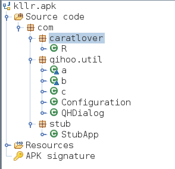

# Objection

基于Frida的一个runtime mobile exploration工具包，不需要越狱就可以访问移动端应用的security posture

主要参考[实用FRIDA进阶：内存漫游、hook anywhere、抓包](https://www.anquanke.com/post/id/197657)

先查看完整包名

```
frida-ps -U | grep 包名中的关键词 
```

objection注入应用

```
objection -g com.android.settings explore
```

测试命令

`env`查看应用环境信息

`frida`查看frida版本信息

`memory list modules`查看内存中加载的库信息

`memory list exports libssl.so`查看库的导出函数信息

## objection使用

### 内存堆搜索与执行

在堆上搜索某个类的实例

本例子中需要点击进入显示页面才会出现这个实例

```
android heap search instances com.android.settings.DisplaySettings
```


调用实例方法

```
android heap execute 0x31ca getPreferenceScreenResId
```


在实例上执行js代码

```
android heap evaluate 0x31ca
```

0x31ca可以用作clazz变量


### 查看当前可用的activity或service

```
android hooking list activities
```


启动activity或service

```
android intent launch_activity com.android.settings.nfc.HowItWorks
```


### 内存漫游

列出内存中所有的类

```
android hooking list classes
```


根据关键词搜索特定类

```
android hooking search classes display 
```


根据关键词搜索特定方法（很慢）

```
android hooking search methods wifiDisplay
```

查看特定类的所有方法

```
android hooking list class_methods com.android.settings.DisplaySettings
```


### HOOK

hook类的所有方法

```
android hooking watch class android.bluetooth.BluetoothDevice
```


查看hook的函数数量

```
jobs list
```


点开已连接的设备，就会显示操作调用的方法


删除一个hook任务

```
jobs kill innetg726f
```

hook单个方法的参数、返回值、调用栈

此时会hook方法的所有重载

```
android hooking watch class_method android.bluetooth.BluetoothDevice.getName --d
ump-args --dump-backtrace --dump-return
```


在蓝牙页面中点击一个设备进行连接


## Wallbreaker插件

[Wallbreaker](https://github.com/hluwa/Wallbreaker)基于frida，用于分析java堆，可以在内存中搜索对象和类，并且将目标实际结构可视化

objection加载Wallbreaker插件

```
plugin load /root/Desktop/Wallbreaker
```

搜索类

```
plugin wallbreaker classsearch display
```


搜索实例

```
plugin wallbreaker objectsearch com.android.settings.DisplaySettings
```


classdump

```
plugin wallbreaker classdump --fullname com.android.settings.DisplaySettings
```


对于android.bluetooth.BluetoothDevice类，它的classdump结果中的instance fields为


objectdump

```
plugin wallbreaker objectdump 0x2bfa
```

对于android.bluetooth.BluetoothDevice类的实例，它的objectdump结果中的instance fields为


## FRIDA-DEXDump

[FRIDA-DEXDump](https://github.com/hluwa/frida-dexdump)用于find和dump内存中的dex

[深入 FRIDA-DEXDump 中的矛与盾](https://mp.weixin.qq.com/s/n2XHGhshTmvt2FhxyFfoMA)

原理是利用特征从内存中检索已经加载的DEX文件，不需要像传统方法拦截加载代码的函数

- 完整的dex，通过暴力搜索dex035可以找到
  - dex文件的魔数0x64 65 78 0A 30 33 35，对应字符串dex035
- 没有头部的dex，通过匹配一些特征找到，然后自动修复文件头

加载插件

```
plugin load /root/Desktop/FRIDA-DEXDump/frida_dexdump
```

脱壳

```
plugin dexdump dump
```

例如在下面是一个加壳的apk文件，可以看到没什么业务代码



dexdump可以得到一系列的dex文件


使用adb可以查看当前窗口运行的app和包名

```
adb shell dumpsys window | grep mCurrentFocus
```


在dex文件所在的文件夹，搜索activity所在的dex

```
grep -ril "PasswordLoginActivity" *
```


将dex拖入jadx中，找到实际实现代码

