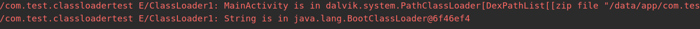
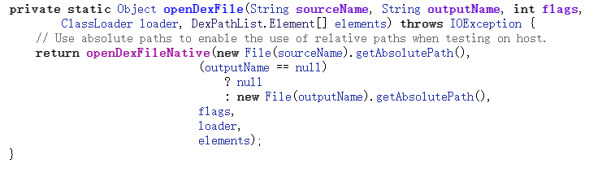
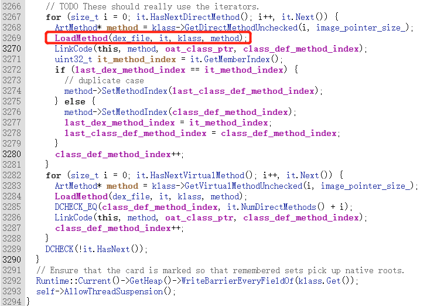
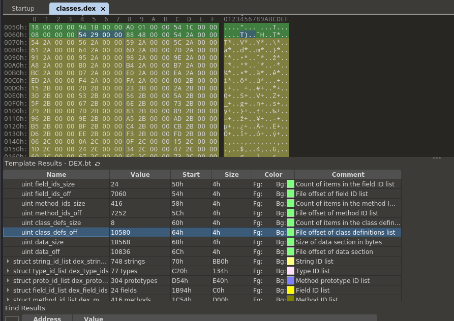
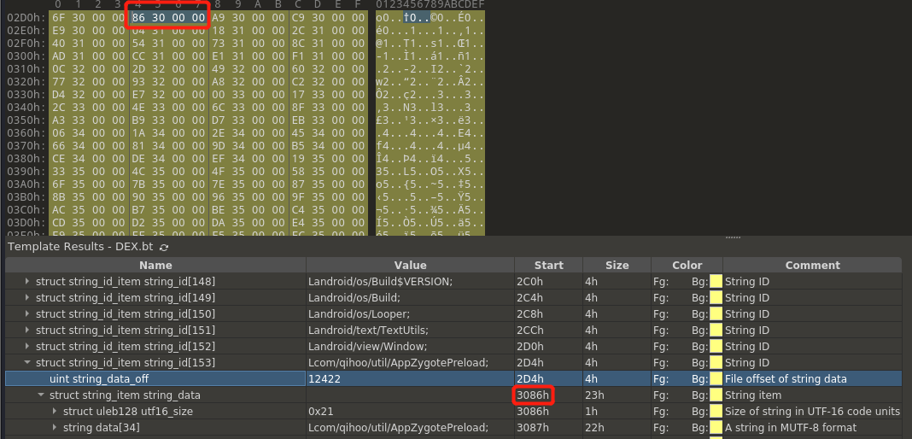

# android加壳脱壳学习

## 类加载器原理

### 双亲委派模式

[Android加壳脱壳学习（1）——动态加载和类加载机制详解](https://bbs.pediy.com/thread-271538.htm)

android中常用的类加载器

- PathClassLoader和DexClassLoader继承至BaseDexClassLoader抽象类
- DexClassLoader常用于动态加载


双亲委派模式

- 加载.class文件时，以**递归**的形式逐级向上委托给父加载器ParentClassLoader加载，如果加载过了就不再加载一遍，直到链路的最顶级
- 顶级classloader如果没有加载过，则尝试加载；加载失败，则逐级向下交给调用者加载


双亲委派模式作用

- 防止同一个.class文件重复加载
- 对于任意一个类保证在虚拟机中的唯一性
  - 由加载它的**类加载器**和这个类的**全类名**，一同确立在Java虚拟机中的唯一性
- 更加安全，无法通过自定义类来替代系统的类，可以防止核心API库被随意篡改

### 类加载

类加载步骤

- 装载
- 链接：验证、准备、解析
- 初始化


.class文件显式加载方式

- 通过Class.forName()方法动态加载
- 通过ClassLoader.loadClass()方法动态加载
  - 不会触发类的初始化，不会对类的静态变量、静态代码块进行初始化操作

### BaseDexClassLoader中重要属性

PathClassLoader和DexClassLoader都继承自BaseDexClassLoader：


BaseDexClassLoader：

- DexPathList：该类主要用来查找Dex、so库的路径，将路径合并成数组（路径列表）


DexPathList：

- dexElements：将dexPath转换成File列表，记录所有的dexFile（一个路径下的DexFile列表）


DexFile：

- 用来描述Dex文件，Dex加载以及Class查找都是由该类调用native方法完成


BaseDexClassLoader会初始化dexPathList，收集dex文件和Native文件动态库

**热修复**原理

- 当查找某个类时，会遍历所有的dex文件，如果找到则直接返回，不再继续遍历dexElements
- 也就是说当两个类在不同的dex中出现，会优先处理排在前面的dex文件
- 将需要修复的类所打包的dex文件插入到DexPathList中Element[]数组的前面，这样就实现了修复后的Class抢先加载，达到了修改bug的目的


### 实验验证

#### 双亲委派机制

验证App中的MainActivity类加载器和系统类String类的类加载器

```java
ClassLoader thisClassLoader = MainActivity.class.getClassLoader();
ClassLoader StringClassLoader = String.class.getClassLoader();
Log.e("ClassLoader1", "MainActivity is in " + thisClassLoader.toString());
Log.e("ClassLoader1", "String is in " + StringClassLoader.toString());
```

结果

- MainActivity的类加载器为dalvik.system.PathClassLoader 
  - 加载已安装apk的dex
  - DexPathList中主要包含两个变量信息
    - dexElements：将dexPath转换成File列表，记录所有dexFile
    - nativeLibraryPathElements：记录所有的native动态库，包括app目录的native库和系统目录的native库
- String的类加载器为java.lang.BootClassLoader
  - BootClassLoader加载系统预安装的类



遍历父类加载器

```java
	ClassLoader thisClassLoader = MainActivity.class.getClassLoader();
    printClassLoader(thisClassLoader);

public static void printClassLoader(ClassLoader classLoader) {
        Log.e("printClassLoader", "this->" + classLoader.toString());
        ClassLoader parent = classLoader.getParent();
        while(parent != null) {
            Log.e("printClassLoader", "parent->" + parent.toString());
            parent = parent.getParent();
        }
    }
```

结果

PathClassLoader的父加载器是BootClassLoader


验证双亲委派机制

```java
ClassLoader thisClassLoader = MainActivity.class.getClassLoader();
try {
	Class StringClass = thisClassLoader.loadClass("java.lang.String");
	Log.e("ClassLoader1", "Load StringClass Success " + thisClassLoader.toString());
} catch (ClassNotFoundException e) {
	e.printStackTrace();
	Log.e("ClassLoader1", "Load StringClass Fail");
}
```

结果

MainActivity的类加载器PathClassLoader可以加载String类，是因为双亲委派机制，PathClassLoader 委托父加载器BootClassLoader进行加载

#### 动态加载Dex

新建一个测试类

```java
package com.test.classloadertest;

public class TestClass {
    public void test02() {
        System.out.println("dynamic");
    }
}
```

用javac编译成class文件，再用d8工具编译得到dex（单个dex文件的大小是有限制的，如果超过长度需要生成多个DEX文件）


将dex放到手机的/data/local/tmp/下，修改classses.dex的权限

```
chmod 777 classes.dex
```

在主程序中编写代码实现Dex动态加载

DexClassLoader方法参数

- dexPath：目标所在的apk或jar文件的路径，装载器从路径中寻找指定的目标类
- optPath：输出的优化路径
  - 由于android系统中，一个应用程序对应一个linux用户，应用程序只对自己的数据目录有写的权限，所以需要存放在一个app可写的路径中
- libPath：目标类使用的C/C++库
- 父装载器

```java
 	Context appContext = this.getApplication();
    testDexClassLoader(appContext, "/data/local/tmp/classes.dex");


private void testDexClassLoader(Context context, String dexfilepath) {
    // 存放优化后的dex、lib库
    File optfile = context.getDir("opt_dex", 0);
    File libfile = context.getDir("lib_dex", 0);

    ClassLoader parentClassLoader = MainActivity.class.getClassLoader();
    ClassLoader tmpClassLoader = context.getClassLoader();
    // 为DexClassLoader指定父类加载器
    // 第一个参数：dex文件所在位置
    // 第四个参数：父类加载器可以是PathClassLoader也可以是BootClassLoader
    DexClassLoader dexClassLoader = new DexClassLoader(dexfilepath, optfile.getAbsolutePath(),libfile.getAbsolutePath(), parentClassLoader);
    printClassLoader(tmpClassLoader);
    printClassLoader(dexClassLoader);

    Class clazz = null;
    try {
        // 使用类加载器加载类
        clazz = dexClassLoader.loadClass("com.test.classloadertest.TestClass");
    } catch (ClassNotFoundException e) {
        e.printStackTrace();
    }
    if(clazz != null) {
        Method testFuncMethod = null;
        try {
            // 通过class对象获取方法
            testFuncMethod = clazz.getDeclaredMethod("test02");
            // 通过class对象获取实例
            Object object = clazz.newInstance();
            // 调用实例的方法
            testFuncMethod.invoke(object);
        } catch (NoSuchMethodException e) {
            e.printStackTrace();
        } catch (IllegalAccessException e) {
            e.printStackTrace();
        } catch (InstantiationException e) {
            e.printStackTrace();
        } catch (InvocationTargetException e) {
            e.printStackTrace();
        }
    }
}
```

结果

- dynamic被打印，说明dex被动态加载
- DexClassLoader的DexPathList包含了传入的/data/local/tmp/classes.dex路径信息
- DexClassLoader的父类加载器是PathClassLoader


#### 打印Dex中的所有类

```java
 public static void getClassListInClassLoader(ClassLoader classLoader) {
     Class BaseDexClassLoader = null;
     try {
         BaseDexClassLoader = Class.forName("dalvik.system.BaseDexClassLoader");
         Field pathListField = BaseDexClassLoader.getDeclaredField("pathList");
         pathListField.setAccessible(true);
         Object pathListObj = pathListField.get(classLoader);
         System.out.println(pathListObj);
         System.out.println("-------------------------");

         Class DexElementClass = Class.forName("dalvik.system.DexPathList");
         Field DexElementFiled = DexElementClass.getDeclaredField("dexElements");
         DexElementFiled.setAccessible(true);
         Object[] dexElementObj = (Object[]) DexElementFiled.get(pathListObj);
         for(int i = 0; i < dexElementObj.length; i++)
             System.out.println(dexElementObj[i]);
         System.out.println("-------------------------");

         Class Element = Class.forName("dalvik.system.DexPathList$Element");
         Field dexFileField = Element.getDeclaredField("dexFile");
         dexFileField.setAccessible(true);
         Class DexFile =Class.forName("dalvik.system.DexFile");
         Field mCookieField = DexFile.getDeclaredField("mCookie");
         mCookieField.setAccessible(true);
         Field mFiledNameField = DexFile.getDeclaredField("mFileName");
         mFiledNameField.setAccessible(true);
         Method getClassNameListMethod = DexFile.getDeclaredMethod("getClassNameList",Object.class);
         getClassNameListMethod.setAccessible(true);

         for(Object dexElement:dexElementObj){
             Object dexfileObj = dexFileField.get(dexElement);
             Object mCookiedobj = mCookieField.get(dexfileObj);
             String mFileNameobj = (String) mFiledNameField.get(dexfileObj);
             String[] classlist = (String[]) getClassNameListMethod.invoke(null,mCookiedobj);
             for(String classname:classlist){
                 System.out.println(classLoader.toString()+"-----"+mFileNameobj+"-----"+classname);
             }
         }

     } catch (ClassNotFoundException | NoSuchFieldException | IllegalAccessException | NoSuchMethodException | InvocationTargetException e) {
         e.printStackTrace();
     }

 }
```

### 可能的脱壳点

关注恢复后的时机、文件起始位置、文件的大小

#### DEX加载流程

DexClassLoader构造函数


BaseDexClassLoader参数一致的构造函数


DexPathList最后调用的构造函数


makeDexElements函数


loadDexFile函数根据是否优化分别调用DexFile和DexFile.loadDex

- loadDex函数会调用`new DexFile(sourcePathName, outputPathName, flags, loader, elements);`


DexFile中最终调用的构造函数

- 可以看出mInternalCookie和mCookie值相同


- loadDex函数调用的DexFile函数版本，最后调用的openDexFile是同一个


openDexFile函数

- 此函数的返回值就是mCookie



openDexFileNative函数

- mCookie就是返回值array，类型为long数组，每一项都是DexFile对象的指针


（刚才截图来自于android 9但与android 8流程一致，下面由于产生的调用函数的不同，所以采用android 8的流程和截图）

OpenDexFilesFromOat函数-->oat_file_assistant.MakeUpToDate函数-->GenerateOatFileNoCheck函数

- 判断Dex2Oat函数是否调用成功


##### Dex2Oat函数调用

- 构造执行参数，调用exec函数


exec函数会调用ExecAndReturnCode函数

- fork创建子进程
- execv或execve执行程序，在另一个进程中对dex进行编译


GenerateOatFileNoChecks函数中返回成功与否结果

MakeUpToDate函数返回成功与否结果

##### 若Dex2Oat函数调用失败

在OpenDexFilesFromOat函数中调用dex_file_loader.Open函数


DexFile的Open函数


DexFile的OpenFile函数调用OpenCommon函数

OpenCommon函数中调用了DexFile的构造函数


DexFile::DexFile函数

- 第一个参数为Dex基址
- 第二个参数为Dex大小


##### 若Dex2Oat函数调用成功

在OpenDexFilesFromOat函数中调用oat_file_assistant.LoadDexFiles函数


LoadDexFiles函数


OpenDexFile函数


DexFile::Open函数


然后和调用失败流程一样，进入同一个OpenCommon函数，最后到达DexFile::DexFile函数

无论dex2oat函数是否调用，都会到达OpenCommon函数和DexFile::DexFile函数

OpenCommon函数和DexFile::DexFile函数都可以作为脱壳点

#### Dex2Oat编译流程

dex2oat.cc的main函数


Dex2oat函数调用setup


setup函数中进行一些编译操作


像编译过程中会调用的CompileMethod函数也可以作为脱壳点


#### 类的加载和初始化流程

[FART正餐前甜点：ART下几个通用简单高效的dump内存中dex方法](https://bbs.pediy.com/thread-254028.htm)

LoadClass->LoadClassMembers->LinkCode

LoadClassMembers函数负责准备接下来类函数执行过程中所需要的变量和函数

- 该函数首先是遍历内存中dex的相关field并初始化为ArtField对象；
- 遍历类中所有的函数，并初始化函数对应的ArtMethod对象




LoadMethod(self, dex_file, it, klass, method)函数也包含了对DexFile对象的引用，因此这也是一个脱壳点


通过LoadMethod的DexFile参数获取DexFile起始地址和长度

```javascript
function main() {
    var lib = Module.enumerateSymbols("libart.so");
    var LoadMethod;
    for(var n in lib) {
        // 在库中找到名字包含LoadMethod的方法
        if(lib[n].name.indexOf("LoadMethod") > 0) {
            console.log(lib[n].name);
            LoadMethod = lib[n].address;
        }
    }
    Interceptor.attach(LoadMethod, {
        onEnter:function(arg){
            // 利用dexfile参数
            // Process.pointerSize为指针大小，便于后续移植
            var beg = arg[1].add(Process.pointerSize).readPointer();
            var size = arg[1].add(Process.pointerSize*2).readU32();
            console.log(hexdump(beg, {length:16}));
            console.log(size);
        }
    })
}
```


通过LoadMethod的ArtMethod间接获取DexFile

```javascript
function main() {
    Java.perform(function() {

        var addrGetDexFile = null;
        var funcGetDexFile = null;
        var addrGetObsoleteDexCache = null;
        var map = {};

        var lib = Module.enumerateSymbols("libart.so");
        var LoadMethod;

        var module_libext = null;
        if (Process.arch === "arm64") {
            module_libext = Module.load("/data/app/fart64.so");
        } else if (Process.arch === "arm") {
            module_libext = Module.load("/data/app/fart.so");
        }

        addrGetDexFile = module_libext.findExportByName("GetDexFile");
        // 创建一个NativeFunction用于调用位于第一个参数地址的函数，第二个参数为返回值类型，第三个参数为参数类型  
        funcGetDexFile = new NativeFunction(addrGetDexFile, "pointer", ["pointer", "pointer"]);

        for(var n in lib) {
            if(lib[n].name.indexOf("LoadMethod") >= 0) {
                console.log(lib[n].name);
                LoadMethod = lib[n].address;
            }
            if(lib[n].name.indexOf("ArtMethod") >= 0 && lib[n].name.indexOf("GetObsoleteDexCache") >= 0) {
                console.log(lib[n].name);
                addrGetObsoleteDexCache = lib[n].address;
            }
        }

        Interceptor.attach(LoadMethod, {
            onEnter:function(arg){
                // funcGetDexFile即为GetDexFile函数
                var dexFile = funcGetDexFile(arg[3], addrGetObsoleteDexCache);
                var beg = dexFile.add(Process.pointerSize).readPointer();
                var size = dexFile.add(Process.pointerSize*2).readU32();
                if(map[size] == undefined) {
                    console.log(hexdump(beg, {length:16}));
                    map[size] = beg;
                }
            }
        })
    })
}

setImmediate(main);
```


也可以通过反射后的方法间接得到ArtMethod

```javascript
var classes = Java.use("XXX");
var methods = classes.class.getDeclaredMethods();
var artmethod = methods[0].getArtMethod();
```

#### 函数执行过程

如ArtMethod::invoke方法

以及ART中解析模式下所有函数都要进入的方法Execute

只要获取ArtMethod，就可以通过GetDexFile函数获取dex_file指针，实现dex的内存dump


关键查找包含 **ArtMethod或DexFile** 为 **参数、返回值或者能够间接获取** 的**可导出**的函数，可以在IDA中查找，然后使用Frida来HOOK

## Dex整体加固壳

### APP运行流程

[FART：ART环境下基于主动调用的自动化脱壳方案](https://bbs.pediy.com/thread-252630.htm)

#### 加壳入口点

入口类替换：修改清单文件设置启动application为加壳MyApplication

```xml
<application
        android:name=".MyApplication"
```

定义MyApplication

```java
public class MyApplication extends Application {

    static {
        Log.e("test", "MyApplsication static");
    }

    public MyApplication() {
        Log.e("test", "MyApplsication Construct");
    }
    
    @Override
    public void attachBaseContext(Context newBase) {
        super.attachBaseContext(newBase);
        Log.e("test", "MyApplication attachBaseContext");
    }

    @Override
    public void onCreate() {
        super.onCreate();
        Log.e("test", "MyApplication onCreate");
    }
}
```

执行顺序为：

- 启动application的类初始化`<clinit>`函数、默认构造器、attachBaseContext函数、onCreate函数
  - 一般在这几个函数中完成dex解密
- MainActivity


#### ClassLoader修正

直接用DexClassLoader加载的类不具备组件生命周期，无法启动，会显示加载类失败的异常

（Android 8.0以后用InMemoryClassLoader的也比较多）

主要的解决方案：

- 替换系统组件类加载器mClassLoader为DexClassLoader，设置DexClassLoader的parent为mClassLoader
  - 初始为pathClassLoader-->BootClassLoader
  - 修正后DexClassLoader-->pathClassLoader-->BootClassLoader

- 修改原有的双亲委派关系，在系统组件类加载器和BootClassLoader之间插入DexClassLoader
  - 初始为pathClassLoader-->BootClassLoader
  - 修正后pathClassLoader-->DexClassLoader-->BootClassLoader
- 合并BaseDexClassLoader子类中的dexElements
  - 合并pathClassLoader和DexClassLoader的dexElements

##### 组件类加载器mClassLoader

ActivityThread.main()是进入App世界的大门

ActivityThread中sCurrentActivityThread保存创建的ActivityThread实例，通过currentActivityThread方法返回


sCurrentActivityThread中mPackages属性存储了加载的apk信息


在mPackages字典中根据报名字符串可以获得相应的LoadedApk信息

LoadedApk类中mClassLoader即为组件类加载器，将mClassLoader修改为DexClassLoader即可实现类加载器的修正


### 常见加固入口类

#### 360加固

StubApp作为入口应用，包含`<clinit>`函数、默认构造器、attachBaseContext函数、onCreate函数


#### 爱加密加固

s.h.e.l.l.S作为入口应用


#### 百度加固

入口类com.baidu.haokan.Application


#### 阿里加固


## 函数脱取壳

### Dex中获取所有类名

frida代码获取dex文件所有类名

```javascript
var classlist = Memory.readU32(beg.add(0x64));
var classsize = Memory.readU32(beg.add(0x60));
var typelist = Memory.readU32(beg.add(0x44));
var strlist = Memory.readU32(beg.add(0x3C));
for(var i=0; i<classsize; i++) {
    var address = Memory.readU32(beg.add(classlist + 0x20*i));
    address = Memory.readU32(beg.add(typelist + 4*address));
    address = Memory.readU32(beg.add(strlist + 4*address));
    var classname = Memory.readCString(beg.add(address));
    classname = classname.replace(/\//g, ".").slice(2).replace(/;/g, "");
    console.log(classname);
}
```

执行结果


先找到DEX头中class段的偏移



根据偏移，找到class_def_item_list段，其中class_idx记录了在type段的下标


在type_id_list段中，找到第0x17项存储的descriptor_idx值0x99


在string_id_list段中，找到第0x99项存储的字符串所在地址为0x3086



## 常见脱壳工具

### FRIDA-DEXDump

[FRIDA-DEXDump](https://github.com/hluwa/frida-dexdump)用于find和dump内存中的dex

[深入 FRIDA-DEXDump 中的矛与盾](https://mp.weixin.qq.com/s/n2XHGhshTmvt2FhxyFfoMA)

支持普通搜索和深度搜索，深度搜索可以搜索到更多的dex文件

#### 主要函数scandex

最简单的情况是能匹配到dex文件头魔数，读取dex文件长度

如果dex文件头和长度都被抹掉

- 需要查找string_ids_off的固定值0x70，减去0x3C后为dex起始地址
- 读取map_off值，判断map段是否在内存地址范围内；判断map_off的值是否与类型为TYPE_MAP_OFF的map_item的offest值一致

```javascript
scandex: function scandex() {
    var result = [];
    // 枚举内存中所有的可读段
    Process.enumerateRanges('r--').forEach(function (range) {
        try {
            // 段开头、段大小、Magic数 dex035
            Memory.scanSync(range.base, range.size, "64 65 78 0a 30 ?? ?? 00").forEach(function (match) {
				// 如果在系统路径下，肯定不是所需dex
                if (range.file && range.file.path
                    && (// range.file.path.startsWith("/data/app/") ||
                    range.file.path.startsWith("/data/dalvik-cache/") ||
                    range.file.path.startsWith("/system/"))) {
                    return;
                }
				// 检测从dex头匹配位置到段结束的长度是否大于dex头长度0x70，如果连头都放不下，肯定不是dex
                if (verify(match.address, range, false)) {
                    // get_dex_real_size在0x20处读dex文件长度
                    var dex_size = get_dex_real_size(match.address, range.base, range.base.add(range.size));
                    result.push({
                        "addr": match.address,
                        "size": dex_size
                    });
					// 直接传输一个最长的size
                    var max_size = range.size - match.address.sub(range.base);
                    if (enable_deep_search && max_size != dex_size) {
                        result.push({
                            "addr": match.address,
                            "size": max_size
                        });
                    }
                }
            });
			/* 
			开启深度搜索 
			因为DEX文件头和file size都可能会被抹掉
			*/
            if (enable_deep_search) {
                // 70 00 00 00是string_ids_off的值，查找包含该值的段
                Memory.scanSync(range.base, range.size, "70 00 00 00").forEach(function (match) {
                    // match.address为DEX头string_ids_off字段偏移，减去0x3C即为DEX起始地址
                    var dex_base = match.address.sub(0x3C);
                    if (dex_base < range.base) {
                        return
                    }
                    // 内存开始区域没有dex魔数，如何处理
                    if (dex_base.readCString(4) != "dex\n" && verify(dex_base, range, true)) {
                        var real_dex_size = get_dex_real_size(dex_base, range.base, range.base.add(range.size));
                        result.push({
                            "addr": dex_base,
                            "size": real_dex_size
                        });
                        var max_size = range.size - dex_base.sub(range.base);
                        if (max_size != real_dex_size) {
                            result.push({
                                "addr": match.address,
                                "size": max_size
                            });
                        }
                    }
                })
            }
            /* 非深度搜索模式 */
            else {
                if (range.base.readCString(4) != "dex\n" && verify(range.base, range, true)) {
                    var real_dex_size = get_dex_real_size(range.base, range.base, range.base.add(range.size));
                    result.push({
                        "addr": range.base,
                        "size": real_dex_size
                    });
                }
            }

        } catch (e) {
        }
    });
```

DEX文件头示例


#### 检查函数verify

```javascript
function verify(dexptr, range, enable_verify_maps) {
    if (range != null) {
        var range_end = range.base.add(range.size);
        // 检测段大小是否大于dex头长度0x70，如果连头都放不下，肯定不是dex
        if (dexptr.add(0x70) > range_end) {
            return false;
        }

        if (enable_verify_maps) {
            // get_maps_address函数首先计算maps_offset = dexptr.add(0x34).readUInt()，也就是maps段的偏移位置，一般map段在DEX文件的末尾；然后检查dex文件头加上maps_offset是否在段的起止地址范围内
            var maps_address = get_maps_address(dexptr, range.base, range_end);
            if (!maps_address) {
                return false;
            }
            // get_maps_end函数读maps_size，检查它是否在2~50之间，然后计算maps段长度（maps_size*21 + 4），最后检查maps段结束地址是否在段的起止范围内
            var maps_end = get_maps_end(maps_address, range.base, range_end);
            if (!maps_end) {
                return false;
            }
            return verify_by_maps(dexptr, maps_address)
        } else {
            // 0x3C位置是string_ids_off，也就是string_ids段的偏移位置，string_ids段一般紧随于DEX头后面，所以string_ids_off一般为0x70
            return dexptr.add(0x3C).readUInt() === 0x70;
        }
    }
    return false;
}
```

#### 检查函数verify_by_maps

```javascript
function verify_by_maps(dexptr, mapsptr) {
    var maps_offset = dexptr.add(0x34).readUInt();
    var maps_size = mapsptr.readUInt();
    for (var i = 0; i < maps_size; i++) {
        var item_type = mapsptr.add(4 + i * 0xC).readU16();
        // 找到类型为TYPE_MAP_LIST的条目
        if (item_type === 4096) {
            var map_offset = mapsptr.add(4 + i * 0xC + 8).readUInt();
            // DEX头中的map_off值与TYPE_MAP_LIST条目里面的索引值一致
            if (maps_offset === map_offset) {
                return true;
            }
        }
    }
    return false;
}
```

比较**DEX头中map_offest中的值**是否与**DEX文件末尾dex_map_list中类型为TYPE_MAP_LIST的条目的offest值**是否一致

例如DEX头中的map_off字段在dex的0x34位置处，值为7380956


map_item列表在map的0x4位置处，每个item的大小为0xC


类型为TYPE_MAP_LIST的条目，item_type值为0x1000，也就是4096；offest值为7380956与map_off字段中的偏移地址一致

