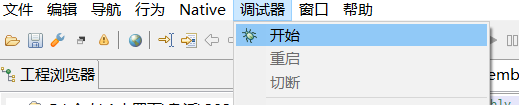
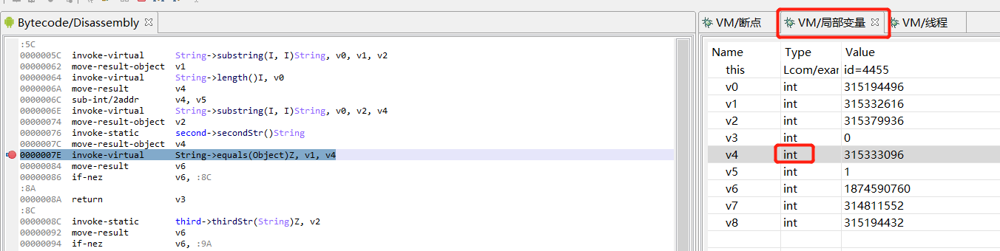

# android安全学习

  * [android](#android)
  * [android studio项目开发](#android-studio项目开发)
    * [项目结构](#项目结构)
    * [Android SDK](#android-sdk)
    * [Android NDK](#android-ndk)
      * [Java文件中native方法](#java文件中native方法)
      * [lib库中函数实现](#lib库中函数实现)
      * [native方法加载lib库](#native方法加载lib库)
  * [android逆向](#android逆向)
    * [APK文件](#apk文件)
    * [Dalvik虚拟机](#dalvik虚拟机)
      * [Smali代码](#smali代码)
        * [寄存器](#寄存器)
    * [Genymotion模拟器](#genymotion模拟器)
    * [Android Debug Bridge](#android-debug-bridge)
      * [adb 的工作原理](#adb-的工作原理)
      * [adb常用命令](#adb常用命令)
    * [JEB静态分析APK](#jeb静态分析apk)
      * [MainActivity](#mainactivity)
      * [AndroidManifest\.xml](#androidmanifestxml)
      * [res/values/资源文件](#resvalues资源文件)
    * [JEB动态调试APK](#jeb动态调试apk)
      * [原理介绍](#原理介绍)
      * [环境准备](#环境准备)
        * [将adb添加到环境变量](#将adb添加到环境变量)
        * [手机/模拟器运行APK](#手机模拟器运行apk)
        * [JEB打开APK文件](#jeb打开apk文件)
      * [JEB动态调试](#jeb动态调试)
        * [JEB附加进程](#jeb附加进程)
        * [手机触发目标代码行](#手机触发目标代码行)
        * [JEB查看返回值](#jeb查看返回值)
    * [log动态调试](#log动态调试)
    * [Dalvik层混淆](#dalvik层混淆)
      * [ProGuard混淆](#proguard混淆)
      * [DEX破坏](#dex破坏)
      * [APK伪加密](#apk伪加密)
      * [APK增加数据](#apk增加数据)
      * [DEX隐藏](#dex隐藏)
    * [IDA静态分析lib库](#ida静态分析lib库)
      * [lib库位置](#lib库位置)
      * [标准的Native方法命名函数](#标准的native方法命名函数)
      * [JNI\_OnLoad函数](#jni_onload函数)
      * [init\_array端](#init_array端)
    * [IDA动态调试lib库](#ida动态调试lib库)
      * [IDA patch 反调试](#ida-patch-反调试)
      * [IDA调试端口配置](#ida调试端口配置)
      * [so库替换](#so库替换)
      * [IDA attach进程](#ida-attach进程)

主要参考《CTF训练营》

## android

**Android**是一种基于**Linux**的开源的操作系统，主要用于移动设备，如智能手机和平板电脑

- **2003**年**10**月，**Andy Rubin**等人一起创办了**Android**公司
- **2005**年**8**月，谷歌收购了该公司，并让**Andy Rubin**继续负责**Android**项目
- **2007**年，谷歌开放了**Android**的源代码，加速了**Android**普及
- **2008**年谷歌推出**Android**系统的第一个版本
- **2017**年**3**月，**Android**全球网络流量和设备超越**Microsoft Windows**，正式成为全球第一大操作系统


自2008年以来，Android已更迭了许多版本：


Android系统架构：

- 应用框架：提供应用程序开发的各种API
- Binder IPC：Binder进程间通信机制，为高级框架 API 与 Android 系统服务提供交互
- 系统服务：专注于特定功能的模块化组件
- 硬件抽象层 (HAL)：让 Android 忽略较低级别的驱动程序实现
- Linux 内核：提供硬件底层驱动


## android studio项目开发

Android Studio 是用于开发 Android 应用的官方集成开发环境 (IDE)，以 IntelliJ IDEA 为基础构建而成

下载链接：https://developer.android.com/studio

### 项目结构

Android Studio项目结构主要包括：

- manifests文件夹：
  - 包含 **AndroidManifest.xml** 文件，该清单文件描述了Android 构建工具、Android 操作系统和应用的基本信息。比如文件中声明了软件包名称和应用 ID，也声明了应用的组件，包括所有 Activity、服务、广播接收器和内容提供程序，以及应用所需的访问权限和需要的硬件和软件功能。
- java文件夹：包含 Java 源代码文件，以及其他测试文件
- res文件夹：包含所有非代码资源（例如 XML 布局、界面字符串和位图图像），这些资源划分到相应的子目录中
  - drawable文件夹：包含应用程序开发过程中所需的不同类型的图像
  - layout文件夹：包含用来定义应用程序用户界面的所有XML布局文件，最重要的是activity_main.xml文件，描述主页面控件的布局
  - values文件夹
    - 包含如字符串、尺寸、颜色和样式定义在内的许多XML文件
    - 其中一个最重要的文件是包含字符串信息的**strings.xml**文件


### Android SDK

Android SDK是开发Android应用程序所需的软件开发工具和库的集合，谷歌每发布一个新的Android版本或更新版本，就会发布相应的SDK，开发者必须下载并安装。

在导航栏可以打开sdk manager。


sdk manager：


Android SDK包含了从头开始编写程序一直到进行测试所需的所有工具， 这些工具使得从开发、调试到打包的整个开发过程非常顺畅：

- Android SDK Tools：包含一套完整的Android开发和调试工具， android studio中已包含
- SDK Build Tools：用于构建Android应用程序的二进制文件
- SDK Platform：SDK平台的版本是由Android版本(如Android 7)和API版本(如API级别24)确定的，在构建Android应用程序之前，必须指定一个SDK平台作为构建目标，较新的SDK平台版本为开发者提供了更多特性，但较旧的设备可能与较新的平台版本不兼容
- SDK Platform-Tools：平台工具用于支持当前Android平台的特性，与测试设备上的Android平台交互，例如**Android Debug Bridge (adb)**就是一个用于与设备通信的方便的命令行工具，SDK Platform-Tools向后兼容，所以只需要一个版本即可
- Android Emulator：Android Emulator是一种设备仿真工具，可在计算机上模拟Android设备，从而使开发人员可以在不同设备和Android API级别上测试应用程序，而无需为每个设备都配备物理设备。该工具可以模拟多种Android设备，如Android手机、平板电脑、Wear操作系统和Android电视设备。它提供了提供了真正Android设备的几乎所有功能，如打电话、发短信等。


### Android NDK

Android NDK 是一个工具集，可使用 C 和 C++ 等语言以原生代码（native code）实现应用的各个部分，其主要功能为：

- 进一步提升设备性能，以降低延迟或运行游戏、物理模拟等计算密集型应用
- 重复使用自己或其他开发者的 C 或 C++ 库

Android NDK构建原生应用时使用的主要组件：

- 原生共享库：NDK 从 C/C++ 源代码构建这些库或 .so 文件。
- Java 原生接口 (JNI)：**JNI** 是 Java 和 C/C++组件用于相互通信的接口，它允许在Java虚拟机中运行的Java代码与其他编程语言编写的应用程序和库进行互操作

#### Java文件中native方法

Native层方法有两个特征：

- NDK生成的库文件需要显式加载：通过**System.loadLibrary**加载库，文件名为libMyJni.so的库，加载名字为MyJni
- 需要声明Native层方法的名字，且在名字前需加上**native**


#### lib库中函数实现

将上面的代码命名为MyJni.java，运行`javah MyJni`命令，会在同目录下生成MyJni.h文件：

```C++
/* DO NOT EDIT THIS FILE - it is machine generated */
#include <jni.h>
/* Header for class MyJni */

#ifndef _Included_MyJni
#define _Included_MyJni
#ifdef __cplusplus
extern "C" {
#endif
/*
 * Class:     MyJni
 * Method:    getPart3
 * Signature: ()Ljava/lang/String;
 */
JNIEXPORT jstring JNICALL Java_MyJni_getPart3
  (JNIEnv *, jclass);

#ifdef __cplusplus
}
#endif
#endif
```

包含对函数`Java_MyJni_getPart3`的说明：

- JNIEXPORT表明该函数是导出的，可以在IDA的**Exports**窗口看到
- JNIEnv *为当前线程的JNIEnv环境变量指针
- jclass为该函数所属java类实例的指针，这两个参数是每个JNI函数必须的
- 返回值为`jstring`

编写MyJni.c实现函数：

```c
#include "MyJni.h"

JNIEXPORT jstring JNICALL Java_MyJni_getPart3(JNIEnv *env, jclass obj)
{
  return (*env)->NewStringUTF(env, "Just a test!");
}
```

然后新建两个文件Android.mk和Application.mk修改编译参数：

Android.mk：

```
LOCAL_PATH := $(call my-dir)
include $(CLEAR_VARS)

LOCAL_MODULE := MyJni
LOCAL_SRC_FILES := MyJni.c
include $(BUILD_SHARED_LIBRARY)
```

Application.mk：

```
APP_ABI := all
```

然后将这些文件放在jni文件夹中，使用`ndk-build`编译：


#### native方法加载lib库

MyJni.getPart3方法调用后，JNI需要连接到库中的相应函数，因此必须知道 Java 声明的**Native方法**与**so库中函数**的配对关系，配对的方式主要有两种：

- 使用**JNI Native**方法名称解析的**静态注册**

  - 动态链接中需要根据**规范命名**库中的函数，以便系统能够正确的动态链接，如如getPart3对应的库函数名为`Java_com_example_mobilenormal_MyJni_getPart3`
  - 前缀` Java`，一个完整的类名`com_example_mobilenormal_MyJni`，原方法名称`getPart3`

- 使用**Registernative API**调用的**动态注册**

  - `(*env)->RegisterNatives(env, class, method, numMethods)`，调用该函数，即可**动态注册**Native函数

    Application.mk不变，Android.mk中把后缀c换成cpp

    Myjni.h

    ```c
    /* DO NOT EDIT THIS FILE - it is machine generated */
    #include <jni.h>
    #include <assert.h>
    #include <cstdlib>
    #include <cstring>
    /* Header for class MyJni */
    
    #ifndef _Included_MyJni
    #define _Included_MyJni
    #ifdef __cplusplus
    extern "C" {
    #endif
    /*
     * Class:     MyJni
     * Method:    getPart3
     * Signature: ()Ljava/lang/String;
     */
    
    jstring check
      (JNIEnv *, jclass);
    
    #ifdef __cplusplus
    }
    #endif
    #endif
    
    ```

    Myjni.cpp

    ```cpp
    #include "MyJni.h"
    
    //要动态注册的方法
    jstring check(JNIEnv* env, jclass jclass1)
    {
        return env->NewStringUTF("123");
    }
    
    //方法对应表
    static JNINativeMethod gMethods[] = {
        //第一个参数为native方法名称；第二个参数为native方法参数；第三个参数为lib库中方法名称
            { "check", "()Ljava/lang/String", (void*)check }
    };
    
    //为某一个类注册本地方法
    static int registerNativeMethods(JNIEnv* env, const char* className, JNINativeMethod* gMethods, int numMethods)
    {
      jclass clazz;
      clazz = env->FindClass(className);
      if (clazz == NULL) {
        return JNI_FALSE;
      }
      if (env->RegisterNatives(clazz, gMethods, numMethods) < 0) {
        return JNI_FALSE;
      }
      return JNI_TRUE;
    }
    
    //完整类名
    #define JNIREG_CLASS "MyJni"
    
    //为所有类注册本地方法
    static int registerNatives(JNIEnv* env)
    {
      if (!registerNativeMethods(env, JNIREG_CLASS, gMethods, sizeof(gMethods) / sizeof(gMethods[0])))
        return JNI_FALSE;
      return JNI_TRUE;
    }
    
    //在系统加载库时调用，如果成功则返回JNI版本，失败则返回-1
    JNIEXPORT jint JNICALL JNI_OnLoad(JavaVM* vm, void* reserved)
    {
    
      JNIEnv* env = NULL;
      jint result = -1;
    
      if (vm->GetEnv((void**) &env, JNI_VERSION_1_4) != JNI_OK) {
        return -1;
      }
      if (!registerNatives(env)) {//注册
        return -1;
      }
      return JNI_VERSION_1_4;
    }
    ```

观察加载lib库的过程：

在Android 7.0.0_r1中，关键的调用源码在JavaVMExt::LoadNativeLibrary中：

- android::OpenNativeLibrary主要功能是调用Linker（Android系统中的连接器）的**dlopen**函数加载Lib库
  
- dlopen调用时会搜索目标lib文件代码中是否包含**init_array**段，如果包含这个段，就会**在加载时运行**
  
  - 下面的范例可以在init_array中添加内容：
  
    ```c
    void my_init(void) __attribute__((constructor));
    void my_init(void)
    {
        //运行(*env)->RegisterNatives
    }
    ```
  
- dlopen调用完成后，将查找lib库中是否有名为**JNI_OnLoad**的导出函数
  
  - 如果有该导出函数，就会在加载时自动运行
  - 可以用JNI_OnLoad调用(*env)->RegisterNatives

```c
void* handle = android::OpenNativeLibrary(env,
                                         runtime_->GetTargetSdkVersion(),
                                         path_str,
                                         class_loader,
                                         library_path);
sym = library->FindSymbol("JNI_OnLoad", nullptr);
```


## android逆向

### APK文件

APK文件是Android应用程序包，本质是一个ZIP格式的压缩包，可直接解压

- META-INF目录：保存应用的签名信息
- assets目录：存放APK所需的一些静态文件，存放在该文件夹的文件会**原封不动打包到APK中**
- lib目录：APK所依赖的Native层的Lib库，一般为libxxx.so格式
- res目录：存放APK使用的资源文件
- AndroidManifest.xml：应用清单文件，所有APK需包含
- classes.dex文件：存放**Dalvik字节码**的DEX可执行文件
- resource.arsc：应用资源表文件


### APK打包流程

AAPT2（Android 资源打包工具）是一种构建工具，能够析资源、为资源编制索引，并将资源编译为针对 Android 平台进行过优化的二进制格式。

aidl用于定义客户端与服务均认可的编程接口，以便二者使用进程间通信 (IPC) 进行相互通信

d8是一种命令行工具，将项目的 Java 字节码编译为在 Android 设备上运行的 DEX 字节码。

apksigner工具用于 APK 签名，并确保 APK 的签名能够在 APK 支持的所有版本的 Android 平台上成功通过验证

zipalign 是一种 zip 归档文件对齐工具。它可确保归档中的所有未压缩文件相对于文件开头都是对齐的；如果是apksigner，需要在apksigner之前对齐；如果是jarsigner，需要在jarsigner之后对齐


### Dalvik虚拟机

虽然Android平台使用Java语言开发应用程序，但Android程序并非运行在标准的Java虚拟机上，而是运行在谷歌专门为其开发的Dalvik虚拟机上。但是Android4.4以后，为了解决UI卡顿、显示延迟等性能问题，引入了全新的ART（Android RunTime）虚拟机，抛弃了Dalvik虚拟机。

Dalvik虚拟机与Java虚拟机的主要区别：

- 运行的字节码不同
  - Dalvik虚拟机运行的是Dalvik字节码，所有Dalvik字节码由Java字节码转换而来，并打包到一个DEX可执行文件中
  - Dalvik可执行文件的体积更小
- 虚拟机架构不同
  - Java虚拟机基于栈架构，Dalvik虚拟机基于寄存器架构

在编译过程中，将**Java代码**编译成**Dalvik字节码**

在逆向过程中，需要将DEX文件中的**二进制**的**Dalvik字节码**，先反汇编得到**Smali代码**（类似于汇编代码），再解析得到**Java代码**（类似于C++代码）

下图展示了Java代码在JVM虚拟机和Dalvik虚拟机上编译执行的区别：


下图展示了Java代码在Dalvik虚拟机和ART虚拟机上编译执行的区别：


https://www.youtube.com/watch?v=m9UZnWLLurY

#### Smali代码

对于下面的Java代码：

```java
public String func(int i, int j) {
        return String.valueOf(i + j -i / j * 3);
    }
```

Smali代码为：

- `.method` 开始方法定义`.end method `结束方法定义
- `func`为方法名，`I`表示整型，`String`为返回值类型
- `.registers 5`使用5个寄存器，访问标志位为0，2个局部变量名字为i和j
- p开头寄存器表示传入参数，v开头表示局部变量
- `invoke-static`表示调用静态方法：`String（调用者）->valueOf（方法名）(I（参数类型）)String（返回值类型）, v0（参数）`

```
.method public func(I, I)String
          .registers 5
          .annotation system MethodParameters
              accessFlags = {
                  0x0,
                  0x0
              }
              names = {
                  "i",
                  "j"
              }
          .end annotation
00000000  add-int             v0, p1, p2
00000004  div-int             v1, p1, p2
00000008  mul-int/lit8        v1, v1, 3
0000000C  sub-int/2addr       v0, v1
0000000E  invoke-static       String->valueOf(I)String, v0
00000014  move-result-object  v0
00000016  return-object       v0
.end method
```

除了`I`表示整型外，smali数据类型还包括：

| smali语法 | 类型       |
| --------- | ---------- |
| V         | void       |
| Z         | boolean    |
| B         | byte       |
| S         | short      |
| C         | char       |
| F         | float      |
| I         | int        |
| J         | long       |
| D         | double     |
| L         | Java类类型 |
| [         | array      |

##### 寄存器

在Dalvik的字节码中，寄存器始终为**32位**，并且可以存储任何类型的值。2个寄存器用于容纳64位类型（Long和Double）。

寄存器有两种命名方案：

- 普通的v命名方案
  - 方法的参数被放置在最后n个寄存器中
- 参数寄存器的p命名方案

假如一个方法有3个参数，总共有5个寄存器：

| v命名法 | p命名法 |                               |
| ------- | ------- | ----------------------------- |
| v0      |         | the first local register      |
| v1      |         | the second local register     |
| v2      | p0      | the first parameter register  |
| v3      | p1      | the second parameter register |
| v4      | p2      | the third parameter register  |

非静态方法的**第一个**参数总是**调用该方法的对象**。比如方法`LMyObject;->callMe(II)V`有2个整数参数的同时，也在整数参数前有一个隐式的`LMyObject`参数，所以该方法总共有3个参数。

https://tryhackme.com/room/androidhacking101

### Android安全机制

参考文章[Android安全机制](https://www.cnblogs.com/bmjoker/p/11827614.html)

- 进程沙箱隔离机制

  Linux的用户之间是相互隔离的，用户有各自的所属资源和权限范围，互不干扰

  Android将Linux的用户隔离机制移植为**应用程序隔离**，应用程序在安装时被赋予用户标识UID，不同UID的应用程序相互隔离

- 应用程序签名机制

  生成私钥公钥，对应用程序进行签名

  签名可以识别代码的作者，检测应用程序是否发生了改变，在应用程序之间建立信任

- 权限声明机制

  Android程序默认无法访问系统和资源，需要应用程序显式声明权限、名称、保护级别

  - Normal申请即可使用
  - Dangerous需要在安装时由用户确认
  - Signature要求应用程序的数字签名与声明引用权限的应用程序的数字签名相同
  - Signatureorsystem适用于特殊情况

- 访问控制机制

  与linux访问控制机制一致，DAC 自主访问控制

  每个文件属于一个用户和一个组，由UID和GID标识所有权，rwx权限三元组

  Linux用户：超级用户root（UID为0）、系统伪用户（UID为1~499）、普通用户（500~6000）

- 进程通信机制

  binder机制，基于共享内存的高效进程通信

- 内存管理机制

- SELinux

  安全增强型 Linux，最大限度地减小系统中服务进程可访问的资源（最小权限原则）

  - Disabled：禁用
  - Permissive：启用但不实施安全性策略，只发出警告和记录行动
  - Enforcing：启用并实施，拒绝访问及记录行动

### Genymotion模拟器

如果没有root后的手机，可以使用模拟器在PC上测试和运行Android程序。

除了android studio自带的模拟器之外，Genymotion模拟器也很好用，个人可以使用免费版。


下载带VirtualBox的版本容易出错，建议分别下载Genymotion和VirtualBox

Genymotion安装教程： https://blog.csdn.net/changsimeng/article/details/63253582

由于Genymotion的底层为x86架构，为了运行一些APK，需要在模拟器中**安装ARM翻译器**，在下面的链接中找到相应API版本的翻译器，直接拖入打开的模拟器中，安装完成后重启模拟器即可：

https://github.com/m9rco/Genymotion_ARM_Translation

### Android Debug Bridge

Android Debug Bridge (ADB)是一个开发工具，方便Android设备和个人电脑之间的通信。包括以下三个组件：

- **客户端**：用于发送命令。客户端在开发机器上运行。可以通过发出 adb 命令从命令行终端调用客户端。
- **守护程序 (adbd)**：用于在设备上运行命令。守护程序在每个设备上作为后台进程运行。
- **服务器**：用于管理客户端与守护程序之间的通信。服务器在开发机器上作为后台进程运行。

#### adb 的工作原理

当启动某个 adb 客户端时，该客户端会先检查是否有 adb 服务器进程正在运行。如果没有，它会启动服务器进程。服务器在启动后会与本地 TCP 端口 **5037** 绑定，并监听 adb 客户端发出的命令 - 所有 adb 客户端均通过端口 5037 与 adb 服务器通信。

然后，服务器会与所有正在运行的设备建立连接。它通过扫描 5555 到 5585 之间（该范围供前 16 个模拟器使用）的奇数号端口查找模拟器。服务器一旦发现 adb 守护程序 (adbd)，便会与相应的端口建立连接。请注意，每个模拟器都使用**一对按顺序排列**的端口 - 用于控制台连接的偶数号端口和用于 adb 连接的奇数号端口。例如：

模拟器 1，控制台：5554
模拟器 1，adb：5555
模拟器 2，控制台：5556
模拟器 2，adb：5557

#### adb常用命令

```shell
# 查看设备
adb devices -l
# 将命令发送至特定设备
adb -s emulator-5555 install helloWorld.apk
# 将远程的apk拉取到本地
adb install path_to_apk
# 设置从主机端口到设备端口的转发
adb forward tcp:6100 tcp:7100
# 从设备复制文件
adb pull remote local
# 将文件复制到设备
adb push local remote
# 停止 adb 服务器
adb kill-server
# 发出 adb 命令
adb [-d | -e | -s serial_number] command
# 发出 shell 命令（单个）
adb [-d |-e | -s serial_number] shell shell_command
# 启动交互式 shell
adb [-d | -e | -s serial_number] shell
# 退出交互式 shell
exit
# 调用 Activity 管理器 (am)
adb shell am start -a android.intent.action.VIEW
# 调用软件包管理器 (pm)
adb shell pm uninstall com.example.MyApp
```

https://developer.android.com/studio/command-line/adb

### JEB静态分析APK

常用的逆向分析软件有Android Killer/jadx/APK Studio/JEB，JEB全称JEB Decompiler，由PNF Software公司开发，是一款闭源商业软件，支持对APK、DEX、Jar文件的反编译


打开JEB，将APK文件拖入其中，得到文件的逆向结果。


#### MainActivity

双击打开MainActivity字节码，右键选择解析/按TAB键，可以看到反编译得到的MainActivity类的Java代码。一般反编译先从MainActivity入手，查看函数逻辑。


#### AndroidManifest.xml

JEB逆向AndroidManifest.xml，将其解析为可读的格式，根据该文件找到该APK的启动Activity。

启动Activity的标志为包含`<action android:name="android.intent.action.MAIN"/>`和 `<category android:name="android.intent.category.LAUNCHER" />`属性。

在拿到APK后一般第一个查看这个清单文件，首先要查看APK包含几个Activity，然后找到该APK的启动Activity；留意APK有没有定义其他组件，如Service、Receiver等，它们可能会用来实现不同进程的RPC调用；关注APK**所需的权限**，寻找可能的攻击面。


#### res/values/资源文件

解密原resources.arsc文件，得到多个XML文件存放在res/values/目录下


res/values/目录下的XML文件中，重要的是public.xml和strings.xml。

public.xml中存放着Android程序中所使用的的ID与类型、变量名之间的关系，如果反编译后的代码中有”R.id.xxx”或者”find-ViewById(xxx)”形式的代码，只需要到public.xml中查找该ID对应的变量类型和变量名。


然后再到相应的文件如strings.xml中查找相应的值。


### JEB动态调试APK

#### 原理介绍

Dalvik虚拟机支持调试，实现了JDWP（Java Debug Wire Protocol，Java调试有线协议），可以支持使用JDWP的调试器来调试Android程序。

Dalvik虚拟机为实现JDWP加入了DDM（Dalvik Debug Monitor，Dalvik调试监控器）特性，可以使用**DDMS**（Dalvik Debug Monitor Server，Dalvik调试监控器服务）查看。DDMS主要用于实现设备截屏、查看线程信息、文件预览、模拟来电、模拟短信、模拟GPS信息等功能。在SDK目录的tools文件夹下，双击monitor.bat就可以启动DDMS。


Dalvik虚拟机在启用调试后都会启动一个JDWP线程，等待打开DDMS或者调试器连接。

为了使Dalvik虚拟机能够启用调试，有以下两种可能：

- Android系统属性**ro.debuggable**为1
- Android系统属性ro.debuggable为0，但是APK的AndroidManifest.xml文件中的`<application>`元素中包含了`android:debuggable="true"`

在默认情况下，使用Android AVD生成的模拟器的ro.debuggable属性为1，可以直接用于调试。

如果属性为0，可以使用Apktool对APK进行反编译，修改AndroidManifest.xml文件，添加上`android:debuggable="true"`属性后再重打包回去。

#### 环境准备

##### 将adb添加到环境变量

在使用JEB连接之前，一定将adb添加到环境变量中。adb属于platform-tools，可以在Android Studio中下载，也可以单独下载

adb在电脑中所在位置可以参考：


##### 手机/模拟器运行APK

运行APK，不然找不到进程


##### JEB打开APK文件


#### JEB动态调试

##### JEB附加进程

打开调试器



检查APP名称是否正确，点击附上


JEB右侧出现VM栏：


在MainActivity的smali代码中，按照需求选择获取所需返回值的下一行，然后ctrl+B下断点：


##### 手机触发目标代码行

在手机APP中输入flag，点击提交：


##### JEB查看返回值

能够在JEB的局部变量窗口看到变量值：



将v4变量的int类型修改成正确的string类型，就可以获取到正确的返回值


### log动态调试

log调试是传统的动态调试方法，通过修改反编译后的BakSmali汇编代码，加入自定义的语句，可以实现打印信息、修改执行流程、篡改返回值等功能。

但是使用log调试，需要对APK进行**重打包**，不适用于使用了完整性校验、签名校验等保护措施的APK。

常用的log静态方法都位于android.util.Log中：

```java
Log.v(String tag, String msg);
Log.d(String tag, String msg);
Log.i(String tag, String msg);
Log.w(String tag, String msg);
Log.e(String tag, String msg);
```

这些方法都需要两个参数：tag参数和要打印的字符串变量，一般从上下文中选取一个不再使用的局部变量，用来存储tag字符串。

将APK文件拖入Android Killer工具中。


在50行之前输入：

```
invoke-static {v5, v5}, Landroid/util/Log;->v(Ljava/lang/String;Ljava/lang/String;)I
```


保存文件修改后，点击编译重打包APK，然后在生成路径下找到打包后的文件。


在模拟器上安装APK，使用`adb logcat`查看log输出信息，然后模拟器触发事件，就可以看到相应的log。


### Dalvik层混淆

#### ProGuard混淆

ProGuard混淆是Android SDK自带的混淆器，能够将类名、方法名、变量名等标识符进行混淆，修改为无意义的字母组合。


ProGuard混淆开启方式非常简单，只要在编译之前将build.gradle配置文件中的minifyEnabled属性设置为true即可。


ProGuard混淆不会混淆所有的类名方法名变量名，如果要查看默认不对哪些文字做修改，可以查看混淆设置，位于Android SDK目录下的tools/proguard/proguard-android.txt文件中。

可以使用JEB的交叉引用和重命名功能，将看懂的方法改为容易辨识的名字。

#### DEX破坏

部分题目会将classes.dex等文件的部分字段改掉，改掉的部分不影响APK在手机中的正常运行，但是会影响Apktool对反编译的处理，使得Apktool进入异常处理流程，最终退出反编译。

两种解题思路：

- 查看Apktool报错信息，回溯哪些字段出现问题

- 找到正常的APK文件进行对比，看是否能找到异常的字段

#### APK伪加密

APK文件本质上是一个ZIP文件，将加密字段设置为1，达到伪加密效果，不影响APK运行，但是影响反编译。

原理是修改标记为“P K 01 02”的连续4位字节后的第5位字节，1表示加密，0表示不加密。

去除伪加密，只需要将其设置为0。

#### APK增加数据

APK有标志头和标志尾，在尾部附加信息不影响程序运行但是会影响在电脑中的解压缩。

#### DEX隐藏

也称为DEX加壳，将真正执行的DEX隐藏在me讴歌位置。

APK执行时执行解壳程序，将真正的DEX解密出来，再使用**DexClassLoader**动态加载。

由于DexClassLoader加载DEX文件前需要将其首先保存在文件中，所以可以关注调用DexClassLoader和保存文件的位置。

### IDA静态分析lib库

#### lib库位置

NDK生成的原生库一般被包含在APK的/lib/<cpu>/lib<name>.so路径下，因为原生代码是针对特定的cpu编译的，如果需要APK运行在超过一种类型的硬件上，就必须在APK中包含原生库的每个编译版本。


#### 标准的Native方法命名函数

IDA查看**标准的Native方法命名**的函数：


#### JNI_OnLoad函数

IDA查看**JNI_OnLoad**函数：


#### init_array端

IDA查看**init_array段**：

首先打开Segments窗口：


双击进入init_array字段：


双击查看函数中隐藏代码：


### IDA动态调试lib库

这里以ISCC2021的LOCKK题目为例，介绍IDA动态调试的流程。

打开题目附件中armeabi-v7a中的libLibs.so，拖入IDA中分析，发现包含了简易的反调试信息：


#### IDA patch 反调试

需要用IDA patch掉这个反调试，才能让IDA之后成功attach到进程上。

在JNI_OnLoad函数中，通过Edit->Patch program->Change byte，输入4个00，将反调试patch掉。


此时再点击F5进行反编译，发现已经没有反调试这句代码了：


然后将修改保存到文件中：


#### IDA调试端口配置

在IDA目录下的dbgsrv文件夹中找到android_server（因为这个适用于32位arm架构，64位arm处理器则需要android_server64文件），然后将该文件传输到手机端的/data/local/tmp文件夹下：


然后输入adb shell，进入模拟器的/data/local/tmp文件夹，将android_server的权限设置为777，然后运行该文件：


刚才的cmd窗口不要关，再打开一个新窗口，输入：adb forward tcp:23946 tcp:23946，完成端口转发：


#### so库替换

将patch后的so文件放到运行的app文件夹中，先找到app包所在路径：pm list packages -f | grep lockk


接下来查看原始so库的情况：


然后把打过补丁的so库push到该文件夹中：adb push C:\Users\XXXX\Desktop\libLibs.so /data/app/com.iscclockk-1/lib/arm/。如果报错权限不够，需要用adb root语句。（如果使用了adb root语句，会重启adb，前面的android_server运行会关闭，需要重新运行android_server并转发端口。）


接着查看新so库的情况，设置so库的权限：


#### IDA attach进程

运行IDA32 pro并连接调试客户端，首先选择debugger：


然后填写本地IP地址127.0.0.1：


Attach to process，找到lockk：


点击OK，可以成功attach到进程：

