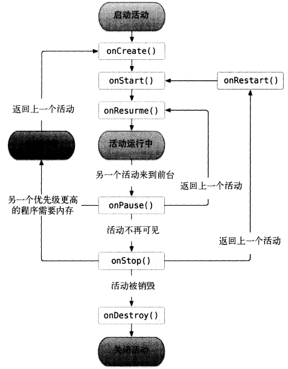
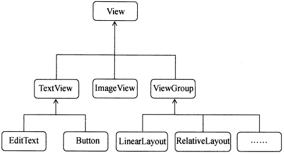

# Android开发学习

## Activity

任何活动都需要重写OnCreate方法

```java
public class MainActivity extends AppCompatActivity {

    @Override
    protected void onCreate(Bundle savedInstanceState) {
        super.onCreate(savedInstanceState);
        setContentView(R.layout.activity_main);
    }
}
```

点击按钮显示消息

```java
// findViewById方法获取在布局文件中定义的元素
Button button1 = (Button) findViewById(R.id.button);
// setOnClickListener为按钮注册一个监听器
button1.setOnClickListener(new View.OnClickListener() {
    @Override
    public void onClick(View v) {
        // 静态方法makeText()创建一个Toast对象，show()方法将Toast显示出来
        // 第一个参数是上下文，活动本身就是上下文；第三个参数是显示的时长
        Toast.makeText(MainActivity.this, "You clicked Button 1",
                Toast.LENGTH_SHORT).show();
    }
});
```

让菜单显示出来

```java
@Override
public boolean onCreateOptionsMenu(Menu menu) {
    // 第一个参数指定通过哪一个资源文件来创建菜单
    // 第二个参数是指将菜单添加到哪一个Menu对象中
    getMenuInflater().inflate(R.menu.main, menu);
    return true;
}
```

定义菜单的响应事件

```java
@Override
public boolean onOptionsItemSelected(MenuItem item) {
    switch(item.getItemId()) {
        case R.id.add_item:
            Toast.makeText(this, "You clicked Add", Toast.LENGTH_SHORT).show();
            break;
        case R.id.remove_item:
            Toast.makeText(this, "You clicked Remove", Toast.LENGTH_SHORT).show();
            break;
        default:
    }
    return true;
}
```

销毁当前活动

```java
finish();
```

### Intent

Intent是Android中各组件交互的一种重要方式，可以指明当前组件想要执行的动作，还可以在不同组件间传递数据。

可用于启动活动、启动服务、发送广播。

#### 显式Intent

Intent(Context packageContext, Class<?> cls)

- 启动活动的上下文
- 想要启动的目标活动

startActivity()方法用于启动活动

```java
button1.setOnClickListener(new View.OnClickListener() {
    @Override
    public void onClick(View v) {
        Intent intent = new Intent(MainActivity.this, SecondActivity.class);
        startActivity(intent);
    }
});
```

##### 传递数据给下一个活动

将MainActivity的数据传递给SecondActivity：

putExtra方法接收两个参数：

- 键，用于取值
- 真正要传递的数据

```java
String data = "Hello SecondActivity";
Intent intent = new Intent(MainActivity.this, SecondActivity.class);
intent.putExtra("extra_data", data);
startActivity(intent);
```

在SecondActivity中将传递的数据取出，并打印出来

- getIntent()获取到用于启动SecondActivity的Intent
- getStringExtra()获取传入的字符串数据，getIntString()、getBooleanString()

```java
Intent intent = getIntent();
String data = intent.getStringExtra("extra_data");
Log.d("SecondActivity", data);
```

##### 传递数据给上一个活动

MainActivity中：

startActivityForResult()方法接收两个参数：

- Intent
- 请求码，用于在之后回调中判断数据来源

```java
Intent intent = new Intent(MainActivity.this, SecondActivity.class);
startActivityForResult(intent, 1);
```

SecondActivity中：

setResult方法接收两个参数：

- 返回处理结果，一般用RESULT_OK或者RESULT_CANCELED两个值
- 带有数据的Intent

```java
Button button2 = (Button) findViewById(R.id.button2);
button2.setOnClickListener(new View.OnClickListener(){
    @Override
    public void onClick(View v) {
        // 创建Intent只用来传递数据
        Intent intent = new Intent();
        intent.putExtra("data_return", "Hello FirstActivity");
        setResult(RESULT_OK, intent);
        // 销毁当前活动
        finish();
    }
});
```

按下Back键时，也可以向FirstActivity返回数据

```java
@Override
public void onBackPressed() {
    Intent intent = new Intent();
    intent.putExtra("data_return", "Hello FirstActivity");
    setResult(RESULT_OK, intent);
    finish();
}
```

MainActivity中：

SecondActivity被销毁后会回调上个活动的onActivityResult方法

一个活动可能调用startActivityForResult启动多个不同的活动，需要用requestCode判断数据来源

```java
@Override
protected void onActivityResult(int requestCode, int resultCode,  Intent data) {
    switch(requestCode) {
        case 1:
            if (resultCode == RESULT_OK) {
                String returnedData = data.getStringExtra("data_return");
                Log.d("FirstActivity", returnedData);
            }
            break;
        default:
    }
}
```

#### 隐式Intent

不明确指出想要启动的活动，而是制定一系列更为抽象的action和category等信息，由系统去分析Intent

添加<intent-filter>内容，可以制定当前活动能够响应的action和category：

```xml
<activity android:name=".SecondActivity">
    <intent-filter>
        <action android:name="com.example.learn1.ACTION_START" />
        <category android:name="android.intent.category.DEFAULT" />
    </intent-filter>
</activity>
```

只有<action>和<category>能够同时和Intent中指定的匹配上时，该活动才能响应该Intent

```java
Intent intent = new Intent("com.example.learn1.ACTION_START");
startActivity(intent);
```

每个intent中只能指定一个action，但是能指定多个category

```java
intent.addCategory("com.example.learn1.MY_CATEGORY");
```

隐式Intent还可以启动其他程序的活动：

- Intent.ACTION_VIEW为android系统的内置动作，常量值为android.intent.action.VIEW
- Uri.parse将网址字符串解析成一个Uri对象

```java
Intent intent = new Intent(Intent.ACTION_VIEW);
intent.setData(Uri.parse("http://www.baidu.com"));
startActivity(intent);
```

编写活动实现响应并打开网页Intent的功能：

- <data>精确制定当前活动能够响应什么类型的数据

```xml
<activity android:name=".ThirdActivity">
    <intent-filter tools:ignore="AppLinkUrlError">
        <action android:name="android.intent.action.VIEW" />
        <category android:name="android.intent.category.DEFAULT" />
        <data android:scheme="http" />
    </intent-filter>
</activity>
```

### 活动的生命周期

Android使用Task管理活动，Task是一组存放在栈里的活动的集合，也被称为返回栈

入栈：启动新活动

出栈：finsh()销毁活动，按下Back键

系统总是会显示处于栈顶的活动给用户

活动在生命周期中的四种状态：

- 运行状态：位于返回栈栈顶
- 暂停状态：不处于栈顶，但仍然可见
- 停止状态：不处于栈顶，完全不可见
- 销毁状态：活动从返回栈中移除

活动的生存期，7个回调方法：

- onCreate()：活动第一次创建时被调用
- onStart()：不可见变为可见
- onResume()：准备好与用户交互时调用，一定位于返回栈栈顶+处于运行状态
- onPause()：准备启动或恢复另一个活动
- onStop()：活动完全不可见时调用
- onDestory()：活动被销毁之前调用
- OnRestart()：活动由停止变成运行状态之前调用

3种生存期：

- 完整生存期：onCreate()到onDestory()
- 可见生存期：onStart()到onStop()
- 前台生存期：onResume()到onPause()



#### 例子

对话框式活动和普通活动区别：

```xml
<activity android:name=".DialogActivity"
    android:theme="@android:style/Theme.Dialog">
</activity>
<activity android:name=".NormalActivity" ></activity>
```

MainActivity第一次创建，按顺序执行onCreate()、onStart()、onResume()

启动NormalActivity，MainActivity顺序执行onPause()、onStop()

返回MainActivity，MainActivity顺序执行OnRestart()、onStart()、onResume()

启动DialogActivity，MainActivity顺序执行onPause()

返回MainActivity，MainActivity顺序执行onResume()

点击退出，MainActivity顺序执行onPause()、onStop()、onDestory

MainActivity中保存临时数据：

```java
// onSaveInstanceState在活动回收前一定会被调用
protected void onSaveInstanceState(Bundle outState) {
    super.onSaveInstanceState(outState);
    String tempData = "Something you just typed";
    outState.putString("data_key", tempData);
}
```

onCreate方法中也有一个Bundle类型的参数

```java
protected void onCreate(Bundle savedInstanceState) {
    super.onCreate(savedInstanceState);
    setContentView(R.layout.activity_main);
    if (savedInstanceState != null) {
        String tempData = savedInstanceState.getString("data_key");
        Log.d(TAG, tempData);
    }
}
```

### 活动的启动模式

修改位置：

```xml
<activity 
    android:name=".MainActivity"
    android:launchMode="singleTop">
    <intent-filter>
        <action android:name="android.intent.action.MAIN" />
        <category android:name="android.intent.category.LAUNCHER" />
    </intent-filter>
</activity>
```

有四种：

- standard
  - 每启动一个新活动，就在返回栈中入栈，并处于栈顶
  - 每次启动都创建该活动的一个新实例
- singleTop
  - 启动活动时发现栈顶已经是该活动，不会再创建新实例
- singleTask
  - 在整个应用程序上下文中只存在一个实例，如果返回栈中已存在该实例则直接使用
- singleInstance
  - 启用一个新的返回栈来管理活动
  - 因为每个应用程序都有自己的返回栈，启用新的返回栈，可以使得该活动可以同时被其他应用程序和我们的应用程序调用

### 活动的最佳实践

打印当前活动名称

```java
getClass().getSimpleName()
```

随时随地退出程序

```java
public class ActivityCollector {

    public static List<Activity> activities = new ArrayList<>();

    public static void addActivity(Activity activity) {
        activities.add(activity);
    }

    public static void removeActivity(Activity activity) {
        activities.remove(activity);
    }

    public static void finishAll() {
        for (Activity activity : activities) {
            if(!activity.isFinishing()) {
                activity.finish();
            }
        }
        android.os.Process.killProcess(android.os.Process.myPid());
    }
}
```

启动活动的最佳写法

```java
// 在SecondActivity中intent所需的参数一目了然
public static void actionStart(Context context, String data1, String data2) {
    Intent intent = new Intent(context, SecondActivity.class);
    intent.putExtra("param1", data1);
    intent.putExtra("param2", data2);
    context.startActivity(intent);
}
// 在MainActivity中只需一行代码启动SecondActivity
SecondActivity.actionStart(MainActivity.this, "data1", "data2");
```

## UI开发

常用控件和布局的基本结构



Android控件的可见属性，可以通过android:visibility进行指定：

- visible：可见的，默认状态
- invisible：不可见，仍然占据原来位置和大小
- gone：不仅不可见，还不再占用任何屏幕空间

控件的setVisibility方法和getVisibility方法改变和查询空间可见性

```java
if (progressBar.getVisibility() == View.GONE) {
    progressBar.setVisibility(View.VISIBLE);
} else {
    progressBar.setVisibility(View.GONE);
}
```

AlertDialog

```java
AlertDialog.Builder dialog = new AlertDialog.Builder(MainActivity.this);
dialog.setTitle("This is a Dialog");
dialog.setMessage("important");
dialog.setPositiveButton("OK", new DialogInterface.OnClickListener() {
    @Override
    public void onClick(DialogInterface dialog, int which) {
    }
});
dialog.setNegativeButton("Cancel", new DialogInterface.OnClickListener() {
    @Override
    public void onClick(DialogInterface dialog, int which) {
    }
});
dialog.show();
```

### 4类基本布局

#### 线性布局

android:layout_gravity定义控件的对齐方式

android:layout_width="0dp"的情况下，android:layout_weight="1"可以使用比例的方式指定控件的大小

系统会把LinearLayout下所有控件指定的layout_weight值相加，得到一个总值，然后每个控件所占大小的比例就是用该控件的layout_weight值除以刚才算出的总值

```xml
<LinearLayout
    android:layout_width="match_parent"
    android:layout_height="match_parent"
    android:orientation="horizontal">

    <EditText
        android:id="@+id/editTextTextPersonName"
        android:layout_width="0dp"
        android:layout_height="wrap_content"
        android:layout_weight="1"
        android:ems="10"
        android:inputType="textPersonName"
        android:text="Name" />

    <Button
        android:id="@+id/button4"
        android:layout_width="0dp"
        android:layout_height="wrap_content"
        android:layout_weight="1"
        android:text="Button" />
</LinearLayout>
```

EditText的android:layout_weight="1"，Button的android:layout_width="wrap_content"，表示：

- Button宽度仍按照wrap_content计算
- EditText会占满屏幕所有剩余空间

```xml
<EditText
    android:id="@+id/editTextTextPersonName"
    android:layout_width="0dp"
    android:layout_height="wrap_content"
    android:layout_weight="1"
    android:ems="10"
    android:inputType="textPersonName"
    android:text="Name" />

<Button
    android:id="@+id/button4"
    android:layout_width="wrap_content"
    android:layout_height="wrap_content"
    android:text="Button" />
```

#### 相对布局

与父控件的相对位置：

android:layout_alignParentLeft、android:layout_alignParentTop、android:layout_alignParentRight、android:layout_alignParentBottom、android:layout_centerInParent

与其他控件的相对位置：

android:layout_toLeftOf="@id/button5"、android:layout_toRightOf、android:layout_above、android:layout_below

#### 帧布局

#### 百分比布局

允许直接指定控件在布局中所占的百分比，实现任意比例分割布局

LInearLayout本身支持按比例指定控件大小，只为FrameLayout和RelativeLayout进行了功能扩展

- 百分比布局不是内置在系统SDK中的，需要把完整的包路径写出来
- 还必须定义一个app的命名空间，才能使用百分比布局的自定义属性

在build.gradle中添加：

```
implementation 'androidx.percentlayout:percentlayout:1.0.0'
```

activity_main.xml

```xml
<?xml version="1.0" encoding="utf-8"?>
<androidx.percentlayout.widget.PercentFrameLayout xmlns:android="http://schemas.android.com/apk/res/android"
    xmlns:app="http://schemas.android.com/apk/res-auto"
    xmlns:tools="http://schemas.android.com/tools"
    android:layout_width="match_parent"
    android:layout_height="match_parent"
    tools:context=".MainActivity">

    <Button
        android:id="@+id/button10"
        app:layout_widthPercent = "50%"
        app:layout_heightPercent = "50%"
        android:layout_gravity="top|left"
        android:text="Button" />

</androidx.percentlayout.widget.PercentFrameLayout>
```

### 创建自定义组件

#### 创建自定义布局

在activity_main.xml中引入布局文件

```xml
<include layout="@layout/title" />
```

在MainActivity隐藏系统自带的标题栏

```java
ActionBar actionBar = getSupportActionBar();
if(actionBar != null) {
    actionBar.hide();
}
```

#### 创建自定义组件

创建自定义组件后，不必反复写同一函数

创建类TitleLayout

```java
public class TitleLayout extends LinearLayout {

    // 重写构造函数
    public TitleLayout(Context context, AttributeSet attrs) {
        super(context, attrs);
        // 实现动态加载布局文件，第一个参数为要加载的布局id，第二个参数为父布局
        LayoutInflater.from(context).inflate(R.layout.title, this);
        Button titleBack = (Button) findViewById(R.id.button);
        Button titleEdit = (Button) findViewById(R.id.button2);
        titleBack.setOnClickListener(new OnClickListener() {
            @Override
            public void onClick(View v) {
                ((Activity) getContext()).finish();
            }
        });
        titleEdit.setOnClickListener(new OnClickListener() {
            @Override
            public void onClick(View v) {
                Toast.makeText(getContext(), "You clicked Edit button", Toast.LENGTH_SHORT).show();
            }
        });
    }
}
```

在activity_main.xml中使用该类，需要指明控件的完整类名

```xml
<com.example.uicustomviews.TitleLayout
    android:layout_width="match_parent"
    android:layout_height="wrap_content" />
```

### ListView

在布局文件中定义ListView

```xml
<ListView
        android:id="@+id/list_view"
        android:layout_width="match_parent"
        android:layout_height="match_parent" />
```

在MainActivity中通过ArrayAdapter适配器将数据传输给listview

ArrayAdapter的第二个参数为ListView子项布局的id

- android.R.layout.simple_list_item_1是一个Android内置的布局文件，里面只有一个TextView，可用于简单的显示一段文本

```java
// 数组中的数据需要适配器传递给ListView
// ArrayAdapter可以通过泛型指定要适配的数据类型，然后在构造函数中将要适配的数据传入
ArrayAdapter<String> adapter = new ArrayAdapter<String>(
        // 参数为：当前上下文、ListView子项布局的id、要适配的数据
        MainActivity.this, android.R.layout.simple_list_item_1, data);
ListView listView = (ListView) findViewById(R.id.list_view);
// 将构建好的适配器对象传进去
listView.setAdapter(adapter);
```

#### 定制ListView的界面

##### 定义实体类作为ListView适配器的适配类型

Fruit类有name和imageId两个参数

```java
public class Fruit {
    private String name;
    private int imageId;

    public Fruit(String name, int imageId) {
        this.name = name;
        this.imageId = imageId;
    }

    public String getName() {
        return name;
    }

    public int getImageId() {
        return imageId;
    }
}
```

##### 定义布局作为ListView的子项

fruit_item布局中定义了两项内容

```xml
<?xml version="1.0" encoding="utf-8"?>
<LinearLayout xmlns:android="http://schemas.android.com/apk/res/android"
    xmlns:app="http://schemas.android.com/apk/res-auto"
    xmlns:tools="http://schemas.android.com/tools"
    android:layout_width="match_parent"
    android:layout_height="wrap_content">

    <ImageView
        android:id="@+id/imageView"
        android:layout_width="wrap_content"
        android:layout_height="wrap_content"
        android:layout_weight="1"/>

    <TextView
        android:id="@+id/textView"
        android:layout_width="wrap_content"
        android:layout_height="wrap_content"
        android:layout_gravity="center_vertical"
        android:layout_marginLeft="10dp"
        android:layout_weight="1"
        android:text="TextView" />
</LinearLayout>
```

##### 定义适配器继承ArrayAdapter

自定义的适配器将泛型指定为Adapter类

```java
public class FruitAdapter extends ArrayAdapter<Fruit> {
    private int resourceId;
    // 重写构造函数
    public FruitAdapter(Context context, int textViewResourceId, List<Fruit> objects) {
        super(context, textViewResourceId, objects);
        resourceId = textViewResourceId;
    }

    // 重写getView方法，在每个子项滚动到屏幕内时会被调用
    @Override
    public View getView(int position, View convertView, ViewGroup parent) {
        // 获取当前项的Fruit实例
        Fruit fruit = getItem(position);
        // 动态加载布局文件
        View view = LayoutInflater.from(getContext()).inflate(resourceId, parent, false);
        // 设置图片和文字的显示
        ImageView fruitImage = (ImageView) view.findViewById(R.id.imageView);
        TextView fruitName = (TextView) view.findViewById(R.id.textView);
        fruitImage.setImageResource(fruit.getImageId());
        fruitName.setText(fruit.getName());
        return view;
    }
}
```

##### MainActivity调用适配器

先初始化一些数据

```java
private void initFruits() {
    for (int i=0; i<3; i++) {
        Fruit apple = new Fruit("Apple", R.drawable.a);
        fruitList.add(apple);
```

然后调用适配器，将数据传入适配器中

```java
private List<Fruit> fruitList = new ArrayList<>();

//main方法中
		initFruits();
        FruitAdapter adapter = new FruitAdapter(MainActivity.this, R.layout.fruit_item, fruitList);
		ListView listView = (ListView) findViewById(R.id.list_view);
        // 将构建好的适配器对象传进去
        listView.setAdapter(adapter);
```

为listview添加监听事件：

```java
ListView listView = (ListView) findViewById(R.id.list_view);
// 将构建好的适配器对象传进去
listView.setAdapter(adapter);
listView.setOnItemClickListener(new AdapterView.OnItemClickListener() {
    @Override
    public void onItemClick(AdapterView<?> parent, View view, int position, long id) {
        Fruit fruit = fruitList.get(position);
        Toast.makeText(MainActivity.this, fruit.getName(), Toast.LENGTH_SHORT).show();
    }
});
```

### RecyclerView

增强版的ListView，能够实现ListView同样的效果，优化了它的不足

同样需要定义实体类作为适配器的适配类型，也需要定义布局作为子项，在定义适配器时与ListView有较大差别：

- 包含内部类ViewHolder
- FruitAdapter的构造函数
- 三个需要重写的方法：onCreateViewHolder、onBindViewHolder、getItemCount

```java
public class FruitAdapter extends RecyclerView.Adapter<FruitAdapter.ViewHolder> {

    private List<Fruit> mFruitList;

    // 定义内部类ViewHolder
    static class ViewHolder extends RecyclerView.ViewHolder {
        // 保存子项最外层布局的实例
        View fruitView;
        ImageView fruitImage;
        TextView fruitName;

        public ViewHolder(View view) {
            super(view);
            fruitView = view;
            fruitImage = (ImageView) view.findViewById(R.id.imageView);
            fruitName = (TextView) view.findViewById(R.id.textView);
        }
    }

    // FruitAdapter的构造函数
    public FruitAdapter(List<Fruit> fruitList) {
        mFruitList = fruitList;
    }

    // FruitAdapter的构造函数继承RecyclerView.Adapter，必须重写下面三个方法
    // 用于创建ViewHolder实例
    @Override
    public ViewHolder onCreateViewHolder(ViewGroup parent, int viewType) {
        // 加载fruit_item布局
        View view = LayoutInflater.from(parent.getContext()).inflate(R.layout.fruit_item, parent, false);
        ViewHolder holder = new ViewHolder(view);
        // 为子项整体和子项中的图片注册点击事件
        holder.fruitView.setOnClickListener(new View.OnClickListener() {
            @Override
            public void onClick(View v) {
                int position = holder.getAdapterPosition();
                Fruit fruit = mFruitList.get(position);
                Toast.makeText(v.getContext(), "you clicked view " + fruit.getName(), Toast.LENGTH_SHORT).show();
            }
        });
        holder.fruitImage.setOnClickListener(new View.OnClickListener() {
            @Override
            public void onClick(View v) {
                int position = holder.getAdapterPosition();
                Fruit fruit = mFruitList.get(position);
                Toast.makeText(v.getContext(), "you clicked image " + fruit.getName(), Toast.LENGTH_SHORT).show();
            }
        });
        return holder;
    }

    // 对子项赋值，在每个子项被滚动到屏幕内的时候执行
    @Override
    public void onBindViewHolder(ViewHolder holder, int position) {
        Fruit fruit = mFruitList.get(position);
        holder.fruitImage.setImageResource(fruit.getImageId());
        holder.fruitName.setText(fruit.getName());
    }

    // 告诉RecyclerView一共有多少子项
    @Override
    public int getItemCount() {
        return mFruitList.size();
    }
}
```

MainActivity调用适配器，需要用layoutManager指明布局方式

LayoutManager中制定了一套可扩展的布局排列接口，子类只要按照接口的规范实现，就能定制出不同排列方式的布局

除了LinearLayoutManager，还提供GridLayoutManager和StaggeredLayoutManager

```java
initFruits();
RecyclerView recyclerView = (RecyclerView) findViewById(R.id.recycler_view);
// layoutManager用于指定RecyclerView的布局方式
LinearLayoutManager layoutManager = new LinearLayoutManager(this);
recyclerView.setLayoutManager(layoutManager);
FruitAdapter adapter = new FruitAdapter(fruitList);
recyclerView.setAdapter(adapter);
```

## 广播

每个应用程序对自己感兴趣的广播进行注册，程序只会收到自己感兴趣的广播内容

广播类型：

- 标准广播：完全异步执行，所有广播接收器几乎会在统一时刻收到这条广播消息，没有先后顺序
- 有序广播：同步执行，广播发出，同一时刻只有一个广播能够收到消息，当这个广播接收器处理完消息后，广播才能继续
  - 有先后顺序，优先级高的广播接收器可以先收到广播消息，前面的广播接收器可以截断后面的广播

### 接收系统广播

注册广播的方式：

- 动态注册：在代码中注册
  - 必须在程序启动后才能够收到广播
- 静态注册：在AndroidManifest.xml中注册

#### 动态注册监听网络变化

创建广播接收器：创建一个继承BroadcastReceiver的类，重写onReceive方法

选择要监听的广播类型：intentFilter.addAction(XXX)

注册服务

取消注册服务

```java
public class MainActivity extends AppCompatActivity {

    private IntentFilter intentFilter;

    private NetworkChangeReceiver networkChangeReceiver;

    @Override
    protected void onCreate(Bundle savedInstanceState) {
        super.onCreate(savedInstanceState);
        setContentView(R.layout.activity_main);
        intentFilter = new IntentFilter();
        // 网络状态发生变化，将会发出android.net.conn.CONNECTIVITY_CHANGE广播
        intentFilter.addAction("android.net.conn.CONNECTIVITY_CHANGE");
        networkChangeReceiver = new NetworkChangeReceiver();
        // 注册广播接收器
        registerReceiver(networkChangeReceiver, intentFilter);
    }

    @Override
    protected void onDestroy() {
        super.onDestroy();
        // 动态注册的广播必须取消注册
        unregisterReceiver(networkChangeReceiver);
    }

    // 内部类继承BroadcastReceiver
    class NetworkChangeReceiver extends BroadcastReceiver {

        // 重写onReceive方法
        @Override
        public void onReceive(Context context, Intent intent) {
            Toast.makeText(context, "network changes", Toast.LENGTH_SHORT).show();
        }
    }
}
```

给出更明确的网络提示，需要获取网络实际连接情况，需要在清单文件中加入权限声明：

```xml
<uses-permission android:name="android.permission.ACCESS_NETWORK_STATE" />
```

获取网络连接情况：

```java
@Override
public void onReceive(Context context, Intent intent) {
    ConnectivityManager connectivityManager = (ConnectivityManager) getSystemService(Context.CONNECTIVITY_SERVICE);
    NetworkInfo networkInfo = connectivityManager.getActiveNetworkInfo();
    if(networkInfo != null && networkInfo.isAvailable()) {
        Toast.makeText(context, "network is available", Toast.LENGTH_SHORT).show();
    } else {
        Toast.makeText(context, "network is unavailable", Toast.LENGTH_SHORT).show();
    }
}
```

#### 静态注册实现开机启动

程序接收开机广播

```java
public class BootCompleteReceiver extends BroadcastReceiver {

    @Override
    public void onReceive(Context context, Intent intent) {
        // TODO: This method is called when the BroadcastReceiver is receiving
        // an Intent broadcast.
        Toast.makeText(context, "Boot Complete", Toast.LENGTH_LONG).show();
        throw new UnsupportedOperationException("Not yet implemented");
    }
}
```

使用android studio的快捷方式创建广播，会自动在清单文件注册广播，需要在intent-filter标签中添加相应action，android系统启动完成后就会发送值为android.intent.action.BOOT_COMPLETED的广播

```xml
<receiver
    android:name=".BootCompleteReceiver"
    android:enabled="true"
    android:exported="true">
    <intent-filter>
        <action android:name="android.intent.action.BOOT_COMPLETED" />
    </intent-filter>
</receiver>
```

还需要在清单文件上加监听系统开机广播的权限申请：

```xml
<uses-permission android:name="android.permission.RECEIVE_BOOT_COMPLETED" />
```

#### 发送自定义广播

注意Android O中对隐式广播做了限制，如下四个条件同时满足，则该广播不能被正常收到：

- r.intent.getComponent() == null
- r.intent.getPackage() == null
- r.intent.getFlags() & Intent.FLAG_RECEIVER_INCLUDE_BACKGROUND) == 0
- !isSignaturePerm(r.requiredPermissions)

点击按钮，发送广播

```java
Button button = (Button) findViewById(R.id.button);
button.setOnClickListener(new View.OnClickListener() {
    @Override
    public void onClick(View v) {
        Intent intent = new Intent("com.example.broadcasttest.MY_BROADCAST");
        // 为了让广播被接收到，需要加上包名
        intent.setPackage("com.example.broadcasttest");
        sendBroadcast(intent);
        Log.v("test", intent.getAction());
    }
});
```

定义类，接收广播

并修改清单文件

```xml
<receiver
    android:name=".MyBroadcastReceiver"
    android:enabled="true"
    android:exported="true">
    <intent-filter>
        <action android:name="com.example.broadcasttest.MY_BROADCAST" />
    </intent-filter>
</receiver>
```

另外，在android O中，App不能使用在manifests中注册receiver的方式接收大部分的隐式广播

##### 有序广播

发送有序广播：

```java
// 第一个参数是intent，第二个参数是权限相关的字符串
sendOrderedBroadcast(intent, null);
```

确定接收先后顺序，设置优先级：

```xml
<intent-filter android:priority="100">
```

截断广播：

```java
// 在onReceiver方法中截断广播
abortBroadcast();
```

## 内容提供器

在不同应用程序之间实现数据共享

提供了一套完整的机制，允许一个程序访问另一个程序的数据，同时保证访问数据的安全性

### Android权限机制

Android运行时权限，不需要在安装软件的时候一次性授权所有申请的权限，而是可以在软件的使用过程中再对某一项权限申请进行授权

权限分类：

- 普通权限，不会直接威胁到用户安全和隐私，系统自动帮我们授权
- 危险权限，可能涉及用户隐私或对设备安全性造成影响，需要用户手动点击授权

一套完整的请求权限的流程，核心是在程序运行过程中由用户授权我们去执行某些危险操作

清单文件中

```xml
<uses-permission android:name="android.permission.CALL_PHONE"/>
```

MainActivity中

- ContextCompat.checkSelfPermission()判断用户是否对应用程序进行了授权
  - 第一个参数是Context，第二个参数是具体的权限名
- ActivityCompat.requestPermissions()方法向用户申请授权
  - 第一个参数是Activity实例，第二个是String数组（里面是要申请的权限名），第三个是请求码
  - 之后系统会弹出一个权限申请的对话框，用户可以选择同意或拒绝权限申请
  - 最终会回调到onRequestPermissionResult()方法中，grantResults参数中存储授权结果

```java
public class MainActivity extends AppCompatActivity {

    @Override
    protected void onCreate(Bundle savedInstanceState) {
        super.onCreate(savedInstanceState);
        setContentView(R.layout.activity_main);
        Button makeCall = (Button) findViewById(R.id.button);
        makeCall.setOnClickListener(new View.OnClickListener() {
            @Override
            public void onClick(View v) {
                // 判断用户是否对应用程序进行了授权
                if (ContextCompat.checkSelfPermission(MainActivity.this, Manifest.
                        permission.CALL_PHONE) != PackageManager.PERMISSION_GRANTED) {
                    // 没有进行授权
                    ActivityCompat.requestPermissions(MainActivity.this, new
                            String[]{Manifest.permission.CALL_PHONE}, 1);
                } else {
                    // 已授权
                    call();
                }
            }
        });
    }

    //打电话
    private void call() {
        try {
            Intent intent = new Intent(Intent.ACTION_CALL);
            intent.setData(Uri.parse("tel:10086"));
            startActivity(intent);
        } catch (SecurityException e) {
            e.printStackTrace();
        }
    }

    @Override
    public void onRequestPermissionsResult(int requestCode, String[] permissions, int[] grantResults) {
        switch (requestCode) {
            case 1:
                if (grantResults.length > 0 && grantResults[0] == PackageManager.PERMISSION_GRANTED) {
                    // 如果用户授权
                    call();
                } else {
                    // 用户未授权
                    Toast.makeText(this, "You denied the permission", Toast.LENGTH_SHORT).show();
                }
                break;
            default:
        }
    }
}
```

### 访问其他程序中的数据

ContentReslover类用于访问内容提供器中共享的数据，增删改查方法使用一个Uri参数，也就是内容URI

内容URI由两部分组成：

- authority：用于对不同的应用程序做区分，采用程序包名
- path：对不同的表做区分

标准的格式写法：content://com.example.app.provider/table1

## 服务

服务使Android中实现程序后台运行的解决方案，适合执行不需要和用户交互而且还要求长期运行的任务，服务运行不依赖任何用户界面

服务不是运行在独立的进程中，而是依赖于创建服务时所在的应用程序进程

### Android多线程编程

创建线程，通过匿名类实现Runnable接口的方式定义线程：

```java
new Thread(new Runnable() {
    @Override
    public void run() {
        // 具体逻辑
    }
}).start();
```

### 异步消息处理机制实现子线程更新UI

```java
public class MainActivity extends AppCompatActivity {

    // 定义整型常量，表示更新动作
    public static final int UPDATE_TEXT = 1;

    private TextView text;

    // 定义handler对象
    private Handler handler = new Handler() {
        // 重写父类方法处理信息
        public void handleMessage(Message msg) {
            switch (msg.what) {
                case UPDATE_TEXT:
                    text.setText("Nice to meet you");
            }
        }
    };

    @Override
    protected void onCreate(Bundle savedInstanceState) {
        super.onCreate(savedInstanceState);
        setContentView(R.layout.activity_main);
        text = (TextView) findViewById(R.id.text);
        Button button = (Button) findViewById(R.id.button);
        button.setOnClickListener(new View.OnClickListener() {
            @Override
            public void onClick(View v) {
                // 创建子线程
                new Thread(new Runnable() {
                    @Override
                    public void run() {
                        Message message = new Message();
                        message.what = UPDATE_TEXT;
                        // 调用handler.sendMessage方法发送消息
                        handler.sendMessage(message);
                    }
                }).start();
            }
        });
    }
}
```

### 异步消息处理机制基本概念

- Message：在线程之间传递消息，可以在内部携带少量信息，用于不同线程间交换数据
  - what、arg1、arg2携带整型数据，obj携带Object对象
- Handler：用于发送和处理消息
  - sendMessage()发送消息
  - handleMessage()接收消息
- MessageQueue：消息队列，存放所有通过Handler发送的消息，每个线程只有一个
- Looper：每个线程中MessageQueue的管家，每个线程只有一个Looper对象
  - Looper.loop()会进入无限循环中，每发现MessageQueue存在一条消息，就取出，并传递到Handler的handleMessage()方法中

Handler在主线程中创建，所以此时handleMessage方法中的代码也会在主线程运行

AsyncTask抽象类

### 服务的基本方法

定义MyService类

```java
public class MyService extends Service {
    public MyService() {
    }

    @Override
    public IBinder onBind(Intent intent) {
        // TODO: Return the communication channel to the service.
        throw new UnsupportedOperationException("Not yet implemented");
    }

    // 在服务创建时调用
    @Override
    public void onCreate() {
        super.onCreate();
    }

    // 在服务启动时调用
    @Override
    public int onStartCommand(Intent intent, int flags, int startId) {
        return super.onStartCommand(intent, flags, startId);
    }

    // 在服务销毁时调用
    @Override
    public void onDestroy() {
        super.onDestroy();
    }
}
```

清单文件中定义Service：

```xml
<service
    android:name=".MyService"
    android:enabled="true"
    android:exported="true"></service>
```

MainActivity启动或者关闭服务：

```java
public class MainActivity extends AppCompatActivity implements View.OnClickListener{

    @Override
    protected void onCreate(Bundle savedInstanceState) {
        super.onCreate(savedInstanceState);
        setContentView(R.layout.activity_main);
        Button startService = (Button) findViewById(R.id.start_service);
        Button stopService = (Button) findViewById(R.id.stop_service);
        startService.setOnClickListener(this);
        stopService.setOnClickListener(this);
    }

    @Override
    public void onClick(View v) {
        switch(v.getId()) {
            case R.id.start_service:
                Intent startIntent = new Intent(this, MyService.class);
                // 启动服务
                startService(startIntent);
                break;
            case R.id.stop_service:
                Intent stopIntent = new Intent(this, MyService.class);
                // 关闭服务
                stopService(stopIntent);
                break;
        }
    }
}
```

#### 活动和服务通过Binder通信

服务

```java
public class MyService extends Service {

    private DownloadBinder mBinder = new DownloadBinder();

    class DownloadBinder extends Binder {

        public void startDownload() {
            Log.d("MyService", "startDownload executed");
        }
        public int getProgress() {
            Log.d("MyService", "getProgress executed");
            return 0;
        }
    }

    public MyService() {
    }

    @Override
    public IBinder onBind(Intent intent) {
        // TODO: Return the communication channel to the service.
        return mBinder;
    }

    // 在服务创建时调用
    @Override
    public void onCreate() {
        Log.d("MyService", "OnCreate executed");
        super.onCreate();
    }

    // 在服务启动时调用
    @Override
    public int onStartCommand(Intent intent, int flags, int startId) {
        Log.d("MyService", "onStartCommand executed");
        return super.onStartCommand(intent, flags, startId);
    }

    // 在服务销毁时调用
    @Override
    public void onDestroy() {
        Log.d("MyService", "onDestroy executed");
        super.onDestroy();
    }
}
```

活动

```java
public class MainActivity extends AppCompatActivity implements View.OnClickListener{

    private MyService.DownloadBinder downloadBinder;

    @Override
    protected void onCreate(Bundle savedInstanceState) {
        super.onCreate(savedInstanceState);
        setContentView(R.layout.activity_main);
        Button startService = (Button) findViewById(R.id.start_service);
        Button stopService = (Button) findViewById(R.id.stop_service);
        Button bindService = (Button) findViewById(R.id.bind_service);
        Button unbindService = (Button) findViewById(R.id.unbind_service);
        startService.setOnClickListener(this);
        stopService.setOnClickListener(this);
        bindService.setOnClickListener(this);
        unbindService.setOnClickListener(this);
    }

    // 创建ServiceConnection匿名类，重写onServiceConnected和onServiceDisconnected方法
    private ServiceConnection connection = new ServiceConnection() {
        // 在成功绑定时调用
        @Override
        public void onServiceConnected(ComponentName name, IBinder service) {
            // 可以调用服务binder中的方法
            downloadBinder = (MyService.DownloadBinder) service;
            downloadBinder.startDownload();
            downloadBinder.getProgress();
        }

        // 在解除绑定时调用
        @Override
        public void onServiceDisconnected(ComponentName name) {

        }
    };

    @Override
    public void onClick(View v) {
        switch(v.getId()) {
            case R.id.start_service:
                Intent startIntent = new Intent(this, MyService.class);
                // 启动服务
                startService(startIntent);
                break;
            case R.id.stop_service:
                Intent stopIntent = new Intent(this, MyService.class);
                // 关闭服务
                stopService(stopIntent);
                break;
            case R.id.bind_service:
                Intent bindIntent = new Intent(this, MyService.class);
                // 绑定服务，将MainActivity和MyService绑定，BIND_AUTO_CREATE绑定后自动创建服务
                bindService(bindIntent, connection, BIND_AUTO_CREATE);
                break;
            case R.id.unbind_service:
                // 解绑服务
                unbindService(connection);
                break;
        }
    }
}
```

### 服务的生命周期

如果调用Context的startService()：

- 服务还没有创建过，先执行onCreate()方法，否则不执行
- 服务执行onStartCommand()方法

服务启动后一直保持运行状态，直到stopService()或stopSelf()被调用

服务只会存在一个实例

如果调用Context的bindService()：

- 服务还没有创建过，先执行onCreate()方法，否则不执行
- 服务执行onBind()方法，调用方获取onBinder()方法返回的IBinder对象实例

服务销毁的可能情况：

- startService()后stopService()，服务执行onDestory()，完全销毁
- bindService()后unbindService()，服务执行onDestory()，完全销毁
- startService()+bindService()，需要stopService()+unbindService()，服务执行onDestory()，完全销毁