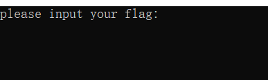
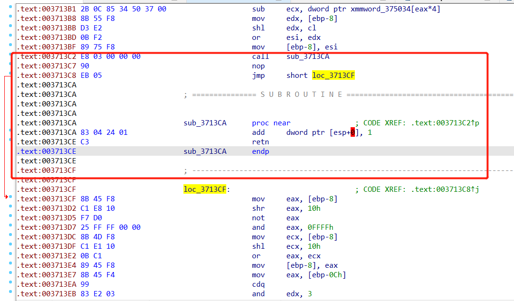
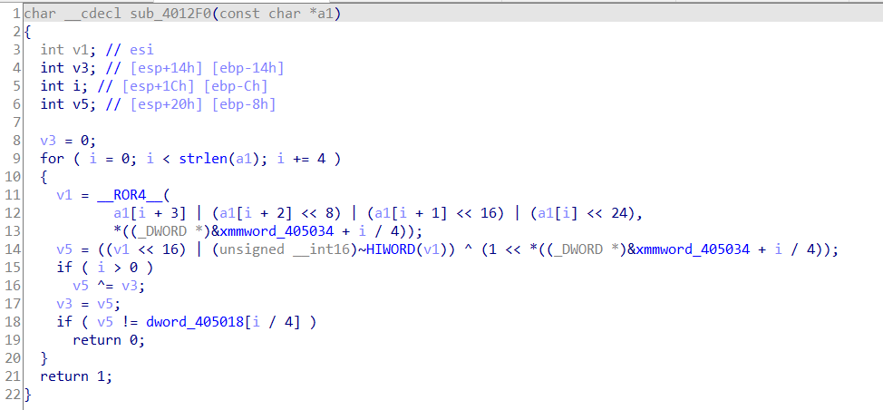
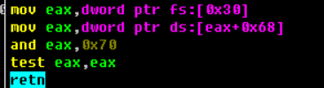
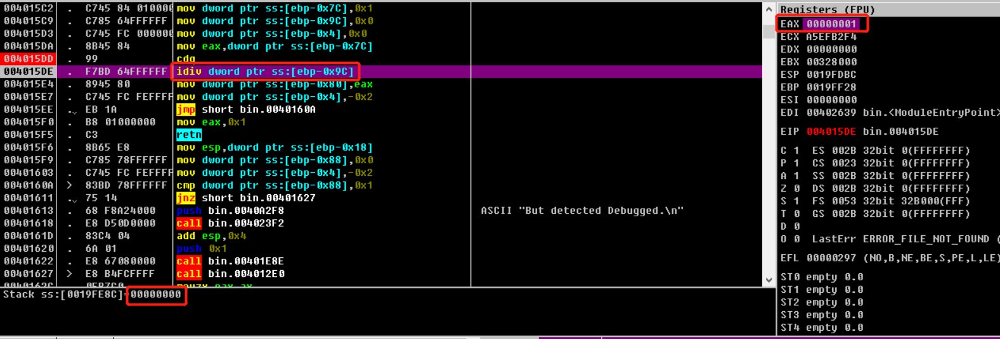

# 逆向安全学习

主要参考文章：[CTF wiki](https://ctf-wiki.org/reverse/windows/unpack/packer-introduction/)

## 脱壳技术

压缩壳原理示例


壳分为压缩壳和加密壳

压缩壳

- 一种只是单纯用于压缩普通 PE 文件的压缩壳
- 而另一种则会对源文件进行较大变形，严重破坏 PE 文件头，经常用于压缩恶意程序
- 常见的压缩壳有：Upx、ASpack、PECompat

加密壳

- 加密壳或称保护壳，应用有多种防止代码逆向分析的技术，它最主要的功能是保护 PE 免受代码逆向分析
- 加密壳的主要目的不再是压缩文件资源，所以加密壳保护的 PE 程序通常比原文件大得多
- 常见的加密壳有：ASProtector、Armadillo、EXECryptor、Themida、VMProtect

### 单步跟踪法

单步跟踪法的原理就是通过 Ollydbg 的步过 (F8)、步入(F7) 和运行到 (F4) 功能，完整走过程序的自脱壳过程，跳过一些循环恢复代码的片段，并用单步进入确保程序不会略过 OEP（Original Entry Point，原始入口地址）

这样可以在软件自动脱壳模块运行完毕后, 到达 OEP, 并 dump 程序

要点：

1. 打开程序按 F8 单步向下, 尽量实现向下的 jmp 跳转
2. 会经常遇到大的循环, 这时要多用 F4 来跳过循环
3. 如果函数载入时不远处就是一个 call(近 call), 那么我们尽量不要直接跳过, 而是进入这个 call
4. 一般跳转幅度大的 jmp 指令, 都极有可能是跳转到了原程序入口点 (OEP)

一开始一般是`pushad`保存现场环境


最后是`popad`恢复现场环境

可以看到最下面的jmp跳转幅度很大，说明极有可能是跳转到OEP


可以看到跳转到了程序入口点


找到程序入口点，就可以利用OllyDebug插件脱壳了

### ESP定律

利用程序中的堆栈平衡快速找到OEP

由于在程序自解密或者自解压过程中，多数壳会先将当前寄存器状态压栈，如使用`pushad`，而在解压结束后，会将之前的寄存器值出栈，如使用`popad`

如果在载入程序后只有ESP寄存器内容发生变化，大概率可以使用ESP定律

- 因此在寄存器压栈后，在ESP处设置断点
- 当寄存器出栈时，程序代码就会被恢复，此时硬件断点触发
- 在断点触发的位置，往往只需要几次单步操作，就会到达程序真正的OEP位置

壳运行前寄存器值


单步执行`pushad`后，发现只有ESP寄存器的值发生变化，说明可以应用ESP定律


对ESP寄存器设置断点后，直接运行程序，触发断点，可以发现此时除了EIP寄存器的值不一样，其他寄存器的值不变


此时再运行几步就能到OEP了

### 一步到达OEP法

根据所脱壳的特征, 寻找其距离 OEP 最近的一处汇编指令, 然后下断点, 在程序走到 OEP 的时候 dump 程序

- ctrl+f 查找 popad
- ctrl+l 跳转到下一个匹配处
- 找到匹配处, 确认是壳解压完毕即将跳转到 OEP 部分, 则设下断点运行到该处
- 只适用于极少数压缩壳

### IAT重建

IAT即为Import Address Table

程序调用外部DLL中的函数时，需要知道这些函数的实际地址，函数名称与函数实际地址的映射关系就存储在IAT表中

使用ImportREC重建IAT

- 首先附加到正在运行的进程
- 然后填写OEP，点击自动搜索，弹出提示框
- 接下来点击获取导入表，查看函数是否有效
- 最后点击修正转储，选择要修复的文件dump.exe，修复成功得到dump_.exe


手动查找IAT表

在ollydebug中右键查找所有模块间调用，选择一个程序的函数进行双击


右键选择follow，进入函数


然后右键follow in dump，选择memory address；再在数据窗口选择长型->地址，可以看到函数名，然后就可以看到IAT块的起始位置和大小


与上面ImportREC自动算出的0x62DC和0x244相同

## 反调试技术

### 花指令

花指令是企图隐藏掉不想被逆向工程的代码块 (或其它功能) 的一种方法，在真实代码中插入一些垃圾代码的同时还保证原有程序的正确执行，而程序无法很好地反编译， 程序内容难以被理解，以达到混淆视听的效果

#### 花指令类型

参考文章：[手脱花指令及IDA脚本编写](https://www.52pojie.cn/forum.php?mod=viewthread&tid=1512089&highlight=%BB%A8%D6%B8%C1%EE) 、[花指令总结](https://www.anquanke.com/post/id/236490)

在代码间插入无用的字节，在不影响执行的情况下，使得反编译错误

- 可以使用`_emit 立即数`实现插入字节
- 通过`jmp 永真条件`实现永恒跳转

##### 多层JMP嵌套

反编译器一般能够成功反汇编

```C
void example1()
{
	__asm {
		jmp LABEL1;
		_emit 68h;
	LABEL1:
		jmp LABEL2;
		_emit 0CDh;
		_emit 20h;
	LABEL2:
		jmp LABEL3;
		_emit 0E8h;
	LABEL3:
	}
	a = 1;
}
```

##### 互补条件代替JMP跳转

je命令永远执行，jne命令一定不执行

```c
void example2_3()
{
	__asm {
		xor eax, eax;
		test eax, eax;
		je LABEL1;
		jne LABEL2;
	LABEL2 :
		_emit 0x5e;
		and eax, ebx;
		_emit 0x50;
		xor eax, ebx;
		_emit 0x74;
		add eax, edx;
	LABEL1:
	}
	a = 23;
}
```

可以发现IDA反编译结果有点混乱


##### call&ret构造花指令

esp中存储的是返回地址的位置，修改esp指向的返回地址，可以跳过垃圾指令

```c
void example3_1()
{

	__asm {
		call LABEL9;
		_emit 0x83;
	LABEL9:
		add dword ptr ss : [esp], 8;
		ret;
		__emit 0xF3;
	}
	a = 31;
}
```

IDA反编译效果不好


使用ollydebug动态调试查看花指令效果，step into call指令后，可以看到在add执行之前，call的返回地址是0x40111B指向的`db 83`垃圾代码


在add语句执行之后，call的返回地址为0x401123指向的正常代码，跳过了中间的垃圾语句


##### 利用函数返回确定值

故意给`LoadLibrary`函数传入不存在的模块名称，它就一定会返回Null，并存在eax寄存器中

```c
void example4_1()
{

	LoadLibrary(L"./hhhh");//函数返回值存储于eax中
	__asm{
		cmp eax, 0;
		jc LABEL6_1;
		jnc LABEL6_2;
	LABEL6_1:
		_emit 0xE8;
	LABEL6_2:
	}
	a = 4;
}
```

IDA反编译效果不好


#### Ollydebug动态调试分析花指令

使用Ollydebug的run trace功能，查看执行的指令和寄存器的修改情况，从中选出重要的指令进行分析

以`看雪.TSRC 2017CTF秋季赛`第二题为例

在50函数中，可以看到用了不安全的`scanf`接收用户输入


双击v1，可以看到栈的大小为12，也就是输入大于12会发生栈溢出


在text段中可以发现大段数据，数据所在地址为0x00413131，正好是"11A"字符可访问的，所以可以用11A覆盖返回地址，从而执行到该位置


在IDA中按下C键，将数据段视作代码，发现此处确实存在可执行的代码


在ollydebug中ctrl+g，输入地址，按回车，给0x413131打上断点，输入abcdefghijkl11A发现确实可以执行到该位置


去除模块分析后，可以看到相应的汇编代码


然后选择View->Run trace和Debug->Step into，查看执行流程


此时可以根据寄存器值的变化，找出关键的指令，可以发现在`jnz ctf2017_.00413B03`后程序逻辑发生变化，所以该处为一个关键判断点，在此处打上断点

```assembly
add esp,-0x10
xor eax,eax 		; eax = 0
pop eax 			; EAX=64636261, ESP=0019FF28
mov ecx,eax 		; ECX=64636261
pop eax				; EAX=68676665, ESP=0019FF2C
mov ebx,eax			; EBX=68676665
pop eax				; EAX=6C6B6A69, ESP=0019FF30
mov edx,eax			; EDX=6C6B6A69
mov eax,ecx			; EAX=64636261

sub eax,ebx			; FL=CPAS, EAX=FBFBFBFC
shl eax,0x2			; FL=CPS, EAX=EFEFEFF0
add eax,ecx			; FL=C, EAX=54535251
add eax,edx			; FL=SO, EAX=C0BEBCBA
sub eax,0xEAF917E2	; FL=CPS, EAX=D5C5A4D8
jnz ctf2017_.00413B03
```


同时将Z寄存器的值从0改为1


按照同样的方法继续跟踪，发现程序又在`jnz ctf2017_.00413B03`后逻辑发生变化

```assembly
add eax,ecx			; FL=CP, EAX=3A290739
sub eax,ebx			; FL=CPS, EAX=D1C1A0D4
mov ebx,eax			; EBX=D1C1A0D4
shl eax,1 			; FL=CS, EAX=A38341A8
add eax,ebx			; FL=CO, EAX=7544E27C
add eax,ecx			; FL=PSO, EAX=D9A844DD
mov ecx,eax			; ECX=D9A844DD
add eax,edx			; FL=CA, EAX=4613AF46
sub eax,0xE8F508C8	; FL=CPA, EAX=5D1EA67E
jnz ctf2017_.00413B03
```

再将Z寄存器的值从0改为1


继续跟踪，还可以发现一次`jnz ctf2017_.00413B03`

```assembly
mov eax,ecx			; EAX=D9A844DD
sub eax,edx			; FL=PO, EAX=6D3CDA74
sub eax,0xC0A3C68	; FL=PA, EAX=61329E0C
jnz ctf2017_.00413B03
```

再将Z寄存器的值从0改为1


再次运行，此时程序正确结束


为了解题，可以分析上面三段汇编代码中输入数据需满足的公式要求

先分析第一段

ecx存1~4位输入abcd，ebx存5~8位输入efgh，edx存9~12位输入ijkl

我们分别用X、Y、Z表示

(X-Y)*4+X+Z=0xEAF917E2

```assembly
add esp,-0x10
xor eax,eax 		; eax = 0
pop eax 			; EAX=64636261, ESP=0019FF28
mov ecx,eax 		; ECX=64636261
pop eax				; EAX=68676665, ESP=0019FF2C
mov ebx,eax			; EBX=68676665
pop eax				; EAX=6C6B6A69, ESP=0019FF30
mov edx,eax			; EDX=6C6B6A69
mov eax,ecx			; EAX=64636261

sub eax,ebx			; FL=CPAS, EAX=FBFBFBFC
shl eax,0x2			; FL=CPS, EAX=EFEFEFF0
add eax,ecx			; FL=C, EAX=54535251
add eax,edx			; FL=SO, EAX=C0BEBCBA
sub eax,0xEAF917E2	; FL=CPS, EAX=D5C5A4D8
jnz ctf2017_.00413B03
```

再分析第二段

注意此时eax应该最开始为0的，所以`add eax,ecx`后eax的值为ecx的值

```assembly
add eax,ecx			; FL=CP, EAX=3A290739 	实际eax的值为ecx的值，也就是X
sub eax,ebx			; FL=CPS, EAX=D1C1A0D4 	eax=X-Y
mov ebx,eax			; EBX=D1C1A0D4 			ebx=X-Y
shl eax,1 			; FL=CS, EAX=A38341A8 	eax=(X-Y)*2
add eax,ebx			; FL=CO, EAX=7544E27C	eax=(X-Y)*2+(X-Y)=(X-Y)*3
add eax,ecx			; FL=PSO, EAX=D9A844DD	eax=(X-Y)*3+X
mov ecx,eax			; ECX=D9A844DD			ecx=(X-Y)*3+X
add eax,edx			; FL=CA, EAX=4613AF46	eax=(X-Y)*3+X+Z
sub eax,0xE8F508C8	; FL=CPA, EAX=5D1EA67E
jnz ctf2017_.00413B03
```

所以(X-Y)*3+X+Z=0xE8F508C8

再分析第三段

```assembly
mov eax,ecx			; EAX=D9A844DD			eax=(X-Y)*3+X
sub eax,edx			; FL=PO, EAX=6D3CDA74	eax=(X-Y)*3+X-Z
sub eax,0xC0A3C68	; FL=PA, EAX=61329E0C
jnz ctf2017_.00413B03
```

所以(X-Y)*3+X-Z=0xC0A3C68

因此只需求解下面的三个公式：

```
(X-Y)*4+X+Z=0xEAF917E2
(X-Y)*3+X+Z=0xE8F508C8
(X-Y)*3+X-Z=0xC0A3C68
```

求解得到ABC为0x7473754a 0x726f6630 0x6e756630也就是Just0for0fun

参考文章：[2017看雪秋季赛 第二题](https://blog.csdn.net/kevin66654/article/details/78387101)

[看雪.腾讯TSRC 2017 CTF 秋季赛 第二题点评及解析思路](https://www.jianshu.com/p/c4cc772cf469)

#### IDA nop花指令

参考文章：[[MRCTF_2020]Shit 超详细WP！！！（程序attach、patch花指令学习）](https://www.52pojie.cn/forum.php?mod=viewthread&tid=1601227&highlight=%BB%A8%D6%B8%C1%EE)

用IDA动态调试程序会发现程序卡住不动


可以发现这是一个死循环


需要将`jnz loc_2112E0`跳转nop掉，使函数自然结束，可以在IDA的Options->General选项中，选择显示机器码，更方便patch


将相应字节码改成90即可


然后应用该补丁，再次开始调试，可以发现此次不再卡在死循环处了



接下来通过string View窗口，找到please input your flag的代码位置，使用F2打上断点


再次开始调试，在输入框中输入abcdef进行测试，F8单步调试，遇到调试器检测函数`IsDebuggerPresent`需要F7步入


在函数里面判断完毕准备跳转时，需要将寄存器ZF的值改为1，跳过U suck等命令


再往下是一次长度的比较，ecx中存储的是输入字符串的长度6，和24进行比较，所以此时还需要将ZF寄存器的值改为1


然后步入主要的加密逻辑函数


可以看出下面代码是将输入数据4个4个取出


之后遇到花指令，程序无法继续调试执行


可以看出该部分是一个call&ret花指令，原本call的返回地址是0x3713C7，在add之后，返回地址变成0x3713C8


因此先把0x3713C7所在的字节nop掉，看看效果


发现程序逻辑变清晰，同时画红框的代码其实都可以直接nop



编写IDA python脚本，实现自动化nop

```python
def nop(addr, endaddr):
    while addr < endaddr:
        PatchByte(addr, 0x90)
        addr += 1
```

然后

```python
nop(0x3713C2, 0x3713CF)
```


后面还有一处花指令，也全部nop


```python
nop(0x371407, 0x371414)
```

打完补丁后，就可以正确识别出位于12F0位置的函数，并成功反编译



### 反调试技术例题

#### IsDebuggerPresent()

当调试器存在时, `kernel32`的`IsDebuggerPresent()`函数返回的是一个非0值

该函数只是单纯地返回了`BeingDebugged`标志的值

在32位环境下检查`BeingDebugged`标志位的方法


标志位不为0则报存在调试器


#### NtGlobalFlag

在 32 位机器上，`NtGlobalFlag`字段位于`PEB`(进程环境块)`0x68`的偏移处, 64 位机器则是在偏移`0xBC`位置

该字段的默认值为 0，当调试器正在运行时, 该字段会被设置为一个特定的值，尽管该值并不能十分可信地表明某个调试器真的有在运行，但该字段常出于该目的而被使用

NtGlobalFlag标志位获取，检查是否该字段值为0x70

- FLG_HEAP_ENABLE_TAIL_CHECK (0x10)
- FLG_HEAP_ENABLE_FREE_CHECK (0x20)
- FLG_HEAP_VALIDATE_PARAMETERS (0x40)



#### CheckRemoteDebuggerPresent

`kernel32`的`CheckRemoteDebuggerPresent()`函数用于检测指定进程是否正在被调试

- ss:[ebp-0x90]处的值需要为0


#### 时间差检测

检测两次时间的差值是否大于1000ms，也就是0x3E8


#### 检测进程名

调用401130函数，根据检测到的不同进程返回相应的值


401130函数使用了 API`CreateToolhelp32Snapshot`来获取当前的进程信息，并在 for 循环里依次比对


#### SEH

SEH是window操作系统默认的异常处理机制，逆向分析中，SEH除了基本的异常处理功能外，还大量用于反调试程序

如果单步调试，遇上1/0，则程序无法执行



赋值-2的语句用于解除异常，F4跳到mov eax,0x1这句就可以