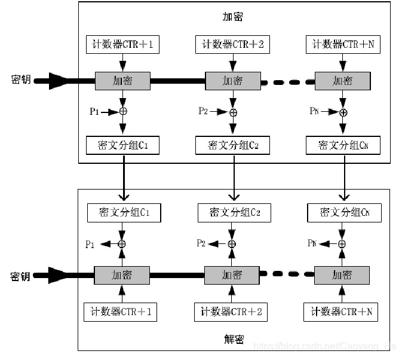

# 加密与解密

* [加密与解密](#加密与解密)
  * [编码](#编码)
    * [hex编码](#hex编码)
    * [urlencode编码](#urlencode编码)
    * [morsecode](#morsecode)
    * [uuencode](#uuencode)
    * [base家族](#base家族)
  * [对称密码](#对称密码)
    * [分组密码](#分组密码)
      * [分组密码的工作模式](#分组密码的工作模式)
        * [ECB 电子编码簿模式](#ecb-电子编码簿模式)
        * [密码分组链接模式 CBC](#密码分组链接模式-cbc)
        * [密文反馈模式 CFB](#密文反馈模式-cfb)
        * [输出反馈模式 OFB](#输出反馈模式-ofb)
        * [计数器模式 CTR](#计数器模式-ctr)
      * [Feistel网络结构](#feistel网络结构)
      * [DES](#des)
      * [AES](#aes)
        * [KeyExpansion()](#keyexpansion)
          * [RotWord()](#rotword)
          * [SubWord()](#subword)
          * [Rcon()](#rcon)
          * [例子](#例子)
        * [轮加密](#轮加密)
          * [字节替换](#字节替换)
          * [行移位](#行移位)
          * [列混淆](#列混淆)
          * [轮密钥加](#轮密钥加)
    * [序列密码](#序列密码)
  * [非对称密码](#非对称密码)
    * [公钥密码的数学知识](#公钥密码的数学知识)
    * [RSA算法](#rsa算法)
      * [密钥产生](#密钥产生)
      * [加密解密](#加密解密)
  * [消息认证](#消息认证)
    * [消息认证码MAC](#消息认证码mac)
    * [数字签名](#数字签名)
  * [散列函数](#散列函数)
    * [MD5算法](#md5算法)
    * [SHA算法](#sha算法)

本文主要参考《CTF训练营》以及[参考链接](https://github.com/NB-STAR/crypto/blob/master/study/cryptography-basic/3.%E5%88%86%E7%BB%84%E5%AF%86%E7%A0%81/%E5%9F%BA%E7%A1%80%E7%9F%A5%E8%AF%86/CRYPT-3_%E5%88%86%E7%BB%84%E5%AF%86%E7%A0%81.md)

信息系统的安全三要素：

- **机密性**
  - 通过加密实现，加密包含对称加密和非对称加密
    - 对称加密只有一个密钥，非对称加密有公钥和私钥
    - 对称加密主要缺点是密钥容易在分发中泄露，非对称加密主要缺点是运行速度慢
    - 可以使用非对称加密管理和更新对称加密的密钥
- **完整性**
  - 加密算法无法保证数据的完整性，因为中间人可以改变密文的顺序，完整性相关的算法有两种：
    - **数字签名**。生成公钥和私钥，使用私钥加密明文得到密文，使用公钥还原密文得到明文。
    - **消息验证码**。先生成私钥，使用加密算法或者（哈希+加密算法）计算消息验证码，验证收到的消息能否生成同样的消息验证码。
- **可用性**

## 编码

编码的目的与加密的目的不同：

- 加密是**保密**为目的
- 编码的目的是转换数据，使**不同类型的系统**能够正确、安全使用数据

### hex编码

将数据转换为它的十六进制编码

### urlencode编码

用于浏览器和网站之间的数据交换，以解决**特殊字符**在传输过程中遇到的问题

是在特殊字符hex的基础上，每个字符前置一个**%**：

```
flag(url_encode_1234_!@#$)
flag(url_encode_1234_!@%23$)
```

### morsecode

摩斯电码是编码，不是一种加密方式，因为它并不存在密钥

`.`表示短音，`-`表示长音，`/`表示分隔符

### uuencode

将二进制文件转化为可见字符文本组成的文件，uuencode编码方案常见于电子邮件信息的传输，目前已被多用途互联网邮件扩展（MIME）大量取代

[在线加解密网站](https://www.qqxiuzi.cn/bianma/uuencode.php)

运算法则是将连续的3字节扩展成4字节，类似于base64：

- 3字节一共有24位，分成4部分，每部分6位数据，范围在0~63之间
- 将每个数加上32，结果刚好落在ASCII字符集可打印字符（32-空白...95-下划线）的范围之中。

### base家族

base64、base32、base16的编码字符集：

- 最后有=的一定是base家族的编码，如果没有可以通过上面的字符集来判断

| 编码方式 | 字符集                           |
| -------- | -------------------------------- |
| base64   | a-z,A-Z,0-9,+,/共64个以及补位的= |
| base32   | A-Z,2-7共32个以及补位的=         |
| base16   | 0-9,A-F共16个以及补位的=         |

base16编码和hex编码在Python中只相差一个大小写


base64编码将3byte对应的24bit分成4份，每份6bit，转换成数字后，在base64编码表中查找对应的表示。在CTF题目中，base64很可能不使用原有的编码表，而是使用私有表。


## 对称密码

加密密钥和解密密钥相同，或实质上等同，即从一个易于推出另一个

### 分组密码

特点：

- 明文被分为**固定长度的块**，分组一般为64bit，或128bit
- 每个分组用相同的**密钥**和**算法**加解密
- 密文分组和明文分组**等长**

设计密码系统的两种主要方法：扩散和混淆

- 扩散，让明文的统计特征消散在密文中，让明文的每个比特影响到密文许多比特的值
- 混淆，使密文和密钥的统计关系尽可能复杂

分组密码由**加密算法**、**解密算法**和**密钥扩展算法**三部分组成

#### 分组密码的工作模式

分组密码只能加密固定长度的分组，当明文的长度超过分组大小时，需要进行迭代，以将很长的明文全部加密。迭代的方法就称为分组密码的工作模式。

##### ECB 电子编码簿模式

最简单的模式，将明文的每一个块加密成密文的每一个块，每次加密的密钥都相同，解密也是一次对一个分组进行解密，每次解密使用同一密钥。


特点：

- 明文分组和密文分组**一一对应**，明文中若有多个相同的明文分组，最后也会被转换成多个相同的密文分组

对ECB模式的攻击：

- 由于每个明文分组独立进行加解密，如果有攻击者作为中间人，截获了两边的通信，能够**改变密文的顺序**，实现**在不破译密文的情况下操纵密文**

##### 密码分组链接模式 CBC

上一个分组的密文与本分组的明文先异或运算，再进行后续加密。


IV：

- 为每个消息传输选取不同的IV，两个相同的消息即使使用相同的密钥，也会有不同的密文

特点：

- 隐藏了明文块的统计特性

  密文块与当前明文块、以前的密文块、初始向量有关

- 明文分组中有1位出错，将影响该分组和后续所有分组的密文

- 具有有限的**两步**错误传播特性

  一个密文块的错误将导致两个密文块不能成功解密

- 具有**自同步**功能

  密文出现丢块和错块不影响后续密文块解密，如果第t块密文正常被接收，从t+1块可以开始被正确解密

- 密文分组中有1位缺失，将会导致分组错位，后续所有密文分组都会解出无效数据

对CBC模式的攻击：

- **比特反转攻击**

  攻击者截获初始向量IV，对其中任意比特进行反转，可以改变明文中相应的比特位

  

##### 密文反馈模式 CFB

一次处理s位，上一块密文作为加密算法的输入，输出的伪随机数与明文异或得到下一块密文

可以看作是**通过分组密码实现流加密**的方式


##### 输出反馈模式 OFB

与CFB类似：

- CFB中，密码算法的输入是前一个**密文分组**
- OFB中，密码算法的输入是前一个**密码算法的输出**


##### 计数器模式 CTR

每个明文分组都与一个经过加密的计数器异或，后续分组计数器递增



#### Feistel网络结构

输入是分组长为2w的明文和一个密钥k，将每组明文分为左右两半，在进行n轮迭代之后，左右两半再合到一起产生密文分组。

Feistel网络解密过程与其加密过程实质是相同的，以密文分组作为算法的输入，但以相反的次序使用子密钥。


Feistel网络的实现与以下参数和特性有关：

- 分组长度

  分组长度越大则安全性越高（其他条件相同时），但加、解密速度也越慢。64比特的分组目前也可用，但最好采用128比特

- 密钥长度

  密钥长度越大则安全性越高（其他条件相同时），但加、解密速度也越慢。64比特密钥现在已不安全，128比特是一个折中的选择

- 轮数

  循环次数越多则安全性越高，通常选择16次

- 子密钥算法

  子密钥算法越复杂则安全性越高

- 轮函数

  轮函数越复杂则安全性越高

#### DES

[参考](https://blog.csdn.net/Caoyang_He/article/details/88868493)

DES，数据加密标准， Data Encryption Standard

尽管DES密钥有64位，但用户只能定义其中的**56**位，其余的8位由算法提供。分别放在8、16、24、32、40、48、56和64位上。也就是每8位的密钥中包含了用户提供的7位和DES确定的1位，这样做是为了让每个8位的块都有奇数个奇偶校验位（即1的个数为奇数）。


DES算法加密过程：

1. 初始置换：输入按照初始置换表重排次序，进行初始置换
2. 16轮循环
   1. 64位明文分成左右2部分，每部分32位，左半部分为L，右半部分为R，然后下面主要操作右半部分：
   2. 扩展置换：将32位输入数据根据扩展置换表扩展成**48位**
      - 便于和密钥进行异或运算
   3. 异或运算：将48位明文数据与48位子密钥进行异或运算
   4. S盒置换：48位输入数据根据S盒置换表置换成**32**位输入数据
      - 是最重要的部分，其他运算都是线性的易于分析，只有S盒代替是**非线性**的
   5. 直接置换：S盒置换后的32位输出数据根据直接置换表进行直接置换
   6. 经过直接置换的32位输出数据与本轮的L部分进行异或操作，结果作为下一轮的R。本轮的R直接作为下一轮的L。
3. 终结置换：按照终结置换表进行终结置换，64位输出就是密文

DES密钥扩展过程：

1. 64位密钥，剔除8个奇偶校验位，留下的**56**位数据分成C和D两部分
2. 循环左移：根据循环左移表对C和D进行循环左移，循环左移后的C和D作为下一轮子密钥的输入，共16轮
3. 合并C和D为56位的数据
4. 将56位数据通过压缩换位表输出**48**位的密钥，用于和明文进行异或操作


#### AES

[参考链接](https://www.davidwong.fr/blockbreakers/aes.html)

AES中分组长度只能是128位，也就是16个字节；密钥的长度可以是128、192、256位。

| AES     | 密钥长度 | 分组长度 | 加密轮数 |
| ------- | -------- | -------- | -------- |
| AES-128 | 128      | 128      | 10       |
| AES-192 | 192      | 128      | 12       |
| AES-256 | 256      | 128      | 14       |

要将明文转换为密文，AES 会对其进行多次转换，其中之一是将其与密钥进行异或。由于我们只为 AES 提供**一个密钥**，因此 AES 需要从中派生出许多密钥。

- 这些派生密钥称为**轮密钥**（或通常为**子密钥**）
- 用于派生这些子密钥的过程称为**密钥扩展**`KeyExpansion`

通过三个不同的函数来帮助构建`KeyExpansion()`函数：

- RotWord()
- SubWord()
- Rcon()

##### KeyExpansion()

原始的是128位密钥，需要生成11*16字节的子密钥，供11次AddRoundKey变换使用，每次使用128位的密钥

密钥膨胀算法以字为基础，一个字等于4个字节，所以所有的子密钥存储在w[44]的字数组中

###### RotWord()

将 4 个字节的值作为输入，并返回这 4 个字节的循环作为输出


###### SubWord()

SubWord 像前面的函数一样接受 4 个字节的输入，并返回 4 个字节的输出。SubWord 基本上是一个**Sbox**，每个字节都根据查找表进行检查并替换为它们的关联值。

这是查找表，要阅读此表，需要将输入分成行和列两部分：


###### Rcon()

接受一个整数作为输入，并返回一个 4 个字节的数组，其中 3 个最低有效字节设置为 0。

AES 在GF(2^8)用多项式定义的有限域中操作它的一些变换X^8 + X^4 + X^3 + X + 1。Rcon 是这些奇怪的转换之一，并且rcon(i) = [X^i, 0, 0, 0]在该领域中被定义。这部分可以直接使用查找表。

下面是查找表的golang代码：

```go
var rcon = [256]byte{
0x8d, 0x01, 0x02, 0x04, 0x08, 0x10, 0x20, 0x40, 0x80, 0x1b, 0x36, 0x6c, 0xd8, 0xab, 0x4d, 0x9a,
0x2f, 0x5e, 0xbc, 0x63, 0xc6, 0x97, 0x35, 0x6a, 0xd4, 0xb3, 0x7d, 0xfa, 0xef, 0xc5, 0x91, 0x39,
0x72, 0xe4, 0xd3, 0xbd, 0x61, 0xc2, 0x9f, 0x25, 0x4a, 0x94, 0x33, 0x66, 0xcc, 0x83, 0x1d, 0x3a,
0x74, 0xe8, 0xcb, 0x8d, 0x01, 0x02, 0x04, 0x08, 0x10, 0x20, 0x40, 0x80, 0x1b, 0x36, 0x6c, 0xd8,
0xab, 0x4d, 0x9a, 0x2f, 0x5e, 0xbc, 0x63, 0xc6, 0x97, 0x35, 0x6a, 0xd4, 0xb3, 0x7d, 0xfa, 0xef,
0xc5, 0x91, 0x39, 0x72, 0xe4, 0xd3, 0xbd, 0x61, 0xc2, 0x9f, 0x25, 0x4a, 0x94, 0x33, 0x66, 0xcc,
0x83, 0x1d, 0x3a, 0x74, 0xe8, 0xcb, 0x8d, 0x01, 0x02, 0x04, 0x08, 0x10, 0x20, 0x40, 0x80, 0x1b,
0x36, 0x6c, 0xd8, 0xab, 0x4d, 0x9a, 0x2f, 0x5e, 0xbc, 0x63, 0xc6, 0x97, 0x35, 0x6a, 0xd4, 0xb3,
0x7d, 0xfa, 0xef, 0xc5, 0x91, 0x39, 0x72, 0xe4, 0xd3, 0xbd, 0x61, 0xc2, 0x9f, 0x25, 0x4a, 0x94,
0x33, 0x66, 0xcc, 0x83, 0x1d, 0x3a, 0x74, 0xe8, 0xcb, 0x8d, 0x01, 0x02, 0x04, 0x08, 0x10, 0x20,
0x40, 0x80, 0x1b, 0x36, 0x6c, 0xd8, 0xab, 0x4d, 0x9a, 0x2f, 0x5e, 0xbc, 0x63, 0xc6, 0x97, 0x35,
0x6a, 0xd4, 0xb3, 0x7d, 0xfa, 0xef, 0xc5, 0x91, 0x39, 0x72, 0xe4, 0xd3, 0xbd, 0x61, 0xc2, 0x9f,
0x25, 0x4a, 0x94, 0x33, 0x66, 0xcc, 0x83, 0x1d, 0x3a, 0x74, 0xe8, 0xcb, 0x8d, 0x01, 0x02, 0x04,
0x08, 0x10, 0x20, 0x40, 0x80, 0x1b, 0x36, 0x6c, 0xd8, 0xab, 0x4d, 0x9a, 0x2f, 0x5e, 0xbc, 0x63,
0xc6, 0x97, 0x35, 0x6a, 0xd4, 0xb3, 0x7d, 0xfa, 0xef, 0xc5, 0x91, 0x39, 0x72, 0xe4, 0xd3, 0xbd,
0x61, 0xc2, 0x9f, 0x25, 0x4a, 0x94, 0x33, 0x66, 0xcc, 0x83, 0x1d, 0x3a, 0x74, 0xe8, 0xcb, 0x8d}
```

###### 例子

在下图中，假设提供给 AES 的密钥是2b7e151628aed2a6abf7158809cf4f3c（十六进制）。这正好填充了四列，并且将是第一个轮密钥。获取下一轮密钥的第一列，步骤如下：

- 取上一轮密钥的最后一列的值并将其赋予rotWord()
- 然后交给 subWord()
- 然后将其与上一轮密钥的第一列进行异或
- round是轮数，从1开始。rcon(round)可以返回一个4字节的数组。将刚才的结果与rcon(round)进行异或。

每个回合都有自己的回合密钥。AES-128 需要10轮，并且将使用 10 + 1 = 11 个轮密钥。


要获得轮密钥的其他3列，只需将**前一列**与**相同索引的前一个轮密钥的列**进行异或。


##### 轮加密

输入到 AES 的明文，然后被处理直到它成为密文，在内部表示为**4 行 4 列的正方形**。这种 AES 内部方形表示被称为“**状态**”，并且在整个加密（或解密）过程中应用于它的不同转换被重新组合成**轮次，**每个**轮次**涉及不同的**轮密钥**。该**轮密钥**从主密钥生成。


每轮主要工作：

1. 字节替换：对状态矩阵进行非线性变换
2. 行移位：对状态矩阵中的行进行循环移位
3. 列混淆 （最后一轮没有列混淆）
4. 轮密钥加


AES-128 是采用 128 位密钥的 AES 变体，总共有 10 轮。**每一轮都将不同的轮密钥和前一轮的输出作为输入**。

注意，最后一轮与其他轮有点不同，**最后一轮跳过了 MixColumns 转换**。

###### 字节替换

输入一个字节，并根据查找表返回相应的字节。

所使用的表与SubWord中的表一致。

###### 行移位

输入一个4*4的状态进行旋转：

第一行不变，第二行在左边旋转一个位置，第三个位置旋转两个位置，第四个位置旋转三个位置。


###### 列混淆

通过矩阵相乘实现，将状态阵列的每个列视为系数在(GF(2^8))上、次数小于4的多项式，再与同一个固定的多项式c(x)进行模(x^4+1)乘法运算。注意这里的矩阵乘法和一般的矩阵乘法不同，乘的结果在相加时用的是**异或**运算，最后用结果取代原字节序列。

列混淆中，输入的每个字节都会影响到输出的四个字节。


逆向列混淆的方法与列混淆相同，只需要将固定矩阵替换成它的逆矩阵。

###### 轮密钥加

异或状态中的值与轮密钥的值。


最后来看看AES加解密的原理框图：

注意加密时第一轮只有轮密钥加，最后一轮没有列混淆。


每轮的数据置换情况：


### 序列密码

基本思想是生成一个叫**密钥流**的**伪随机序列字节流**，然后和数据相异或。


RC4的**密钥长度可变**，范围是`[1,255]`，一个**字节**一个字节进行加密。

用途广泛，常用于SSL/TLS，IEEE 802.11无线语句网标准的一部分WEP（Wired Equivalent Privacy）协议和新Wifi受保护访问协议(WPA)中。

[python实现](https://blog.csdn.net/iPlayForSG/article/details/123644676)辅助理解：

```python
# -- coding: utf-8 --
class RC4:
    def __init__(self, k):
        self.Sbox = self.RC4_init(k)  # 构造生成S盒
	
    # 密钥调度算法KSA用于初始化S盒
    def RC4_init(self, k):
        # 初始化S和T
        Sbox = [] * 255
        T = [] * 256
        for i in range(256):
            Sbox.append(i)  # 初始化 Sbox放入0-255数
            T.append(ord(k[i % len(k)]))  # 存放轮转的256位key
        j = 0
        # 初始排列S
        for i in range(256):
            j = (j + Sbox[i] + T[i]) % 256
            Sbox[i], Sbox[j] = Sbox[j], Sbox[i]
        return Sbox

    def RC4_crypt(self, m):
        c = ''
        i = j = 0
        S = self.Sbox
        for n in range(len(m)):
            i = (i + 1) % 256
            j = (j + S[i]) % 256
            S[i], S[j] = S[j], S[i]  # 交换 更新Sbox
            t = (S[i] + S[j]) % 256 # 生成密钥流
            c += '%02x' % (ord(m[n]) ^ S[t]) # 与明文异或 
        return c


# 加密过程
key = 'Hello_RC4'
rc4 = RC4(key)
# data='5bfe81e7151b1bb2d99eb9571c1aa73121c93215ae7f7b4c8dd944'.decode('hex')
# data = 'flag{this_is_a_sample_flag}'
data = 'flag{this_is_a_sample_flag}'
c = rc4.RC4_crypt(data)
print(c)

# 解密过程
key = 'Hello_RC4'
rc4 = RC4(key)
c = rc4.RC4_crypt(c.decode('hex'))
print(c.decode('hex'))
```


## 非对称密码

对称密码的目标通常是让输入与输出之间不存在紧凑的数学描述关系，依赖于代换和置换；大多数公钥算法则是基于数论函数

对称密码的优点是速度快，密钥长度相对较短，主要缺陷是：

- **密钥分配**问题：通信双方必须使用信道传输密钥，但是信道是不安全的
- **密钥个数**问题：在拥有n个用户的网络中，每对用户都需要一个单独的密钥对，网络中需要n(n-2)/2个密钥对
- **难以防御欺骗行为**：通信双方密钥相同，任意一方都可以伪造另外一方的信息或否认自己发送的信息

公钥体制的主要特点：

- 加密和解密能力分开
- 多个用户用公钥加密的消息只能由一个用户用私钥解密（实现保密通信）
- 一个用户用私钥加密的消息可以让多个用户用公钥解读（用于认证系统中对消息数字签名）
- 无需事先分配密钥
- 密钥持有量大大减少


### 公钥密码的数学知识

[参考链接](https://www.ruanyifeng.com/blog/2013/07/rsa_algorithm_part_two.html)

算法条件：

- 产生一对密钥是计算可行的
- 已知明文、公钥产生密文是计算可行的
- 利用密文、私钥得到明文是计算可行的
- 利用公钥推断出私钥是计算不可行的
- 已知密文、公钥得到明文是计算不可行的
- 加密和解密的顺序可交换（可选）

单向函数：

- y=f(x)在计算上是容易的
- x=f-1(y)在计算上不可选

利用数学上某些正向计算容易，反向计算困难的问题，例如：

- 大整数分解问题
- 有限域的乘法群上的离散对数问题
- 定义在有限域的椭圆曲线上的离散对数问题

互质关系：

- 如果两个正整数，除了1以外，没有其他公因子，就称这两个数是互质关系

欧拉函数：

- 任意给定正整数n，在小于等于n的正整数中，有多少与n构成互质关系

- n=1，则 φ(1) = 1 

- n为质数，则 φ(n) = n-1

- n是质数的某个次方， n = p^k ， φ(n) = p^k-p^(k-1)

- n是多个质数的积，
  $$
  n = p_1^{k_1}p_2^{k_2}...p_r^{k_r},
   φ(n) = φ(p_1^{k_1})φ(p_2^{k_2})...φ(p_r^{k_r}) 
  $$

欧拉定理：

- 如果两个正整数a和n互质，则：
  $$
  a^{ φ(n)}=1(mod\quad n)
  $$

模反元素：

- 如果两个正整数a和n互质，那么一定可以找到整数b，使得ab-1被n整除，或者说ab被n除的余数是1
  $$
  ab=1(mod\quad n)
  $$
  

### RSA算法

密钥长度应用较多的是1024位、2048位

#### 密钥产生

RSA密钥对产生步骤：

1. 随机选择两个不相等的质数p和q

2. 计算p和q的乘积n

3. 计算n的欧拉函数：φ(n) = (p-1)(q-1)

4. 随机选择一个整数e，1 < e < φ(n) ，且e与φ(n)互质

5. 计算e对于φ(n)的模反元素d：
   $$
   ed=1(mod\quad φ(n))等同于ed-1=kφ(n)
   $$

6. **(n, e)**作为公钥，**(n,d)**作为私钥

举个例子：

1. 选择p=61、q=53

2. n = 61*53 = 3233

3. φ(n) = (p-1)(q-1) = 60*52 = 3120

4. e为17

5. 求解下列方程：
   $$
   ed - 1 = kφ(n)
   $$

   $$
   17d - 3120k = 1
   $$

   计算得到d=2753

6. 公钥为（3233,17），私钥为（3233,2753）

#### 加密解密

加密：

如果Bob要向Alice发送加密消息m，就要用Alice的公钥(n,e)对m加密。m必须是整数，且m必须小于n。

加密就是要算出下面的c：
$$
m^e=c(mod\quad n)
$$
解密：

Alice拿到加密消息c后，需要用自己的私钥(n, d)进行解密：
$$
c^d=m(mod\quad n)
$$

## 消息认证

消息认证，证实收到的信息**来自可信的源点**且**未被篡改**的过程。

可用于认证的函数分为两类：

- 消息认证码MAC（Message Authentication Code）：公开函数+密钥产生一个固定长度的值作为标识
- 散列函数（Hash Function）：将任意长度的信息映射成固定长度的信息

### 消息认证码MAC

消息认证码适用于通信双方共享同一密钥来认证消息。

使用消息认证码主要流程：

- 输入Message和K，使用公开函数（可以为hash函数）计算得到MAC码，附加在消息后进行传输
- 接收方收到消息后，先检验收到的Message和自己的K能否计算出同样的MAC值


如果只有收发双方知道K，且接收方计算得到的MAC和收到的MAC一致，则说明：

- 接收方收到的消息未被篡改。因为攻击者不知道密钥K，如果篡改了消息，则无法相应的篡改MAC。仅篡改消息，接收方计算的新MAC值将与收到的MAC值不同。
- 接收方相信发送方不是冒充的。其他人没有密钥，不可能计算出正确的MAC值。

### 数字签名

生成公钥和私钥，使用私钥加密明文得到密文，使用公钥还原密文得到明文。


同时保证机密性和完整性：

- 发送时用B的公钥加密，A的私钥计算签名
- 接收时用A的公钥验证签名是否为A发送，用B的私钥解密查看消息内容


[图片来源文章](https://www.qycn.com/zx/wlaq/shujuanquan/2020/0831/78.html)

## 散列函数

Hash函数将任意长度的消息映射成固定长度的消息。

Hash碰撞：x和x'是两个不同的消息，如果h(x)=h(x')，则称x和x'是Hash函数的一个碰撞。

单向Hash函数：给定一个Hash值y，寻找一个消息x，使得y=h(x)是计算上不可行的。

### MD5算法

输入可以是任意长度，对输入按512位的分组为单位进行处理，输出**128位**的散列值。

### SHA算法

SHA（secure hash algorithm）输入长度小于264，输出**160位**的散列值。