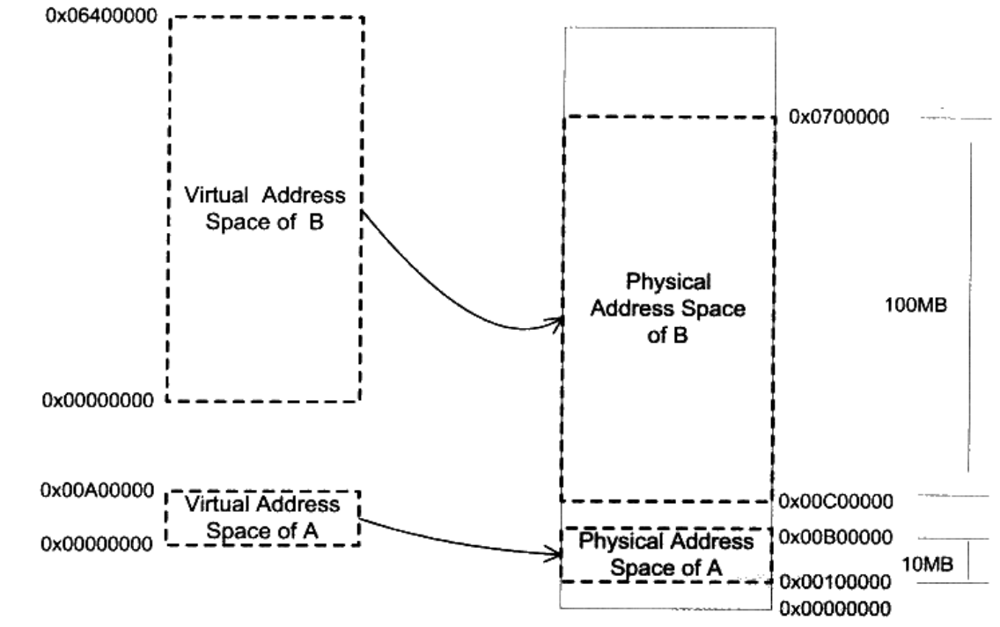
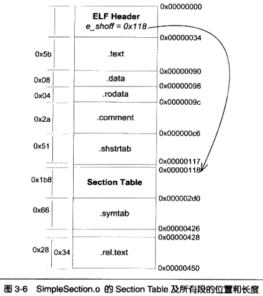
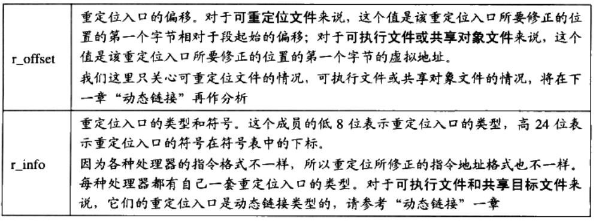

# 程序员的自我修养

## 第一章 温故而知新

计算机系统软件体系结构采用**层**次结构

层次之间相互通信的协议称为**接口**

- 开发工具和应用程序都使用同一接口，操作系统应用程序编程接口

系统调用接口在实现中往往以**软件中断**的方式提供

### 操作系统

操作系统功能：

- 提供抽象接口
- 管理硬件资源

多任务系统：

- 操作系统接管所有硬件资源，运行在一个**受硬件保护的级别**
- 应用程序以**进程**的方式运行在比操作系统**权限更低**的级别
- **抢占式**分配CPU：
  - 操作系统可以**强制剥夺**CPU资源并且分配给它认为目前最需要的进程

操作系统中的硬件驱动程序

- 和操作系统内核一起运行在**特权级**，但它与操作系统内核之间有一定的独立性
- 使其具有比较好的灵活性

### 内存

分段：把一段与程序所需要的内存空间大小的虚拟空间映射到某个地址空间

- 分段对内存区域的映射按程序为单位，粒度太大
- **程序的局部性原理**：一个程序在运行时，在某个时间段内，它只是频繁的用到了一小部分数据

分页：把地址空间人为等分成固定大小的页

- 几乎所有PC上的操作系统都使用**4KB**大小的页
- 虚拟页、物理页、磁盘页
- 获取不在内存中的页触发**页错误**
- 几乎所有硬件采用**MMU**进行页映射

### 线程

线程，也被称为轻量级进程，是程序执行流的最小单元

线程中的私有数据

线程调度：不断在处理器上切换不同的线程

- 优先级调度
  - 线程拥有各自的**线程优先级**
  - 线程优先级改变三种方式：
    - 用户指定优先级
    - 根据进入等待状态的频繁程度提升或降低优先级
      - IO密集型线程比CPU密集型线程容易得到优先级的提升
    - 长时间得不到执行被提升优先级
      - 避免线程**饿死**
- 轮转法

线程的三种状态：

- 运行：线程正在执行
- 就绪：线程可以立刻运行，但CPU已经被占用
- 等待：线程等待某一事件（通常是I/O或同步），无法执行

运行中的线程有一段可以执行的时间，称为**时间片**

#### Linux线程

Linux将所有的执行实体（无论是线程还是进程）都称作**任务**

- **共享同一个内存空间**的多个任务构成一个进程
- 这些任务成为进程里的线程

以下方法可以创建新的任务：

- fork：复制当前进程
  - **写时复制**
- exec：使用新的可执行映像覆盖当前可执行映像
  - fork只产生镜像，需要调用exec执行新的可执行文件
- clone：创建子进程并从指定位置开始执行
  - 可以产生新的任务，从指定位置开始执行，（可选的）共享当前进程的内存空间和文件
  - 实际效果相当于产生一个线程

#### 线程安全

各个线程对同一个数据的访问**同步**

- 一个线程访问数据未结束时，其他线程不得对同一个数据访问

**锁**：为实现同步，每个线程在访问数据或资源之前，先试图**获取**锁，并在访问结束之后**释放**锁

- 二元信号量
- 多元信号量
- 互斥量：与二元信号量类似，区别在于必须获取信号量的线程释放信号量
- 临界区：与互斥量性质相同，但范围限于本进程
- 读写锁：两种获取方式
  - 共享的
  - 独占的
- 条件变量

#### 多线程内部情况

用户态线程和内核线程的对应情况

- 一对一线程模型：真正的并发
  - 一般使用API或系统调用创建的线程均为一对一的线程
- 多对一线程模型：线程之间切换由用户态代码进行
- 多对多线程模型

## 第二章 编译和链接

通常将编译和链接合并到一起的过程称为**构建**

GCC编译程序步骤：

- 预处理：主要处理以#开始的预编译指令

- 编译：将文件进行词法分析、语法分析、语义分析及优化，生成相应的汇编代码文件

- 汇编

- 链接

编译过程：

代码模块之间通过**符号**（函数调用、变量访问）来通信，链接用来修正符合的目标地址

静态链接过程：

- 地址和空间分配
- 符号决议
- 重定位，地址修正的过程

目标文件与运行时库经过链接得到可执行文件

## 第三章 目标文件

可执行文件

- Windows：PE Portable Executable
- Linux：ELF Executable Linkable Format

目标文件、动态、静态链接库与可执行文件格式几乎一样：

- Windows：.obj、.dll、.lib
- Linux：.o、.so、.a

程序与目标文件

- 代码放在.text或者.code段中

- 初始化的全局变量和局部静态变量放在.data段，未初始化的放在.bss段
  - bss段只是预留位置，并没有内容，在文件中也不占空间

程序的分段情况：

- .rodata段存放只读数据，一般是程序的只读变量（const修饰的变量）和字符串常量
- .comment段存放编译器版本信息

### ELF文件结构描述

#### ELF文件头

- 最开始的前4个字节所有ELF文件都相同：0x7F、0x45、0x4C、0x46
  - 第一个字节是DEL控制符，后面三个字节是ELF这3个字母的ASCII码
  - 第五个字节标识ELF文件类，0x01是32位，0x02是64位
  - 第六个字节是字节序，规定ELF文件是大端还是小端
  - 第七个字节是ELF文件的主版本号，一般是1
- e_type表示ELF文件类型
  - ET_REL常量值为1，可重定位文件，一般为.o文件
  - ET_EXEC常量值为2，可执行文件
  - ET_DYN常量值为3，共享目标文件，一般为.so文件

#### 段表

保持ELF文件中段基本属性的结构

- 段的类型
  - SHT_NULL，0，无效段
  - SHT_PROGBITS，1，程序段、代码段、数据段
  - SHT_SYMTAB，2，表示该段的内容为符号表
  - SHT_STRTAB，3，表示该段的内容为字符串表
  - SHT_NOBITS，8，该段在文件中没内容
  - SHT_REL，9，包含了重定位信息
- 段的标志位
  - SHF_WRITE，1，该段在进程空间中可写
  - SHF_ALLOC，2，该段在进程空间中需分配空间，代码段、数据段、.bss段一般会有这个标志位
  - SHF_EXECINSTR，4，该段在进程空间中可以被执行，一般指代码段
- .rel.text段是一个重定位表，是针对.text段的重定位表，因为.text段至少有一个对绝对地址的引用，也就是对printf函数的调用
  - sh_link表示符号表的下标，也就是.symtab的下标9
  - sh_info表示作用于哪个段，也就是.text的下标1
- .strtab或者.shstrtab为字符串表、段表字符串表
  - 字符串的长度往往不定，用字符串在表中的偏移引用字符串
- symtab为符号表，表中符号值就是符号的地址
  - 符号表中在链接过程中最重要的两类符号：
    - **定义**在本目标文件中的全局符号，可以被其他目标文件**引用**
    - 在本目标文件中**引用**的全局符号，却没有**定义**在本目标文件

SimpleSection.o所有段的位置及长度

##### 符号表

符号表的结构

符号表例子

- 符号类型：
  - NOTYPE，未知类型符号
  - OBJECT，是数据对象，比如变量、数组
  - FUNC，是函数或其他可执行代码
  - SECTION，表示一个段，符号必须是STB_LOCAL的
  - FILE，表示文件名，一般都是该目标文件的源文件名，一定是STB_LOCAL，st_shndx一定是SHN_ABS
- 符号绑定信息
  - LOCAL，局部符号，对外部不可见
  - GLOBAL，全局符号，外部可见
  - WEAK，弱引用
- 符号所在段，如果符号定义在本目标文件中，则表示符号所在段在段表中的下标；特殊符号：
  - ABS，表示该符号包含了一个绝对的值
  - COMMON，表示该符号是COMMON块类型的符号，一般**未初始化的全局符号**定义是COMMON
  - UNDEF，表示符号未定义，该符号被本目标文件被引用到，但是定义在其他目标文件中

###### C++符号修饰

C++如何区分不同的重载函数？

**函数签名**包含了函数名、它的参数类型、它所在的类和名称空间及其他信息

在编译器及链接器处理符号时，它们使用某种**名称修饰**的方法，使得每个函数签名对应一个修饰后名称

全局变量和静态变量也需要被修饰

###### 弱符号与强符号

C/C++语言中，默认函数和初始化了的全局变量为**强符号**；未初始化的全局变量为**弱符号**

对外部目标文件的符号引用在目标文件被最终链接成可执行文件时，如果没有找到该符号的定义，链接器就会报符号未定义错误，这种是**强引用**；对于**弱引用**，如果没有被定义，则链接器对于该引用不报错。

## 第四章 静态链接

链接过程中实际的空间分配策略

- .bss段在目标文件和可执行文件中并不占用文件的空间，但是它在**装载**中占用**虚拟地址空间**

链接器一般采用两步链接：

- **空间与地址分配**：获取所有输入目标文件的段长度，并且将它们合并，计算输出文件中各个段合并后的长度和位置
- **符号解析与重定位**

链接前后各个段属性

- 链接之后，各个段已经有了虚拟地址VMA
- 在Linux下，ELF可执行文件默认从地址0x8048000开始分配

可重定位的ELF文件，必须包含可重定位表，来描述如何修改相应段里的内容

- 表中每个要被重定位的地方叫一个**重定位入口**
- **偏移**表示入口在要被重定位的段中的位置

在静态链接器重定位符号以前，编译器使用的是符号临时的假地址，需要链接器对指令进行修正：

- X86基本重定位类型
  - R_386_32，1，重定位修正方法是**绝对寻址修正**，S+A
  - R_386_PC32,2，重定位修正方法是**相对寻址修正**，S+A-P
    - A，保存在被修正位置的值
    - P，被修正的位置，也就是相对于段开始的偏移量或者虚拟地址，可通过r_offest计算得到
    - S，符号的实际地址，r_info的高24位指定的符号的实际地址

弱符号机制允许同一个符号的定义存在于多个文件中，可能存在的情况：

- 两个或两个以上的强符号类型不一致
  - 是非法的，报错
- 有一个是强符号，其他的是弱符号，出现类型不一致
  - 最终输出结果中符号所占空间与强符号相同
  - 如果弱符号大小大于强符号，则会报出警告
- 两个或两个以上的弱符号类型不一致
  - 不同的目标文件需要的**COMMON块**空间大小不一致时，以**最大**的那块为准

需要COMMON块的本质原因是，链接器**不支持符号类型**，无法判断各个符号的类型是否一致

编译器将一个编译单元编译成目标文件时，如果编译单元包含弱符号，那么弱符号最终所占空间大小是未知的，因为有可能其他编译单元中该符号所占空间比本单元的大，所以编译器无法为弱符号在BSS段分配空间。但链接器在读入所有输入文件以后，能够确定任何一个弱符号的最终大小，可以在最终输出文件的BSS段为其分配空间。

### C++相关问题

Linux系统下一般程序的入口是**_start**，这个函数是Linux系统库Glibc的一部分

- 当程序与Glibc库链接在一起形成可执行文件之后，这个函数就是程序初始化部分的入口，程序执行一系列初始化操作，再调用main函数，然后返回到初始化部分进行清理，最后结束进程

- 一些特定操作必须在main函数之前被执行，如C++全局对象的构造函数
- 一些特定操作必须在main函数之后被执行，如C++全局对象的析构函数

这些特定操作基于ELF中两种特殊的段：

- **.init** 构成进程初始化代码
- .**fini** 保存进程终止代码指令

**ABI**（Application Binary Interface）包含符号修饰标准、变量内存布局、函数调用方式等这些跟**可执行代码二进制**兼容相关的内容

### 静态库链接

程序要做到有效的输入输出，需要使用操作系统提供的应用程序编程接口API

一种语言的开发环境往往附带有**语言库**，这些库就是**对操作系统API的包装**

一个**静态库**可以简单的看出**一组目标文件**的集合

静态库链接

整个编译过程中的中间步骤：

- cc1是GCC的C语言编译器，将输入编译成临时的汇编文件
- as是GNU的汇编器，将临时汇编文件汇编成临时目标文件
- collect2程序完成最后的链接
  - collect2是ld链接器的一个包装

BFD（Binary File Descriptor library）目标是希望通过一种**统一的接口**来处理不同的目标文件格式

- 现在GCC、链接器ld、调试器GDB以及binutils的其他工具都是通过BFD库来处理目标文件，而不是直接操作目标文件
- 可以将编译器和链接器本身同具体的目标文件格式**隔离**开来，如果要支持一种新的目标文件格式，只需在BFD库中添加一种格式就可以了

## 第六章 可执行文件的装载与进程

### 进程虚拟地址空间

程序和进程的区别：

- 程序是一个静态的概念，是一个预先编译好的**指令**和**数据集合**的一个文件
- 进程是一个动态的概念，是**程序运行时**的一个过程

32位平台下的4GB虚拟空间，进程只能使用操作系统分配给进程的地址

- 操作系统占用了1GB
- 进程可以使用剩下的3GB

linux进程虚拟地址空间分布

### 装载方式

利用程序的局部性原理，将程序最常用的部分驻留在内存中，将不太常用的数据存放在磁盘里面

两种典型的动态装载方法：

- 覆盖装入
  - 几乎已经被淘汰
  - 需要程序员手工将程序分割成若干块，然后编写一个小的辅助代码也就是**覆盖管理器**，管理这些模块何时应该驻留内存，何时应该被替换掉
  - 并且手工将模块按照它们之间的调用依赖关系组成树状结构
    - 树状结构中从任何一个模块到树的根模块都叫调用路径，该模块被调用时，整个调用路径上的模块必须都在内存中
    - 禁止跨树间调用
- 页映射
  - 将**内存**和**磁盘**中的所有数据和指令按照**页**为单位划分成若干个页
  - 以后所有的装载和操作的**单位**就是页
  - 最常见的页大小是4KB
  - 选择页的方法
    - FIFO，先进先出方法
    - LUR，最少使用方法

### 操作系统装载可执行文件

操作系统装载可执行文件的流程：

- 创建一个独立的虚拟地址空间
  - 实际上是创建页映射函数所需要的数据结构
  - 建立**虚拟空间**到**物理内存**的映射关系
- 读取可执行文件头，建立**虚拟空间**和**可执行文件**的映射关系
  - 当操作系统捕捉到**页错误**时，应该知道程序当前所需要的页在可执行文件中的哪一个位置
  - Linux将进程虚拟空间中的一个段，叫做**虚拟内存区域**
- 将CPU的指令寄存器设置成可执行文件的入口地址，启动运行

### ELF文件链接视图和执行视图

ELF中，段的权限只有为数不多的几种组合：

- 以代码段为代表的权限**可读可执行**的段
- 以数据段和BSS段为代表的权限为**可读可写**的段
- 以只读数据段为代表的权限为**只读**的段

将相同权限的Section，合并到一起当做一个Segment进行映射

Segment的概念实际上是从**装载**的角度重新划分了ELF的各个段

Section和Segment是从不同的角度划分同一个ELF文件，在ELF中被称为不同的视图

- 从Section的角度来看是链接视图
- 从Segment的角度来看是执行视图

ELF文件中，描述segment的结构叫做程序头Program Header，描述ELF文件如何被操作系统映射至进程的虚拟空间

只有lOAD类型的Segment才会被加载

在操作系统里面，VMA除了用来映射可执行文件中的各个Segment以外，操作系统还使用VMA对进程的地址空间进行管理

一个进程基本可以分为以下几种VMA区域：

- 代码VMA，权限只读、可执行；有映像文件
- 数据VMA，权限可读写；有映像文件
- 堆VMA，权限可读写，可执行；无映像文件，匿名，可向上扩展
- 栈VMA，权限可读写，不可执行；无映像文件，匿名，可向下扩展

段地址对齐，为了在页映射机制中节省空间

- 各个段接壤部分共享一个物理页面，然后将该物理页面分别映射两次
- 一个物理页面，可能同时包含了两个段的数据

### Linux内核装载ELF过程

在Linux的bash下输入一个命令执行某个ELF程序：

- 用户层，bash进程调用fork()系统调用创建一个新的进程
- 新的进程调用execve()系统调用执行指定的ELF文件
  - 此时linux内核开始装载工作
  - sys_execve()进行参数的检查复制
  - do_execve()查找被执行的文件，如果找到文件，则读取文件的前128个字节，判断文件格式
  - 调用search_binary_handle()搜索和匹配合适的可执行文件装载处理过程，如load_elf_binary()，其主要步骤
    - 检查ELF可执行文件格式的有效性
    - 寻找动态链接的.interp段，设置动态链接器路径
    - 根据程序头表的描述，对ELF进行映射
    - 初始化ELF进程环境
    - 将系统调用的返回地址修改成ELF可执行文件的入口点
      - 静态链接的文件，程序入口是文件头中e_entry所指的地址
      - 动态链接的文件，入口是动态链接器
  - load_elf_binary()执行完毕，返回至do_execve()再返回至sys_execve()，sys_execve()从内核态返回至用户态，EIP寄存器直接跳转到ELF的入口地址，开始执行新的程序，ELF可执行文件装载完成
- 原先的bash进程继续返回等待刚才启动的新进程结束，然后继续等待用户输入命令

## 第七章 动态链接

静态链接存在**空间浪费**和**更新困难**的问题，动态链接是把链接过程推迟到**运行时**再进行

动态链接基本思想是把程序按照模块拆分成各个相对独立的部分，在程序运行时才将它们链接在一起形成一个完整的程序

Linux系统中，ELF动态链接文件被称为**动态共享对象**（DSO，Dynamic Shared Objects），简称共享对象，一般都是以.so为扩展名的一些文件

在下面的例子中，Program1.o的链接过程与静态链接不一样

- Lib.o没有被链接进来，链接输入的目标文件只有Program1.o
- Lib.so也参与了链接过程，因为Lib.so中包含了完整的符号信息，可以让链接器把对相应符号的引用标记为一个动态链接符号

ld-2.6.1.so是Linux下动态链接器，动态链接器与普通共享对象一样被映射到进程的地址空间

在系统开始运行Program1之前，首先会把控制权交给动态链接器，由它完成所有的动态链接工作以后再把控制权交给Program1

### 地址无关代码

共享对象在编译时不能假设自己在进程虚拟地址空间中的位置，要在**任意地址**加载

可执行文件基本可以确定自己在进程虚拟空间中的起始位置，因为可执行文件往往是**被第一个加载**的文件

PIC 地址无关代码

- 基本思想是把指令中需要被修改的部分分离出来，跟数据部分放在一起
- 指令部分就可以保持不变，数据部分在每个进程中拥有一个副本

#### 类型一 模块内部调用或跳转

是相对地址调用，不需要重定位

#### 类型二 模块内部数据访问

任何一条指令与它需要访问的模块内部数据之间的相对位置是固定的，只需要相对于当前指令加上固定的偏移量就可以访问模块内部数据

#### 类型三 模块间数据访问

在数据段里建立一个指向其他模块全局变量的指针数据，也被称为全局偏移表

当代码需要引用这些变量时，可以通过GOT表中相应的项间接引用

访问GOT表的方法和类型二中的方法一样

#### 类型四 模块间调用跳转

同样利用GOT表

对于数据段的绝对地址引用，可以使用装载时重定位的方法

### 延迟绑定

在一个程序运行过程中，可能很多函数在程序执行完时都不会被用到，如果一开始把所有函数都链接好，实际上是一种浪费

延迟绑定，是当**函数第一次被用到时**才进行绑定

PLT为了实现延迟绑定，在这个过程中间又加了一层中间跳转

在bar@plt的例子中：

- 第一条指令通过GOT间接跳转
  - 为了实现延迟绑定，链接器在初始化阶段没有将bar()地址填入该项，而是填入第二条指令push n的地址
- 第二条指令将n压入堆栈中，n是bar符号引用在.rel.plt中的下标
- 第三条指令将模块ID压入堆栈，然后跳转_dl_runtime_resolve
  - 然后调用动态链接器的_dl_runtime_resolve()函数完成符号解析和重定位工作，并将bar()的真正地址填入到bar@GOT中

实际上，ELF将GOT拆成了两个表

- .got保存全局变量引用的地址
- .got.plt保存函数引用的地址，它的前三项具有特殊意义

### 动态链接相关结构

##### .interp段

.interp段中保存的是一个字符串，就是可执行文件需要的动态链接器的路径

在Linux下，路径几乎都是/lib/ld-linux.so.2

##### .dynamic段

保存了动态链接器所需要的基本信息，可以看作是动态链接下ELF的文件头

##### 其他

**动态符号表**，.dynsym，保存动态链接模块之间的导入导出关系

**动态符号字符串表**，.dynstr

**符号哈希表**，.hash，加快符号的查找过程

动态链接重定位表

- .rel.dyn，是对数据引用的修正，修正位置位于.got和数据段
- .rel.plt，是对函数引用的修正，修正位置位于.got.plt

动态链接时进程堆栈初始化信息

### 动态链接步骤和实现

#### 动态链接器自举

动态链接器本身不可以依赖于其他任何共享对象；动态链接器本身所需要的全局和静态变量的重定位工作由它本身完成

这种具有一定限制条件的启动代码往往被称为**自举**bootstrap

#### 装载共享对象

将可执行文件和链接器本身的符号表都合并到一个符号表中——**全局符号表**

链接器寻找可执行文件依赖的共享对象，将共享对象名字放入装载集合中

从集合中取出一个共享对象的名字，找到并打开相应文件，读取ELF文件头和.dynamic段，将相应的代码段和数据段映射到进程空间

如果这个对象还依赖其他共享对象，那么继续将所依赖的共享对象名字放到装载集合中，直到所有的依赖对象都被装载进来

符号的优先级问题：

当一个符号需要被加入全局符号表时，如果相同的符号名已经存在，则后加入的符号被忽略

#### 重定位和初始化

链接器重新遍历可执行文件和每个共享对象的重定位表，将它们的GOT/PLT中每个需要重定位的位置进行修正

如果某个共享对象有.init段，动态链接器会执行.init段中的代码

但如果进程的可执行文件也有.init段，那么动态链接器不会执行，因为这部分由程序初始化代码负责执行

### 显式运行时链接

让**程序自己**在运行时控制加载指定的模块，可以在不需要模块时将其卸载

动态库的装载需要一系列由动态链接器提供的API：

- dlopen打开动态库
- dlsym查找符号
- dlerror错误处理
- dlclose关闭动态库

## 第八章 Linux共享库组织

共享库版本命名：libname.so.x.y.z

- x表示主版本号，表示重大升级，不同主版本号不兼容
- y表示次版本号，表示增量升级，增加新的接口符号，原来符号不变
- z表示发布版本号，表示错误修正、性能改进，不增加和更改接口

主版本号和次版本号决定了一个共享库的接口

SO-NAME只保留主版本号，如libfoo.so.2，系统为每个共享库在它所在的目录创建一个跟SO-NAME相同的并且指向它的软链接

- 软链接实际会指向目录中主版本号相同、次版本号和发布版本号最新的共享库

共享库系统路径

- /lib，存放系统最关键和基础的共享库
- /usr/lib，主要保存一些开发时用到的共享库
- /usr/local/lib，主要是一些第三方的应用程序的库

如果在系统指定的共享库目录下添加、删除或更新任何一个共享库，或者更改/etc/ld.so.conf的配置，都应该运行ldconfig这个程序

环境变量

- LD_LIBRARY_PARH：改变某个应用程序的共享库查找路径
- LD_PRELOAD：指定预先装载的一些共享库甚至目标文件
- LD_DEBUG：打开动态链接器的调试功能

## 第十章 内存

linux进程地址空间布局

- 栈：用于维护函数调用的上下文
- 堆：容纳应用程序动态分配的内存区域
- 可执行文件映像
- 动态链接库映射区
- 保留区：内存中受到保护而禁止访问的区域

### 栈

栈保存函数调用所需要的维护信息，被称为堆栈帧、活动记录

- 函数返回地址和参数
- 临时变量
- 保存的上下文：函数调用前后需要不变的寄存器

函数标准开头：

- push ebp，把ebp压入栈
- mov ebp, esp，让ebp指向栈顶
- 【可选】sub esp,XXX 在栈上分配XXX字节临时空间
- 【可选】push XXX 如有必要，保存名为XXX寄存器

函数标准结尾：

- 【可选】pop XXX 如有必要，恢复名为XXX寄存器
- mov esp, ebp，恢复esp的同时回收局部变量空间
- pop ebp，从栈中恢复保存的ebp的值
- ret，从栈中取出返回地址，并跳转到该位置

C语言中默认的调用惯例是cdecl，函数调用惯例规定以下内容

- 函数参数的传递顺序和方式
- 栈的维护方式
- 名字修饰策略

函数返回值传递

- 4字节：eax寄存器
- 5~8字节：采用eax和edx联合返回
- 尺寸太大，使用临时的栈上内存作为中转，返回值对象会被拷贝两次

### 堆

程序的运行库向操作系统批发了一块较大的堆空间，然后零售给程序用

Linux堆管理有两种堆空间分配的方式

- brk()系统调用
  - 可以扩大或缩小进程的数据段
  - 将数据段的结束地址向高地址移动，扩大的那部分空间就可以被我们使用
- mmap()
  - 向操作系统申请一块虚拟地址空间，如果它不把地址空间映射到某个文件，这块空间可以称为匿名空间
  - 申请空间的起始地址和大小都必须是系统页大小的整数倍

glibc的malloc处理用户空间请求

- 小于128KB的请求，会在现有的堆空间中，按照堆分配算法分配一块空间并返回
- 大于128KB的请求，会使用mmap()分配一块匿名空间

#### 堆分配算法

如何管理一大块连续的内存空间，能够按照需求分配、释放其中的空间

- 空闲链表：将空闲块按照链表方式连接起来
  - 头结构记录了上一个prev和下一个next空闲块的地址、内存块的大小等信息
- 位图：将整个堆划分为大小相等的块，总是分配整数个块的空间，使用整数数组记录块的使用情况
- 对象池：假定每次请求都是固定的大小，把整个堆空间划分为大量的小块

## 第十二章 系统调用与API

在x86下，Linux系统调用由0x80中断完成，各个通用寄存器用于传递参数

- EAX用于表示系统调用的接口号，又作为调用结果的返回值
- 根据系统调用参数数量的不同，依次将参数放入EBX、ECX、EDX、ESI、EDI和EBP这6个寄存器中传递

现代CPU可以在多种截然不同的特权级别下执行指令，在现代操作系统中，有两种特权级别：用户模式、内核模式，也被称为用户态、内核态

操作系统一般通过**中断**从用户态切换到内核态，中断具有两个属性

- 中断号，从0开始
- 中断处理程序

一个或少数中断号对应所有的系统调用

